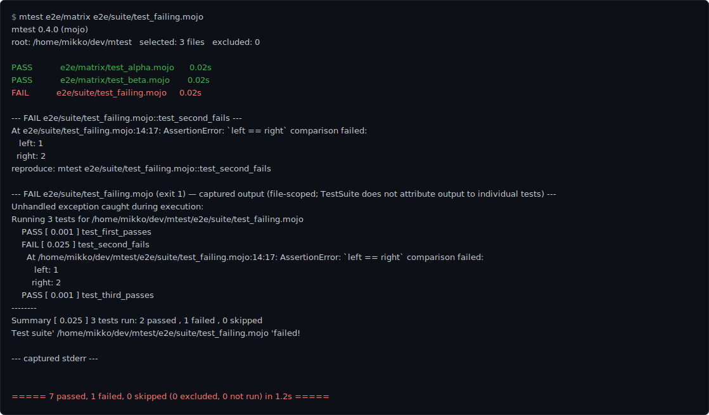
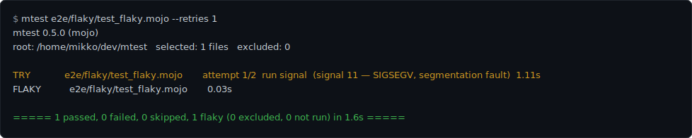
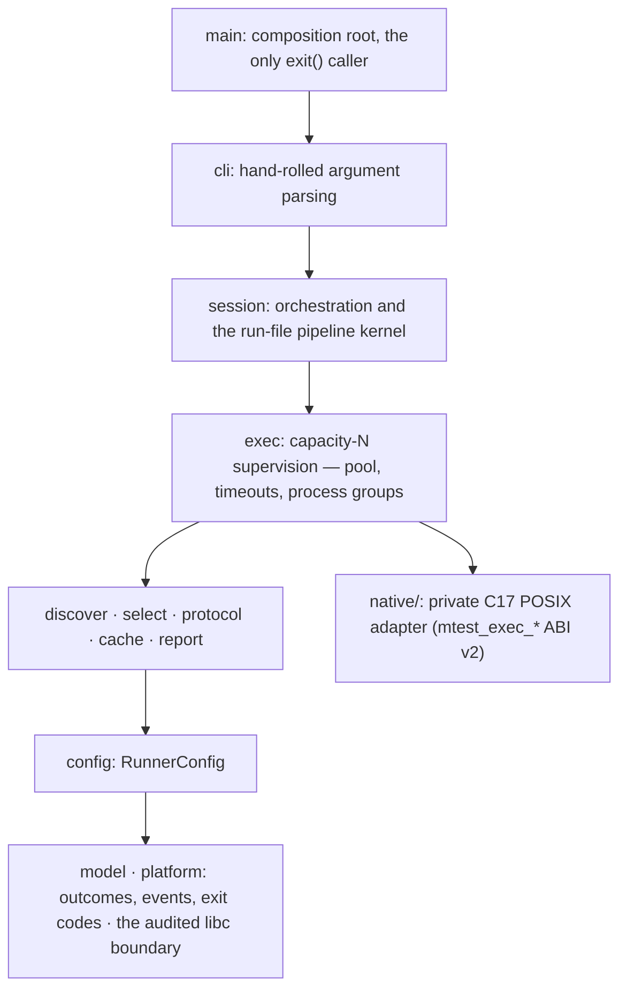

<p align="center">
  
</p>

# mtest

[](https://github.com/mikeleppane/mtest/actions/workflows/ci.yml)

A pytest-like test runner for [Mojo](https://www.modular.com/mojo).

mtest orchestrates the standard library's per-file `TestSuite`, it does not
replace it. `TestSuite` keeps owning discovery and the report format inside
each file; mtest owns everything between files: finding them, building each
one, executing the binary under supervision, selecting and aggregating tests
across files, and reporting results the way CI expects.



## Why

Mojo's standard library ships a per-file test harness, `TestSuite`, and the
`mojo test` CLI subcommand that used to drive many files was removed. That
leaves a gap most projects fill by hand: a shell loop over `mojo build`, a
grep of stdout, and an exit code nobody fully trusts. mtest replaces that
loop with one binary and four commitments:

- **Exit-code fidelity.** Every test file is compiled with `mojo build` and
  the binary is executed directly, because that is the only way Mojo reports
  a truthful process exit code. `mojo run` masks every outcome to `1` and is
  never used.
- **A crash is not a failure.** A failed assertion (FAIL) and a process that
  aborts or dies by signal (CRASH) are different events with different
  causes. They stay distinct in the console, the event stream, and the JUnit
  mapping; the exit code groups both into its failing class.
- **Loud over silent.** Every excluded file, retry attempt, and timeout is
  reported visibly. A run that skipped something never looks like a run that
  passed everything.
- **CI is the customer.** Deterministic, path-sorted output, a hermetic
  build with no third-party runtime dependencies, sharding for CI matrices,
  and machine-readable reports are all first-class.

## Features

- Recursive discovery of `test_*.mojo` files, with `--exclude` globs and
  `-I` include paths.
- Per-test outcomes parsed from each file's `TestSuite` report: `-k`
  substring selection, `path::test` node ids, `--maxfail N`, and
  `mtest collect` to list node ids without running any test body.
- A full outcome model: PASS, FAIL, SKIP, CRASH, TIMEOUT, COMPILE-ERROR,
  COMPILE-TIMEOUT, MALFORMED-SUITE, and PRECOMPILE-ERROR, plus a FLAKY
  annotation for a pass that needed retries. A file that builds and exits
  cleanly without running a single test is labeled NO-TESTS on the console
  and never counts as a pass. Every abnormal outcome carries captured output
  and a one-line reproduce command, and every signal or timeout is named in
  words (`signal 11 — SIGSEGV, segmentation fault`).
- Crash-class retries (`--retries N`) with an explicit FLAKY verdict for a
  late pass. Deterministic failures, such as an ordinary compile error or a
  failing assertion, are never retried.
- Bounded crash attribution: after a CRASH, a strictly bounded pass re-runs
  that file's tests one at a time to name a culprit, and reports honestly
  when it cannot. It never changes the verdict or the exit code.
- Timeouts for both the run (`--timeout`) and the build
  (`--compile-timeout`). Every kill targets the whole process group, and a
  run timeout that had to go past the polite terminate says so on its
  verdict line (`escalated to SIGKILL`).
- Deterministic sharding (`--shard`) for spreading one suite across a CI
  matrix.
- Three machine reporters: an NDJSON event stream (`--json`),
  schema-validated JUnit XML (`--junit-xml`), and GitHub Actions annotations
  (`--gh-annotations`).
- A clean interrupt: Ctrl-C tears down the in-flight process group, prints a
  partial summary with NOT-RUN accounting, and exits `2`.
- Gate files (`--gate`), precompiled package dependencies (`--precompile`),
  a slowest-files list (`--durations`), quiet and verbose modes, and color
  control (`--color`, `NO_COLOR`).

## Installation

mtest ships as a conda package built **from source** by
[rattler-build](https://prefix-dev.github.io/rattler-build/) from
[`recipe/recipe.yaml`](recipe/recipe.yaml), inside an isolated build
environment pinned to the same toolchain this repo builds against
(`mojo ==1.0.0b2`, `clang ==18.1.8`). The binary links against the Mojo
runtime, so the package declares a single conda run dependency,
`mojo-compiler ==1.0.0b2`, instead of vendoring those libraries.

The package is not published to a public channel. `package-build` produces
it into a local channel; `package-check` is a verifier that installs the
artifact into a fresh scratch environment (not your own) and runs it:

```console
$ pixi run package-build   # rattler-build -> build/conda-channel/*.conda
$ pixi run package-check   # verify: install into a scratch env, run the binary
```

To use the package in an environment of your own, install `mtest` from
`build/conda-channel` alongside the Modular and conda-forge channels, so
the `mojo-compiler` run dependency resolves.

linux-64 is the gated platform: a CI job builds the package, installs it
into a fresh environment carrying only the declared run dependency, and
exercises the installed binary. osx-arm64 is declared in the recipe and the
channels solve for it, but no CI runner executes the packaged artifact there.

To run mtest straight from a checkout instead, see
[Developing](#developing).

## Usage

mtest spawns a `mojo build` child per file, so `mojo` must be on that
child's `PATH`. From a checkout, build the binary once and run it under
`pixi run` (or inside a `pixi shell`):

```console
$ pixi run build-bin
$ pixi run bash -c 'build/mtest tests/'
```

`run` is the default subcommand: `mtest tests/` means `mtest run tests/`.
Everything below is real, captured output from this build.

### Writing a test file

A test file is a normal Mojo program: `test_*` functions plus a `main()`
that hands them to the standard library's `TestSuite`. This is
[`e2e/suite/test_passing.mojo`](e2e/suite/test_passing.mojo) (docstring
omitted), the file the next example runs:

```mojo
from std.testing import assert_equal, TestSuite


def test_one_passes() raises:
    assert_equal(1, 1)


def test_two_passes() raises:
    assert_equal(2, 2)


def test_three_passes() raises:
    assert_equal(3, 3)


def main() raises:
    TestSuite.discover_tests[__functions_in_module()]().run()
```

mtest compiles the file, runs the binary, and parses the report `TestSuite`
prints; selection reaches the suite through the arguments mtest passes it.
A file without that `main()` does not build as a standalone program.

### A passing run

```console
$ pixi run bash -c 'build/mtest e2e/suite/test_passing.mojo'
mtest 0.5.0 (mojo)
root: /home/mikko/dev/mtest   selected: 1 files   excluded: 0

PASS           e2e/suite/test_passing.mojo  0.07s

===== 3 passed, 0 failed, 0 skipped (0 excluded, 0 not run) in 0.5s =====
$ echo $?
0
```

The file holds three `test_*` functions; the summary counts them
individually, not the one file that held them.

### A mixed run

`e2e/suite/` is the committed known-outcome tree the end-to-end gate runs
against. One directory exercises most of the outcome model at once:

```console
$ pixi run bash -c 'build/mtest e2e/suite'
mtest 0.5.0 (mojo)
root: /home/mikko/dev/mtest   selected: 7 files   excluded: 0

PASS           e2e/suite/nested/test_nested.mojo  0.07s
COMPILE-ERROR  e2e/suite/test_compile_error.mojo  0.00s
CRASH          e2e/suite/test_crashing.mojo  1.12s  (signal 4 — SIGILL, illegal instruction)
FAIL           e2e/suite/test_failing.mojo  0.08s
PASS           e2e/suite/test_noisy.mojo  0.02s
PASS           e2e/suite/test_passing.mojo  0.02s
NO-TESTS       e2e/suite/test_zero.mojo   0.07s

--- COMPILE-ERROR e2e/suite/test_compile_error.mojo — mojo build said: ---
/home/mikko/dev/mtest/e2e/suite/test_compile_error.mojo:12:17: error: use of unknown declaration 'this_symbol_is_never_defined_anywhere'
    var value = this_symbol_is_never_defined_anywhere()
                ^~~~~~~~~~~~~~~~~~~~~~~~~~~~~~~~~~~~~
mojo: error: failed to parse the provided Mojo source module
reproduce: mojo build e2e/suite/test_compile_error.mojo -o build/bin/e2e_ssuite_stest_ucompile_uerror

[...CRASH detail with its captured stack trace omitted...]

--- FAIL e2e/suite/test_failing.mojo::test_second_fails ---
At e2e/suite/test_failing.mojo:14:17: AssertionError: `left == right` comparison failed:
   left: 1
  right: 2
reproduce: mtest e2e/suite/test_failing.mojo::test_second_fails

[...file-scoped captured output omitted...]

===== 9 passed, 1 failed, 0 skipped, 1 crashed, 1 compile error (0 excluded, 0 not run) in 3.9s =====
$ echo $?
1
```

The summary band's units are deliberately mixed: `passed`, `failed`, and
`skipped` count *tests*, while `crashed` and `compile error` count *files*,
because an abnormal outcome has no reliable per-test breakdown. `test_zero.mojo`
is reported NO-TESTS, not PASS: it builds and exits `0`, but its report shows
zero tests ran. A session that collects nothing but NO-TESTS files exits `5`.

### Selecting tests

`-k STR` is a case-insensitive substring filter over the full node id
(`path::name`), so it matches file paths as well as test names:

```console
$ pixi run bash -c 'build/mtest -k one e2e/matrix'
mtest 0.5.0 (mojo)
root: /home/mikko/dev/mtest   selected: 2 files   excluded: 0

PASS           e2e/matrix/test_alpha.mojo 0.02s
PASS           e2e/matrix/test_beta.mojo  0.03s

===== 2 passed, 0 failed, 0 skipped (0 excluded, 0 not run, 3 deselected) in 0.9s =====
```

A node-id operand selects exactly one test:

```console
$ pixi run bash -c 'build/mtest e2e/matrix/test_alpha.mojo::test_alpha_two'
mtest 0.5.0 (mojo)
root: /home/mikko/dev/mtest   selected: 1 files   excluded: 0

PASS           e2e/matrix/test_alpha.mojo 0.03s

===== 1 passed, 0 failed, 0 skipped (0 excluded, 0 not run, 2 deselected) in 0.5s =====
```

Non-matching tests are counted once as `deselected`, never listed
individually. A file whose every test is deselected is not scheduled at all
and is counted `not run`. A `-k` that empties the whole session exits `5`.

### Listing tests without running them

`mtest collect` (and `--collect-only`) compiles each file, enumerates its
tests through a probe that skips every test body, and lists node ids in
plain lexicographic order:

```console
$ pixi run bash -c 'build/mtest collect e2e/matrix'
e2e/matrix/test_alpha.mojo::test_alpha_one
e2e/matrix/test_alpha.mojo::test_alpha_three
e2e/matrix/test_alpha.mojo::test_alpha_two
e2e/matrix/test_beta.mojo::test_beta_one
e2e/matrix/test_beta.mojo::test_beta_two
$ echo $?
0
```

A file that cannot be probed (a compile error, a crash, a timeout) writes a
diagnostic to stderr and the listing continues for the rest, with a nonzero
exit at the end. Per-test narrowing is a `run` behavior in this build:
under `collect`, `-k` prints a loud ignored notice and a `path::test`
operand contributes its whole file to the listing.

### Retries and FLAKY

`--retries N` grants up to `N` extra attempts, and only to crash-class
failures: a death by signal, a deadline kill, or a compiler that itself
crashed. A failing assertion or an ordinary compile error is deterministic
and is never retried. Every attempt gets its own `TRY` line naming why it
failed, and a file that crashes once and then passes is reported FLAKY, a
pass with a visible history, never a plain PASS:



A FLAKY-only session exits `0`. Without `--retries`, the same crash stands
as the file's final outcome, and every CRASH triggers the bounded
attribution pass:

```console
$ pixi run bash -c 'build/mtest e2e/attribution/test_deterministic_crasher.mojo'
mtest 0.5.0 (mojo)
root: /home/mikko/dev/mtest   selected: 1 files   excluded: 0

CRASH          e2e/attribution/test_deterministic_crasher.mojo  1.12s  (signal 4 — SIGILL, illegal instruction)
WARNING  crash-attribution-start: re-running the crashed file(s) one test at a time to name the culprit (1 file(s); bounded and best-effort). This is SECONDARY diagnostics: the CRASH verdict already stands and nothing found here can change it or the exit code
ATTRIBUTION    e2e/attribution/test_deterministic_crasher.mojo  ATTRIBUTED  culprit: test_boom  (2 isolation rerun(s), 1.18s)

[...captured output omitted...]

===== 0 passed, 0 failed, 0 skipped, 1 crashed (0 excluded, 0 not run) in 2.7s =====
$ echo $?
1
```

When the crash does not reproduce with any test run alone (an
order-dependent crash, for instance), the `ATTRIBUTION` line says
`NO-REPRODUCTION` and the culprit stands UNATTRIBUTED rather than guessed.
The pass is strictly bounded (at most 32 isolation reruns per file, under
per-file and per-session wall-clock budgets), and it never changes the CRASH
verdict or the exit code.

### Timeouts

`--timeout SECS` bounds a single file's run; `--compile-timeout SECS` bounds
its build the same way. A child that ignores the polite terminate signal is
force-killed, and the verdict line says so in words:

```console
$ pixi run bash -c 'build/mtest e2e/stubborn/test_stubborn.mojo --timeout 1 --retries 0'
mtest 0.5.0 (mojo)
root: /home/mikko/dev/mtest   selected: 1 files   excluded: 0

TIMEOUT        e2e/stubborn/test_stubborn.mojo 1.31s  (timed out after 1s, escalated to SIGKILL)

[...captured output omitted...]

===== 0 passed, 0 failed, 0 skipped, 1 timed out (0 excluded, 0 not run) in 1.7s =====
$ echo $?
1
```

A build killed at the compile deadline is reported COMPILE-TIMEOUT, distinct
from COMPILE-ERROR, and a retried rebuild runs against a fresh, quarantined
per-attempt module cache, announced with a `WARNING`.

### Sharding a CI matrix

`--shard [hash:|slice:]M/N` splits the discovered file set into `N` disjoint
shards before any build and runs (or collects) only shard `M`. `hash:`, the
default, assigns each file by a stable hash of its path, so assignment never
depends on machine or discovery order:

```console
$ pixi run bash -c 'build/mtest collect e2e/suite --shard 3/3'
e2e/suite/test_passing.mojo::test_one_passes
e2e/suite/test_passing.mojo::test_three_passes
e2e/suite/test_passing.mojo::test_two_passes
$ echo $?
0
```

The union of every shard's listing is exactly the unsharded listing, and no
node id appears twice. Gate files are never sharded: every gate runs on
every shard. A typical CI matrix cell looks like:

```sh
mtest tests --shard "hash:${SHARD}/4" --junit-xml report.xml --gh-annotations auto
```

### Machine reporters

The three reporters compose with the console and with each other.
[docs/cli-contract.md](docs/cli-contract.md) specifies each in full.

`--json PATH|-` writes a versioned NDJSON event stream
([docs/json-stream.md](docs/json-stream.md) is the normative spec). With
`-`, stdout carries only stream bytes and the console moves to stderr:

```console
$ pixi run bash -c 'build/mtest --json - --gh-annotations off e2e/matrix' 1>/tmp/stream.ndjson
$ head -n 4 /tmp/stream.ndjson
{"event":"stream","version":1,"generator":"mtest 0.5.0"}
{"event":"session_started","root":"/home/mikko/dev/mtest","toolchain":"mojo","selected_count":2,"excluded_count":0,"shard_label":"","sharded_out_count":0,"workers":1}
{"event":"file_started","path":"e2e/matrix/test_alpha.mojo"}
{"event":"test_reported","path":"e2e/matrix/test_alpha.mojo","name":"test_alpha_one","outcome":"pass","detail":"","detail_omitted_bytes":0,"timing":"0.001"}
```

`--junit-xml PATH` writes a schema-validated JUnit report assembled from the
runner's own typed events, never from a parse of console text, and renames
it atomically onto `PATH` so a prior report survives any failure. FAIL maps
to `<failure>`; CRASH and the other abnormal file outcomes map to sentinel
`<error>` testcases:

```xml
<?xml version="1.0" encoding="UTF-8"?>
<testsuites name="mtest" tests="12" failures="1" errors="2">
<testsuite name="e2e/suite/nested/test_nested.mojo" tests="1" failures="0" errors="0" skipped="0" time="0.017">[...]</testsuite>
<testsuite name="e2e/suite/test_compile_error.mojo" tests="1" failures="0" errors="1" skipped="0" time="0.000"><testcase name="[build]" classname="e2e.suite.test_compile_error"><error message="build failed" type="CompileError">[...]</error></testcase>[...]</testsuite>
[...]
</testsuites>
```

`--gh-annotations MODE` (`off|on|auto`, default `auto`: on iff
`GITHUB_ACTIONS=true`) emits GitHub Actions workflow-command annotations in
a deterministic tail after the summary:

```console
$ pixi run bash -c 'build/mtest --gh-annotations on e2e/suite'
[...console output as above, ending with the summary band, then:...]
::error file=e2e/suite/test_compile_error.mojo::e2e/suite/test_compile_error.mojo: compile error
::error file=e2e/suite/test_crashing.mojo::e2e/suite/test_crashing.mojo: crashed (signal 4 — SIGILL, illegal instruction)
::error file=e2e/suite/test_failing.mojo,line=14::e2e/suite/test_failing.mojo::test_second_fails:       At /home/mikko/dev/mtest/e2e/suite/test_failing.mojo:14:17: AssertionError: `left == right` comparison failed:
::notice::9 passed, 1 failed, 0 skipped, 1 crashed, 1 compile error (0 excluded, 0 not run) in 5.0s
```

Inside GitHub Actions (`GITHUB_ACTIONS=true`), every echoed region of
captured child output is wrapped in a per-run `::stop-commands::` fence, so
a test's own output can never forge a workflow command.

## CLI reference

This section is generated against `build/mtest --help` and is not allowed to
drift from that output:

```text
mtest — a pytest-like test runner for Mojo

usage: mtest [run] [PATHS...] [flags] [-- BUILD-ARGS...]

This build serves: paths, --exclude, -I, --build-arg, --gate, --precompile, --mojo, -x/--exitfirst, --timeout, --compile-timeout, -s/--show-output, -q, -v, --color, -k, --maxfail, --durations, --shard, --retries, --json, --junit-xml, --gh-annotations, collect/--collect-only, --help, --version
```

| Flag | Meaning |
|------|---------|
| `PATHS...` | files, directories (walked recursively for `test_*.mojo`), or a node id (`path::test`, selects one test) |
| `-k STR` | case-insensitive substring filter over node ids; a repeated `-k` takes the last occurrence; ignored under `collect`; a `-k` that empties the session exits `5` |
| `--exclude GLOB` | (repeatable) drop matching files from the run, each reported with an `EXCLUDED` line |
| `-I PATH` | (repeatable) an include path forwarded to every `mojo build` |
| `--build-arg ARG` / `-- ARGS...` | forward arguments to `mojo build`; `-o`, `--emit`, and extra source operands are refused (exit `4`) |
| `--gate PATH` | (repeatable) files that must pass first; a gate failure aborts the whole session |
| `--precompile SRC[:OUT]` | (repeatable) `mojo precompile` a package before any test build; its output directory is auto-added to `-I` |
| `--mojo PATH` | override the `mojo` toolchain resolved from `PATH` (or `MTEST_MOJO`) |
| `-x`, `--exitfirst` | stop scheduling new files after the first failing file |
| `--maxfail N` | stop scheduling once `N` tests have failed (`0`, the default, means no limit); checked between files, not mid-file |
| `--timeout SECS` | bound a single file's run (default `300`, `0` disables); exceeding it yields TIMEOUT |
| `--compile-timeout SECS` | bound a single file's build (default `600`, `0` disables); exceeding it yields COMPILE-TIMEOUT |
| `--retries N` | crash-class-only retries, `N` extra attempts (default `0`); a late pass is reported FLAKY |
| `-s`, `--show-output MODE` | `failures` (default), `all`, or `none`: which outcomes show captured output |
| `--durations N` | print the `N` slowest files by run-only wall-clock after the summary (`0`, the default, disables); survives `-q` |
| `-q` | quiet: omit PASS lines |
| `-v` | verbose: add the build command, per-step timing, and the `SLOW`-step label |
| `--color WHEN` | `auto` (default), `always`, or `never`; `NO_COLOR` disables `auto`, while an explicit `always` or `never` wins |
| `--shard [hash:\|slice:]M/N` | run (or collect) only shard `M` of `N`; `hash:` (default, stable over the path) or `slice:` (sorted round-robin) |
| `--json PATH\|-` | write the versioned NDJSON event stream to `PATH`, or to stdout with `-` |
| `--junit-xml PATH` | write a schema-validated JUnit XML report, renamed atomically onto `PATH` |
| `--gh-annotations MODE` | `off\|on\|auto` (default `auto`); `--json -` requires an explicit `--gh-annotations off` |
| `collect [PATHS] [flags]`, `--collect-only` | list node ids, sorted lexicographically, instead of running anything |
| `-h`, `--help` | print the usage text and exit `0` |
| `--version` | print the version and exit `0` |

`-n`/`--workers N` runs discovered files across a pool of `N` worker
processes; `-n auto` sizes the pool to half the machine's logical cores. The
header reports the resolved count, and completion order reflects the
parallelism:

```console
$ pixi run bash -c 'build/mtest -n 2 e2e/matrix'
mtest 0.5.0 (mojo)
root: /home/mikko/dev/mtest   selected: 2 files   excluded: 0   workers: 2

PASS           e2e/matrix/test_beta.mojo       0.02s
PASS           e2e/matrix/test_alpha.mojo      0.02s

===== 5 passed, 0 failed, 0 skipped (0 excluded, 0 not run) in 1.1s =====
```

`--serial GLOB` pins matching files to a final one-at-a-time pass that runs
after the parallel batch drains — for a file that cannot safely share the
machine with its peers. Pinned files carry a `SERIAL` tag:

```console
$ pixi run bash -c "build/mtest -n 2 --serial 'e2e/matrix/test_alpha.mojo' e2e/matrix"
mtest 0.5.0 (mojo)
root: /home/mikko/dev/mtest   selected: 2 files   excluded: 0   workers: 2

PASS           e2e/matrix/test_beta.mojo       0.02s
PASS           e2e/matrix/test_alpha.mojo      0.03s  SERIAL

===== 5 passed, 0 failed, 0 skipped (0 excluded, 0 not run) in 1.5s =====
```

The default is `-n 1`: a single worker on the sequential path, byte-for-byte
the same run and output as before the pool existed.

### Exit codes

Frozen, mirroring pytest:

| Code | Meaning |
|------|---------|
| `0` | every selected test's outcome is PASS or SKIP |
| `1` | at least one failing outcome (FAIL, CRASH, TIMEOUT, COMPILE-ERROR, COMPILE-TIMEOUT, MALFORMED-SUITE, PRECOMPILE-ERROR) |
| `2` | interrupted (SIGINT/SIGTERM); a partial summary is printed |
| `3` | internal mtest error, including protocol drift and a report-destination I/O failure |
| `4` | CLI usage error, detected before any test runs |
| `5` | no tests collected (empty walk, `-k` matched nothing, everything excluded) |

When outcomes mix: a usage error aborts with `4` before the run; otherwise
an interrupt dominates, then an internal error, then any failing outcome,
then nothing-collected.

The full contract, every flag, the node-id grammar, and the outcome
vocabulary live in [docs/cli-contract.md](docs/cli-contract.md).

## Architecture

mtest is pure Mojo, built in layers that import in one direction only:



Arrows show the layering: each module may import only from layers below it.

- `model` and `platform` are the leaves. `model` holds the outcome
  vocabulary, node ids, the typed event set, and exit-code resolution.
  `platform` is one of exactly two audited foreign-ABI boundaries: the
  narrow set of libc operations a Mojo caller needs directly, each carrying
  a local safety proof. The other is `native/`, a private C17 POSIX adapter
  compiled and statically linked at build time, which owns the machinery
  that must be async-signal-safe after `fork` (spawn, pipe supervision,
  signal handling). `exec` is its sole consumer.
- `protocol` parses `TestSuite`'s printed report, and its collection
  listing, into typed results; a parsed report is accepted only when its
  header count, row count, and summary totals all reconcile.
- `session` drives each file through a small pipeline kernel, a pure state
  machine that answers one question: which step does this file need next
  (build, probe, run, retry, stop)? A driver executes that step against
  `exec` and folds the completion back. Retry policy, `--maxfail`
  accounting, and stale-state recovery all live in the kernel, where they
  are unit-tested without spawning a process. The parallel scheduler
  dispatches that same kernel across the worker pool — gate files first,
  then the parallel batch, then any `--serial` pass — while the kernel
  itself stays process-free.
- Reporters consume the typed event stream behind a coordinator seam;
  `session` never imports a concrete reporter. The JUnit and annotation
  reporters are fed by the same events the console renders.
- `exec` supervises a pool of up to N children at once through a Supervisor
  over the native ABI: byte-exact stdout/stderr capture, a poll-based drain
  that never deadlocks, deadline kills that always target the whole process
  group, and exit-versus-signal discrimination. At `-n 1` it drives a single
  child, the same path as before the pool.

## Extending mtest

mtest has no plugin API. Mojo cannot load code at runtime, so there is no
hook to register and nothing to import into the process. The `--json` event
stream is the extension mechanism instead, the same posture Go's
`go test -json` takes: run the tool once, let separate-process consumers
subscribe to its typed events.

The stream is versioned on its header line, growth within version 1 is
additive only, and a conforming consumer must ignore unknown fields and
event kinds. [docs/json-stream.md](docs/json-stream.md) freezes the format
and includes a worked consumer skeleton in about twenty lines.

## Limitations

Facts about this build worth knowing before you rely on it:

- **The pool is descriptor-bounded, and capture is per-worker.** `-n auto`
  takes half the logical cores (`max(1, cores // 2)`, a measured politeness
  bound that leaves headroom for other work, not a compile-starvation limit);
  an explicit `-n N` above the environment's file-descriptor ceiling is
  loudly clamped down to what the machine can honor. Each worker buffers up
  to 16 MiB of captured output (8 MiB per stream), so peak capture memory
  scales with the resolved worker count.
- **Captured output is file-scoped.** `TestSuite` does not attribute a
  file's stdout/stderr to individual tests, so mtest cannot either. Parsed
  FAIL assertion details are per-test; the raw captured block is per-file.
- **`--maxfail` is checked between files.** A file already in flight always
  finishes, so a file with several failing tests can push the count past
  `N` before scheduling stops.
- **Retries under selection are run-side only.** With `-k` or a node id, a
  crash-class run failure is retried, but a crash-class build failure is
  not.
- **`--durations` ranks whole files** by run-only wall-clock; it does not
  see the slowest individual test inside a fast file.
- **The SLOW annotation is a fixed 60s threshold**, informational only; it
  never changes a verdict or the exit code.
- **Memory analysis and packaging are Linux-only.** macOS arm64 CI is a
  blocking check too: it audits the native adapter, links the binary, and
  runs the direct, dogfood, and end-to-end suites. ASan/LSan, Valgrind, and
  the conda package build and consumption run only on linux-64; no runner
  executes the packaged artifact on macOS.
- **GitHub annotations are capped and root-relative.** GitHub's
  workflow-step limits allow 10 error and 10 warning annotations per step
  (past the cap, one aggregate line accounts for the rest), and every
  `file=` path assumes mtest was invoked from the repository root.
- **The JUnit dialect is one settled choice.** JUnit XML has no universal
  schema; every report is validated against the committed
  `scripts/schemas/junit-10.xsd`, which is a conformance claim about that
  schema, not about every consumer in the wild.

## Developing

Requires [pixi](https://pixi.sh). The toolchain (Mojo `1.0.0b2`) and all
tasks are pinned in [pixi.toml](pixi.toml); re-pinning on a Modular release
regenerates the protocol transcripts so the diff is the changelog.

```console
$ pixi install
$ pixi run build-bin
```

The contributor workflow, from a focused check to the full local gate:

```console
$ pixi run fmt
$ pixi run test-file -- PATH
$ pixi run test
$ pixi run e2e
$ pixi run ci
```

The tasks:

| Task | What it does |
|------|--------------|
| `pixi run fmt` | format in place |
| `pixi run build` | precompile `src/mtest` to `build/mtest.mojopkg`, the compile gate |
| `pixi run build-bin` | link the runnable binary at `build/mtest` |
| `pixi run test` | compile every classified unit and integration module into one aggregate binary and execute it directly |
| `pixi run test-file -- PATH` | the same, focused on one module |
| `pixi run dogfood-check` | run three focused probes through the built `mtest` binary itself |
| `pixi run e2e` | drive `build/mtest` against the committed known-outcome tree under `e2e/` and assert exact exit codes and output structure |
| `pixi run transcripts-check` | regenerate the `TestSuite` protocol snapshots to a temp dir and diff byte-for-byte |
| `pixi run ci` | the canonical serial floor: preflight checks, then `test`, `dogfood-check`, `e2e` |
| `pixi run asan-check` | Linux: build and run the highest-risk exec suites under ASan/LSan |
| `pixi run valgrind-check` | Linux: run the exec/native coverage under Memcheck |

`pixi run ci` opens with a fail-fast preflight (version, formatting,
harness membership, unsafe-Mojo inventory, post-fork audit, native ABI,
JUnit oracle, build, rendered-JUnit, and transcript checks). Hosted CI runs
the behavioral floor (`test`, `dogfood-check`, `e2e`) as parallel cells on
both Linux and macOS; the full preflight chain and the memory-safety cells
run on Linux, on every pull request.

Three properties of the test setup are worth knowing up front:

- Everything executes real binaries. Both the aggregate suite and mtest
  itself build with `mojo build` and run the result directly; `mojo run`
  appears nowhere, because it masks crash exit codes.
- The protocol snapshots under `tests/snapshots/protocol/` pin `TestSuite`'s
  report format at the pinned toolchain. They are regenerated only by the
  committed generator, and only when the oracle side changes: a toolchain
  re-pin, or a deliberate fixture edit. A red
  `transcripts-check` after a repo change indicts the change, not the
  snapshots.
- The console images in this README are generated from real runs by
  `scripts/maintenance/console_svg.py`; the text examples are captured from
  the same build they document.

## Non-goals

- **An assertion library.** Assertions come from `std.testing`
  (`assert_equal`, `assert_raises`, and friends); property testing likewise
  belongs upstream.
- **A TestSuite replacement.** mtest orchestrates the standard library's
  harness and depends on its per-file protocol.
- **Runtime dependencies.** The runner is pure Mojo plus one statically
  linked C adapter. Python appears only in build and test tooling, never at
  runtime.

## License

[MIT](LICENSE).
