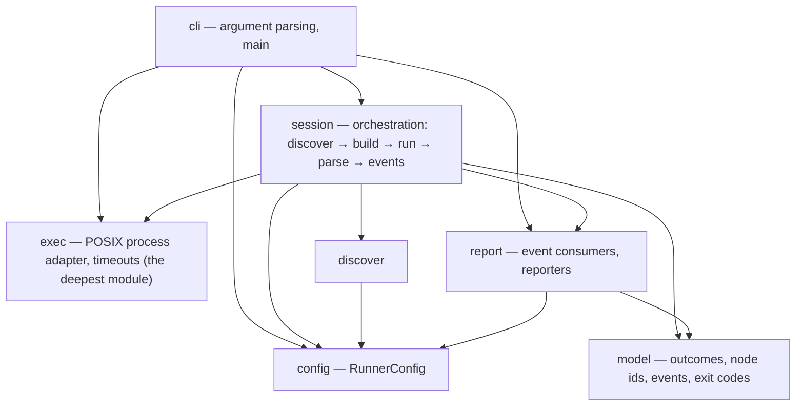

# mtest

A pytest-like test runner for [Mojo](https://www.modular.com/mojo) that
orchestrates the standard library's per-file `TestSuite` — it never replaces it.

> [!NOTE]
> **Status: walking skeleton.** `build/mtest` is a real binary — it discovers
> files, builds each one, executes it directly, and reports a truthful exit
> code — but it has a known ceiling (per-test report parsing is not built yet)
> and is exercised on Linux only so far. See [Status](#status) for exactly what
> that means before you rely on it.

## Why

Mojo's standard library ships a per-file test harness — `TestSuite` — that
discovers `test_*` functions in a module and runs them. It does one file at a
time, and the `mojo test` CLI subcommand that used to drive many files was
removed. That leaves a gap every project fills by hand: a shell loop over
`mojo build`, some `grep` of stdout, and a prayer that the exit code means what
you think it means.

`mtest` fills that gap. It is an **orchestrator on top of `TestSuite`**, not a
replacement. `TestSuite` keeps owning discovery, per-test selection, and the
report format *inside* each file; `mtest` owns everything *between* files —
finding them, building them, running them under supervision, aggregating the
results, and reporting them the way CI expects.

## Design principles

- **Exit-code fidelity is the product.** A test runner whose exit code you
  cannot trust is worse than no runner. `mtest` builds each test file and
  executes the binary directly — live today — because that is the only way
  Mojo reports a truthful process exit code; `mojo run` masks every outcome to
  `1` and never appears in the gate.
- **A crash is not a failure.** An assertion that fails (FAIL) and a process
  that aborts or dies by signal (CRASH) are different events with different
  causes. They already stay distinct in the console summary and the exit code;
  the JUnit XML mapping is still to come.
- **Loud over silent.** Every excluded file is reported with an `EXCLUDED`
  line today; a skipped or truncated run must never look like a run that
  passed everything. Retry and timeout reporting extend this as those
  capabilities land.
- **CI is the customer.** Deterministic, path-sorted console output and a
  hermetic, zero-runtime-dependency build are in place now. Machine-readable
  reports (JUnit XML, GitHub annotations) and parallel workers are the next
  milestones toward that goal — see [Status](#status).

## What works today

- **Discovery** of `test_*.mojo` files under a directory (or an explicit file
  path), with `--exclude` globs and an include path (`-I`).
- **Build-then-execute, never `mojo run`.** Every file is built to a binary
  with `mojo build` and the binary is run directly, because that is the only
  way Mojo reports a truthful process exit code — `mojo run` masks every
  outcome to `1`.
- **A real outcome model at the whole-file granularity**: PASS, FAIL, CRASH
  (death by signal, kept distinct from FAIL), TIMEOUT, and COMPILE-ERROR, each
  with a framed detail section (captured output, or the compiler's own error)
  and a one-line reproduce command.
- **Precompiled package dependencies** via `--precompile`, a per-file
  `--timeout`, gate files that must pass first (`--gate`), stop-after-first-
  failure (`-x`/`--exitfirst`), quiet/verbose console modes (`-q`/`-v`,
  `-s`/`--show-output`), and color control (`--color`, `NO_COLOR`).
- **A clean interrupt.** Ctrl-C stops scheduling, tears down the in-flight
  child's process group, prints a partial summary with NOT-RUN accounting, and
  exits `2`.
- **A deterministic console summary** and a documented, honest ceiling — see
  [Status](#status).

What is **not** built yet: per-test results inside a file (`-k`, `--maxfail`,
`collect`), parallel workers (`-n`/`--workers`), retries/flaky handling,
`--compile-timeout` enforcement, and machine reporters (`--junit-xml`,
`--gh-annotations`). Each is recognized by the parser and refused before any
test runs — see [CLI reference](#cli-reference).

## Examples

Every command below was run against this build. `mtest` spawns a `mojo build`
child per file, so `mojo` must be on that child's `PATH` — run it under
`pixi run` (or inside a `pixi shell`), after building the binary:

```console
$ pixi run build-bin
```

### A passing run

```console
$ pixi run bash -c 'build/mtest testdata/suite/test_passing.mojo'
mtest 0.1.0-dev (mojo)
root: /home/mikko/dev/mtest   selected: 1 files   excluded: 0

PASS           testdata/suite/test_passing.mojo  0.02s

===== 1 passed, 0 failed, 0 crashed, 0 timed out, 0 compile error (0 excluded, 0 not run) in 0.4s =====
$ echo $?
0
```

### A mixed run — FAIL, CRASH, COMPILE-ERROR, and PASS together

```console
$ pixi run bash -c 'build/mtest testdata/suite'
mtest 0.1.0-dev (mojo)
root: /home/mikko/dev/mtest   selected: 7 files   excluded: 0

PASS           testdata/suite/nested/test_nested.mojo  0.02s
COMPILE-ERROR  testdata/suite/test_compile_error.mojo  0.00s
CRASH          testdata/suite/test_crashing.mojo  1.12s  (signal 4 — SIGILL, illegal instruction)
FAIL           testdata/suite/test_failing.mojo  0.07s
PASS           testdata/suite/test_noisy.mojo  0.02s
PASS           testdata/suite/test_passing.mojo  0.02s
PASS           testdata/suite/test_zero.mojo   0.07s

--- COMPILE-ERROR testdata/suite/test_compile_error.mojo — mojo build said: ---
/home/mikko/dev/mtest/testdata/suite/test_compile_error.mojo:12:17: error: use of unknown declaration 'this_symbol_is_never_defined_anywhere'
    var value = this_symbol_is_never_defined_anywhere()
                ^~~~~~~~~~~~~~~~~~~~~~~~~~~~~~~~~~~~~
mojo: error: failed to parse the provided Mojo source module
reproduce: mojo build testdata/suite/test_compile_error.mojo -o build/bin/testdata_ssuite_stest_ucompile_uerror

--- CRASH testdata/suite/test_crashing.mojo (signal 4 — SIGILL, illegal instruction) — captured stdout ---
ABORT: /home/mikko/dev/mtest/testdata/suite/test_crashing.mojo:17:10: simulated hard crash
--- captured stderr ---
#0 0x00007e9f9e0b633b (/home/mikko/dev/mtest/.pixi/envs/default/lib/libKGENCompilerRTShared.so+0x7233b)
#1 0x00007e9f9e0b34a6 (/home/mikko/dev/mtest/.pixi/envs/default/lib/libKGENCompilerRTShared.so+0x6f4a6)
#2 0x00007e9f9e0b7127 (/home/mikko/dev/mtest/.pixi/envs/default/lib/libKGENCompilerRTShared.so+0x73127)
#3 0x00007e9f9de45330 (/lib/x86_64-linux-gnu/libc.so.6+0x45330)
#4 0x0000617133b123a8 test_crashing::test_aborts_process() test_crashing.mojo:0:0
#5 0x0000617133b12ef0 main (/home/mikko/dev/mtest/build/bin/testdata_ssuite_stest_ucrashing+0x1ef0)
#6 0x00007e9f9de2a1ca __libc_start_call_main ./csu/../sysdeps/nptl/libc_start_call_main.h:74:3
#7 0x00007e9f9de2a28b call_init ./csu/../csu/libc-start.c:128:20
#8 0x00007e9f9de2a28b __libc_start_main ./csu/../csu/libc-start.c:347:5
#9 0x0000617133b121d5 _start (/home/mikko/dev/mtest/build/bin/testdata_ssuite_stest_ucrashing+0x11d5)
reproduce: mtest testdata/suite/test_crashing.mojo

--- FAIL testdata/suite/test_failing.mojo (exit 1) — captured stdout ---
Unhandled exception caught during execution: 
Running 3 tests for /home/mikko/dev/mtest/testdata/suite/test_failing.mojo 
    PASS [ 0.001 ] test_first_passes
    FAIL [ 0.010 ] test_second_fails
      At /home/mikko/dev/mtest/testdata/suite/test_failing.mojo:14:17: AssertionError: `left == right` comparison failed:
         left: 1
        right: 2
    PASS [ 0.001 ] test_third_passes
--------
Summary [ 0.010 ] 3 tests run: 2 passed , 1 failed , 0 skipped 
Test suite' /home/mikko/dev/mtest/testdata/suite/test_failing.mojo 'failed! 

--- captured stderr ---
reproduce: mtest testdata/suite/test_failing.mojo


===== 4 passed, 1 failed, 1 crashed, 0 timed out, 1 compile error (0 excluded, 0 not run) in 3.9s =====
$ echo $?
1
```

`test_zero.mojo` above is the documented [zero-test ceiling](#status): it
collects no `test_*` functions, its process exits `0`, and it is counted PASS.

### `--help`

```console
$ pixi run bash -c 'build/mtest --help'
mtest — a pytest-like test runner for Mojo

usage: mtest [run] [PATHS...] [flags] [-- BUILD-ARGS...]

This build serves: paths, --exclude, -I, --build-arg, --gate, --precompile, --mojo, -x/--exitfirst, --timeout, -s/--show-output, -q, -v, --color, --help, --version
$ echo $?
0
```

### `version`

```console
$ pixi run bash -c 'build/mtest version'
mtest 0.1.0-dev
$ echo $?
0
```

### `--exclude`

```console
$ pixi run bash -c 'build/mtest testdata/suite --exclude "*_failing.mojo" --exclude "*_crashing.mojo" --exclude "*_compile_error.mojo"'
mtest 0.1.0-dev (mojo)
root: /home/mikko/dev/mtest   selected: 4 files   excluded: 3

EXCLUDED       testdata/suite/test_compile_error.mojo  (*_compile_error.mojo)
EXCLUDED       testdata/suite/test_crashing.mojo  (*_crashing.mojo)
EXCLUDED       testdata/suite/test_failing.mojo  (*_failing.mojo)
PASS           testdata/suite/nested/test_nested.mojo  0.02s
PASS           testdata/suite/test_noisy.mojo  0.02s
PASS           testdata/suite/test_passing.mojo  0.02s
PASS           testdata/suite/test_zero.mojo   0.02s

===== 4 passed, 0 failed, 0 crashed, 0 timed out, 0 compile error (3 excluded, 0 not run) in 1.7s =====
$ echo $?
0
```

Every exclusion is a loud `EXCLUDED` line naming the pattern that matched — an
excluded file is never silently dropped.

### Interrupt behavior

`Ctrl-C` (SIGINT) stops scheduling new files, sends the in-flight child's
**process group** (not just the child) SIGINT/kill so nothing is orphaned,
prints a partial summary with a NOT-RUN count for everything that never got a
chance to run, and exits `2`. Run against a directory containing a file that
sleeps forever (`testdata/slow/`, interrupted after it started but before it
finished):

```console
$ pixi run bash -c 'build/mtest testdata/slow'
# ^C sent to the process group ~1.5s after the header printed
mtest 0.1.0-dev (mojo)
root: /home/mikko/dev/mtest   selected: 3 files   excluded: 0


===== 0 passed, 0 failed, 0 crashed, 0 timed out, 0 compile error (0 excluded, 3 not run) in 12.0s =====
$ echo $?
2
```

All 3 files are reported NOT-RUN because the interrupt landed before any of
them finished; a `ps` check after exit shows no orphaned `mojo`/`mtest`
processes left behind.

## CLI reference

This section is generated against `build/mtest --help` — it is not allowed to
drift from that output. `run` is the default subcommand: `mtest tests/` means
`mtest run tests/`.

```text
mtest — a pytest-like test runner for Mojo

usage: mtest [run] [PATHS...] [flags] [-- BUILD-ARGS...]

This build serves: paths, --exclude, -I, --build-arg, --gate, --precompile, --mojo, -x/--exitfirst, --timeout, -s/--show-output, -q, -v, --color, --help, --version
```

Flags this build serves:

| Flag | Meaning |
|------|---------|
| `PATHS...` | files, directories (walked recursively for `test_*.mojo`), or an explicit file path |
| `--exclude GLOB` | (repeatable) drop matching files from the run; always reported with a loud `EXCLUDED` line |
| `-I PATH` | (repeatable) an include path forwarded to every `mojo build` |
| `--build-arg ARG` / `-- ARGS...` | (repeatable / pass-through) forward one argument to `mojo build`; `-o`, `--emit`, and extra source operands are refused (exit 4) |
| `--gate PATH` | (repeatable) files that must pass first; a gate failure aborts the whole session |
| `--precompile SRC[:OUT]` | (repeatable) `mojo precompile` a package before any test build; its output directory is auto-added to `-I` |
| `--mojo PATH` | override the `mojo` toolchain resolved from `PATH` (or `MTEST_MOJO`) |
| `-x`, `--exitfirst` | stop scheduling new files after the first failing file |
| `--timeout SECS` | bound a single file's run; exceeding it yields TIMEOUT |
| `-s`, `--show-output MODE` | `failures` (default), `all`, or `none` — which outcomes show captured output |
| `-q` | quiet: omit PASS lines |
| `-v` | verbose: add the build command and per-step timing |
| `--color WHEN` | `auto` (default), `always`, or `never`; `NO_COLOR` also disables color |
| `-h`, `--help` | print this usage text and exit 0 |
| `--version` | print the version and exit 0 |

**Recognized but not yet available** — each is parsed (the parser knows its
spelling and arity) but **refused before any test runs**, with a usage error
naming the flag and the capability that brings it, per the contract's
[availability status](docs/cli-contract.md#24-availability-status-this-build):
`-k` (arrives with the report parser), `--maxfail` (per-test outcomes),
`-n`/`--workers` (parallel workers), `--compile-timeout` (the module-cache
quarantine), `--retries` (retries and flaky handling), `--junit-xml` and
`--gh-annotations` (machine report artifacts), and `--collect-only` / the
`collect` subcommand (test collection). For example:

```console
$ pixi run bash -c 'build/mtest -k foo testdata/suite'
cli: '-k' is part of the mtest v1 contract but is not available in this build (it arrives with the report parser); this build serves: paths, --exclude, -I, --build-arg, --gate, --precompile, --mojo, -x/--exitfirst, --timeout, -s/--show-output, -q, -v, --color, --help, --version (see mtest --help)
$ echo $?
4
```

The full target surface — every flag, the frozen exit-code table, the node-id
grammar, and the outcome vocabulary — is specified in
[docs/cli-contract.md](docs/cli-contract.md); §24 there is the single source of
truth for what this build serves versus refuses.

## Architecture

`mtest` is built in layers, imported one direction only — a layer may import
from a layer below it, never sideways or upward:



`exec` is the **deepest module**: a small process-control interface hiding
pipes, concurrent draining, FFI, platform differences, and cleanup invariants —
it has no dependency on any other layer. `model` and `config` are the other two
leaves. A subprocess-supervision feasibility study confirmed this is buildable
from Mojo on the pinned toolchain via POSIX FFI (separate byte-exact capture, a
terminate-then-kill timeout targeting the whole process group, exit-vs-signal
discrimination).

## Status

`mtest` is a **walking skeleton**: the whole pipeline exists and runs for real
against a real binary, but it does one thing per file — build it, run it,
trust the process exit code — and not yet the finer-grained things a mature
runner does.

- **The zero-test ceiling.** This build does not parse the per-file report
  `TestSuite` prints, so a verdict is decided from the child process's exit
  status alone. A file that builds cleanly and exits `0` without running a
  single test — an empty file, or one where every `test_*` function was
  accidentally renamed — is indistinguishable from a file that ran real tests
  and passed them, and is reported PASS. `testdata/suite/test_zero.mojo` in the
  [examples above](#a-mixed-run--fail-crash-compile-error-and-pass-together)
  demonstrates this. Report parsing and count reconciliation close this hole in
  a later milestone; until then, a PASS from this build means "the file's
  process exited cleanly," not yet "every test in it ran and passed."
- **macOS is untested.** Linux is the only platform the automated gate runs on.
  macOS shares the same POSIX process-supervision surface (`fork`/`execvp`/
  `waitpid`/process groups) the runner depends on, so it is a stated v1 target,
  but nothing has exercised it yet — treat it as unverified until it has its
  own gate.
- **Interrupt behavior is implemented**, not aspirational: Ctrl-C cleans up the
  in-flight child's process group, prints the partial summary with NOT-RUN
  accounting, and exits `2`. See the [example above](#interrupt-behavior).
- **Not built yet**: per-test results inside a file, `-k`/`--maxfail`/
  `collect`, parallel workers, retries/flaky handling, `--compile-timeout`
  enforcement, JUnit XML, and GitHub annotations. Each is refused explicitly
  (exit 4) rather than silently accepted — see
  [CLI reference](#cli-reference).

## Developing

Requires [pixi](https://pixi.sh). The toolchain (Mojo `1.0.0b2`) and all tasks
are pinned in [pixi.toml](pixi.toml).

```console
$ pixi install                 # one-time, the only networked step
$ pixi run ci                  # fmt-check → build → transcripts-check → test → e2e
```

`pixi run ci` is the full gate. Individually:

| Task | What it does |
|------|--------------|
| `pixi run build` | precompile `src/mtest` to `build/mtest.mojopkg` — the compile gate |
| `pixi run build-bin` | link the runnable binary at `build/mtest` from `src/main.mojo` |
| `pixi run transcripts` | regenerate the golden transcripts in place (local only) |
| `pixi run transcripts-check` | regenerate to a temp dir and diff byte-for-byte |
| `pixi run test` | build each `tests/test_*.mojo` and execute the binary directly |
| `pixi run e2e` | build `build/mtest`, then drive it against `testdata/` and assert exact exit codes and console structure |

The golden transcripts are the project's contract with the toolchain: a red
`transcripts-check` after a repository change indicts the change, not the
goldens. They are regenerated only by the generator, never by hand, and only
when the toolchain itself changes (which shows up in every transcript header).

## Non-goals

- **Not an assertion library.** Assertions come from `std.testing`
  (`assert_equal`, `assert_raises`, …). Property testing likewise belongs
  upstream.
- **Not a replacement for `TestSuite`.** `mtest` orchestrates it and depends on
  its per-file protocol. When Mojo ships an official multi-file runner, the goal
  is to remain the fastest-to-re-pin orchestrator on top of it, or to be absorbed
  gracefully.
- **No runtime dependencies.** The runner is pure Mojo; Python appears only in
  build-time tooling under `scripts/`.

## Toolchain

`mtest` pins Mojo `1.0.0b2`. Re-pinning quickly on each Modular release — and
regenerating the protocol transcripts so the diff *is* the changelog — is a core
part of how the project stays trustworthy.

## License

[MIT](LICENSE).
