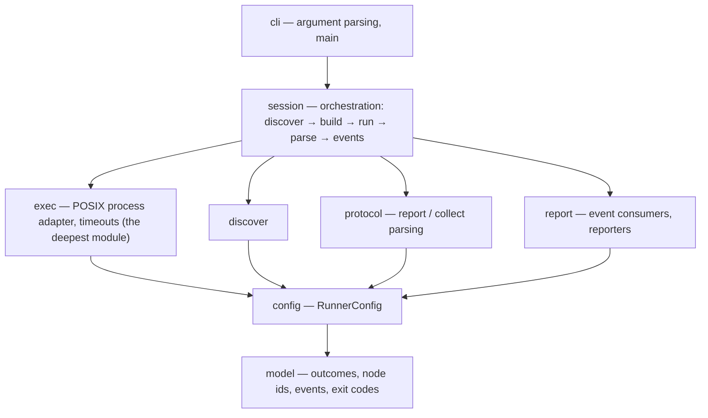

# mtest

A pytest-like test runner for [Mojo](https://www.modular.com/mojo) that
orchestrates the standard library's per-file `TestSuite` — it never replaces it.

> [!IMPORTANT]
> **Status: pre-v1 — the runner is not built yet.** There is no `mtest` command
> to install or run today. This repository currently holds the *foundation*:
> the committed command-line contract, a golden-transcript harness that pins
> `TestSuite`'s real protocol at the pinned toolchain, and the verdict of a
> subprocess-supervision feasibility study. See [Status](#status) for exactly
> what exists and what does not. Nothing below is presented as working unless
> this section says it is.

## Why

Mojo's standard library ships a per-file test harness — `TestSuite` — that
discovers `test_*` functions in a module and runs them. It does one file at a
time, and the `mojo test` CLI subcommand that used to drive many files was
removed. That leaves a gap every project fills by hand: a shell loop over
`mojo build`, some `grep` of stdout, and a prayer that the exit code means what
you think it means.

`mtest` is being built to fill that gap. It is an **orchestrator on top of
`TestSuite`**, not a replacement. `TestSuite` keeps owning discovery, per-test
selection, and the report format *inside* each file; `mtest` owns everything
*between* files — finding them, building them, running them under supervision,
aggregating the results, and reporting them the way CI expects.

## Design principles

These are the principles the tool is being built to. They are goals, not yet
shipped behavior (see [Status](#status)).

- **Exit-code fidelity is the product.** A test runner whose exit code you
  cannot trust is worse than no runner. The plan is to build each test file and
  execute the binary directly, because that is the only way Mojo reports a
  truthful process exit code — `mojo run` masks every outcome to `1`. Green
  should mean green; a nonzero exit should tell you *which* class of failure
  happened.
- **A crash is not a failure.** An assertion that fails and a process that
  aborts or dies by signal are different events with different causes. They stay
  distinct — in the summary, the JUnit XML, and the exit code — so a memory bug
  never hides inside a wall of red assertions.
- **Loud over silent.** Every excluded file, retry, and timeout is reported
  visibly. A run that skipped something must never look like a run that passed
  everything.
- **CI is the customer.** JUnit XML, GitHub Actions annotations, deterministic
  ordering independent of parallel completion, and a hermetic,
  zero-runtime-dependency build are first-class, not afterthoughts.

## Architecture

`mtest` is built in layers, imported one direction only — every layer may import
from layers above it, never sideways or downward.



`exec` is the **deepest module**: a small process-control interface hiding pipes,
concurrent draining, FFI, platform differences, and cleanup invariants. A
subprocess-supervision feasibility study confirmed this is buildable from Mojo on
the pinned toolchain via POSIX FFI (separate byte-exact capture, timeout with a
signal-first process-group kill, exit-vs-signal discrimination).

## Status

**What exists today:**

- **The command-line contract** — [docs/cli-contract.md](docs/cli-contract.md),
  the full v1 CLI specification (subcommands, flags, the frozen exit-code model,
  the outcome vocabulary, the JUnit mapping). Marked DRAFT until the v1.0 freeze.
- **A protocol-transcript oracle** — 8 committed `TestSuite` probe fixtures under
  [fixtures/](fixtures/) and 19 normalized golden transcripts under
  [goldens/transcripts/](goldens/transcripts/) that pin `TestSuite`'s exact
  per-file behavior at Mojo `1.0.0b2`. A committed generator regenerates them
  mechanically and a CI gate diffs them byte-for-byte, so any change in the
  toolchain's protocol shows up as a reviewable diff.
- **A hermetic CI gate** and a self-verifying transcript smoke test.

**What does NOT exist yet** (this is the honest part):

- No `mtest` binary, no argument parser, no discovery, no build/run
  orchestration, no reporters. `src/mtest/` is an empty package that compiles.
- Everything in [Design principles](#design-principles) and the CLI contract
  describes the *target*, not a runnable command.

Platforms: Linux and macOS are the intended v1 targets; only Linux is exercised
so far.

## Developing

Requires [pixi](https://pixi.sh). The toolchain (Mojo `1.0.0b2`) and all tasks
are pinned in [pixi.toml](pixi.toml).

```console
$ pixi install                 # one-time, the only networked step
$ pixi run ci                  # fmt-check → build → transcripts-check → test
```

`pixi run ci` is the full gate. Individually:

| Task | What it does |
|------|--------------|
| `pixi run build` | precompile the (empty) `src/mtest` package — the compile gate |
| `pixi run transcripts` | regenerate the golden transcripts in place (local only) |
| `pixi run transcripts-check` | regenerate to a temp dir and diff byte-for-byte |
| `pixi run test` | build each `tests/test_*.mojo` and execute the binary directly |

The transcript gate, run just now against this tree:

```console
$ pixi run transcripts-check
transcripts-check: OK — transcripts match a fresh regeneration
```

The golden transcripts are the project's contract with the toolchain: a red
`transcripts-check` after a repository change indicts the change, not the
goldens. They are regenerated only by the generator, never by hand, and only
when the toolchain itself changes (which shows up in every transcript header).

## Non-goals

- **Not an assertion library.** Assertions come from `std.testing`
  (`assert_equal`, `assert_raises`, …). Property testing likewise belongs
  upstream.
- **Not a replacement for `TestSuite`.** `mtest` orchestrates it and depends on
  its per-file protocol. When Mojo ships an official multi-file runner, the goal
  is to remain the fastest-to-re-pin orchestrator on top of it, or to be absorbed
  gracefully.
- **No runtime dependencies.** The runner is pure Mojo; Python appears only in
  build-time tooling under `scripts/`.

## Toolchain

`mtest` pins Mojo `1.0.0b2`. Re-pinning quickly on each Modular release — and
regenerating the protocol transcripts so the diff *is* the changelog — is a core
part of how the project stays trustworthy.

## License

[MIT](LICENSE).
