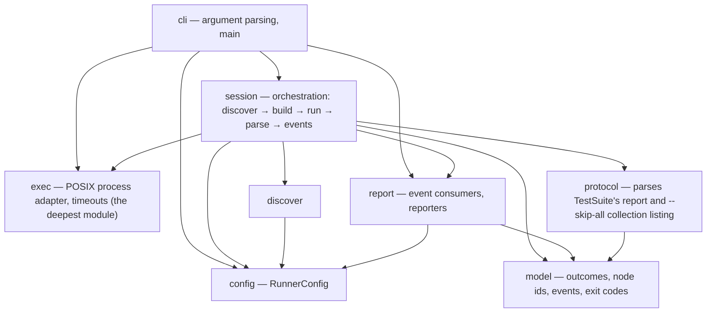

# mtest

A pytest-like test runner for [Mojo](https://www.modular.com/mojo) that
orchestrates the standard library's per-file `TestSuite` — it never replaces it.

> [!NOTE]
> **Status: walking skeleton, now with a per-test spine.** `build/mtest` is a
> real binary — it discovers files, builds each one, executes it directly,
> parses each file's `TestSuite` report, and reports a truthful exit code at
> per-test granularity: `-k`, node-id selection, `--maxfail`, `mtest collect`,
> and `--durations` are all live today. What's still missing: a crash never
> attributes to one test inside its file, captured output is file-scoped (not
> per test), and the whole runner is exercised on Linux only so far. See
> [Status](#status) for exactly what that means before you rely on it.

## Why

Mojo's standard library ships a per-file test harness — `TestSuite` — that
discovers `test_*` functions in a module and runs them. It does one file at a
time, and the `mojo test` CLI subcommand that used to drive many files was
removed. That leaves a gap every project fills by hand: a shell loop over
`mojo build`, some `grep` of stdout, and a prayer that the exit code means what
you think it means.

`mtest` fills that gap. It is an **orchestrator on top of `TestSuite`**, not a
replacement. `TestSuite` keeps owning discovery and the report format *inside*
each file; `mtest` parses that report and owns everything *between* files —
finding them, building them, running them under supervision, selecting and
aggregating tests across files, and reporting them the way CI expects.

## Design principles

- **Exit-code fidelity is the product.** A test runner whose exit code you
  cannot trust is worse than no runner. `mtest` builds each test file and
  executes the binary directly — live today — because that is the only way
  Mojo reports a truthful process exit code; `mojo run` masks every outcome to
  `1` and never appears in the gate.
- **A crash is not a failure.** An assertion that fails (FAIL) and a process
  that aborts or dies by signal (CRASH) are different events with different
  causes. They stay distinct in the console summary and the exit code; the
  JUnit XML mapping is still to come.
- **Loud over silent.** Every excluded file is reported with an `EXCLUDED`
  line today; a skipped, deselected, or truncated run must never look like a
  run that passed everything. Retry and timeout reporting extend this as those
  capabilities land.
- **CI is the customer.** Deterministic, path-sorted console output and a
  hermetic, zero-runtime-dependency build are in place now. Machine-readable
  reports (JUnit XML, GitHub annotations) and parallel workers are the next
  milestones toward that goal — see [Status](#status).

## What works today

- **Discovery** of `test_*.mojo` files under a directory (or an explicit file
  path), with `--exclude` globs and an include path (`-I`).
- **Build-then-execute, never `mojo run`.** Every file is built to a binary
  with `mojo build` and the binary is run directly, because that is the only
  way Mojo reports a truthful process exit code — `mojo run` masks every
  outcome to `1`.
- **Per-test outcomes, selection, and collection.** The `protocol` layer
  parses every file's `TestSuite` report, so results are tracked per test, not
  just per file: `-k STR` (a case-insensitive substring filter over node ids),
  an explicit node-id operand (`path::test`), `--maxfail N` (stop scheduling
  after N failing tests), and `mtest collect` / `--collect-only` (list node
  ids, sorted lexicographically, via a `--skip-all` collection probe, without
  running a single test body).
- **A real outcome model**, now at both file and test granularity: PASS, FAIL,
  CRASH (death by signal, kept distinct from FAIL), TIMEOUT, COMPILE-ERROR,
  and NO-TESTS (a file that builds and exits cleanly but reports zero tests —
  the former "zero-test ceiling" is closed; see [Status](#status)), each with
  a framed detail section (captured output, or the compiler's own error) and a
  one-line reproduce command.
- **`--durations N`**, the N slowest *files* by run-only wall-clock, printed
  after the summary band (survives `-q`).
- **Precompiled package dependencies** via `--precompile`, a per-file
  `--timeout`, gate files that must pass first (`--gate`), stop-after-first-
  failure (`-x`/`--exitfirst`), quiet/verbose console modes (`-q`/`-v`,
  `-s`/`--show-output`), and color control (`--color`, `NO_COLOR`).
- **A clean interrupt.** Ctrl-C stops scheduling, tears down the in-flight
  child's process group, prints a partial summary with NOT-RUN accounting, and
  exits `2`.
- **A deterministic console summary** and a documented, honest set of
  remaining limits — see [Status](#status).

What is **not** built yet: parallel workers (`-n`/`--workers`), test sharding
(`--shard`) and serial pinning (`--serial`), retries/flaky handling
(`--retries`), `--compile-timeout` enforcement, the machine event stream
(`--json`), and machine reporters (`--junit-xml`, `--gh-annotations`). Each is
recognized by the parser and refused before any test runs — see
[CLI reference](#cli-reference).

## Examples

Every command below was run against this build. `mtest` spawns a `mojo build`
child per file, so `mojo` must be on that child's `PATH` — run it under
`pixi run` (or inside a `pixi shell`), after building the binary:

```console
$ pixi run build-bin
```

### A passing run

```console
$ pixi run bash -c 'build/mtest testdata/suite/test_passing.mojo'
mtest 0.1.0-dev (mojo)
root: /home/mikko/dev/mtest   selected: 1 files   excluded: 0

PASS           testdata/suite/test_passing.mojo  0.07s

===== 3 passed, 0 failed, 0 skipped (0 excluded, 0 not run) in 0.5s =====
$ echo $?
0
```

`test_passing.mojo` has three `test_*` functions; the summary counts them
individually (`3 passed`), not the one file that held them.

### A mixed run — FAIL, CRASH, COMPILE-ERROR, NO-TESTS, and PASS together

```console
$ pixi run bash -c 'build/mtest testdata/suite'
mtest 0.1.0-dev (mojo)
root: /home/mikko/dev/mtest   selected: 7 files   excluded: 0

PASS           testdata/suite/nested/test_nested.mojo  0.07s
COMPILE-ERROR  testdata/suite/test_compile_error.mojo  0.00s
CRASH          testdata/suite/test_crashing.mojo  1.12s  (signal 4 — SIGILL, illegal instruction)
FAIL           testdata/suite/test_failing.mojo  0.08s
PASS           testdata/suite/test_noisy.mojo  0.02s
PASS           testdata/suite/test_passing.mojo  0.02s
NO-TESTS       testdata/suite/test_zero.mojo   0.07s

--- COMPILE-ERROR testdata/suite/test_compile_error.mojo — mojo build said: ---
/home/mikko/dev/mtest/testdata/suite/test_compile_error.mojo:12:17: error: use of unknown declaration 'this_symbol_is_never_defined_anywhere'
    var value = this_symbol_is_never_defined_anywhere()
                ^~~~~~~~~~~~~~~~~~~~~~~~~~~~~~~~~~~~~
mojo: error: failed to parse the provided Mojo source module
reproduce: mojo build testdata/suite/test_compile_error.mojo -o build/bin/testdata_ssuite_stest_ucompile_uerror

--- CRASH testdata/suite/test_crashing.mojo (signal 4 — SIGILL, illegal instruction) — captured output (file-scoped; TestSuite does not attribute output to individual tests) ---
ABORT: /home/mikko/dev/mtest/testdata/suite/test_crashing.mojo:17:10: simulated hard crash
--- captured stderr ---
#0 0x00007ef08659c33b (/home/mikko/dev/mtest/.pixi/envs/default/lib/libKGENCompilerRTShared.so+0x7233b)
#1 0x00007ef0865994a6 (/home/mikko/dev/mtest/.pixi/envs/default/lib/libKGENCompilerRTShared.so+0x6f4a6)
#2 0x00007ef08659d127 (/home/mikko/dev/mtest/.pixi/envs/default/lib/libKGENCompilerRTShared.so+0x73127)
#3 0x00007ef086245330 (/lib/x86_64-linux-gnu/libc.so.6+0x45330)
#4 0x0000604b8bdac3a8 test_crashing::test_aborts_process() test_crashing.mojo:0:0
#5 0x0000604b8bdacef0 main (/home/mikko/dev/mtest/build/bin/testdata_ssuite_stest_ucrashing+0x1ef0)
#6 0x00007ef08622a1ca __libc_start_call_main ./csu/../sysdeps/nptl/libc_start_call_main.h:74:3
#7 0x00007ef08622a28b call_init ./csu/../csu/libc-start.c:128:20
#8 0x00007ef08622a28b __libc_start_main ./csu/../csu/libc-start.c:347:5
#9 0x0000604b8bdac1d5 _start (/home/mikko/dev/mtest/build/bin/testdata_ssuite_stest_ucrashing+0x11d5)
reproduce: mtest testdata/suite/test_crashing.mojo

--- FAIL testdata/suite/test_failing.mojo::test_second_fails ---
At testdata/suite/test_failing.mojo:14:17: AssertionError: `left == right` comparison failed:
   left: 1
  right: 2
reproduce: mtest testdata/suite/test_failing.mojo::test_second_fails

--- FAIL testdata/suite/test_failing.mojo (exit 1) — captured output (file-scoped; TestSuite does not attribute output to individual tests) ---
Unhandled exception caught during execution: 
Running 3 tests for /home/mikko/dev/mtest/testdata/suite/test_failing.mojo 
    PASS [ 0.001 ] test_first_passes
    FAIL [ 0.058 ] test_second_fails
      At /home/mikko/dev/mtest/testdata/suite/test_failing.mojo:14:17: AssertionError: `left == right` comparison failed:
         left: 1
        right: 2
    PASS [ 0.001 ] test_third_passes
--------
Summary [ 0.059 ] 3 tests run: 2 passed , 1 failed , 0 skipped 
Test suite' /home/mikko/dev/mtest/testdata/suite/test_failing.mojo 'failed! 

--- captured stderr ---


===== 9 passed, 1 failed, 0 skipped, 1 crashed, 1 compile error (0 excluded, 0 not run) in 3.9s =====
$ echo $?
1
```

Two details worth naming explicitly:

- **The summary band's units are deliberately mixed.** `passed`/`failed`/
  `skipped` count *tests* (`test_failing.mojo` contributes 2 passed + 1 failed
  on its own); `crashed`/`compile error` count *files*, because an abnormal
  outcome — a crash, a timeout, a compile error — has no reliable per-test
  breakdown. This is not a bug; it is the honest boundary of what the runner
  can attribute (see [Status](#status)).
- `test_zero.mojo` above is reported **NO-TESTS**, not PASS: it builds and
  exits `0`, but its `TestSuite` report shows zero tests ran. This closes what
  used to be an open "zero-test ceiling" — a file that never ran a test used
  to be indistinguishable from a real pass. It still doesn't fail the *whole*
  session by itself here (other files fail this run regardless), but a
  directory containing *only* NO-TESTS files collects nothing and exits `5`
  — see the [`-k`/collect examples](#selecting-tests---k-and-node-ids) below.

### `--help`

```console
$ pixi run bash -c 'build/mtest --help'
mtest — a pytest-like test runner for Mojo

usage: mtest [run] [PATHS...] [flags] [-- BUILD-ARGS...]

This build serves: paths, --exclude, -I, --build-arg, --gate, --precompile, --mojo, -x/--exitfirst, --timeout, -s/--show-output, -q, -v, --color, -k, --maxfail, --durations, collect/--collect-only, --help, --version
$ echo $?
0
```

### `version`

```console
$ pixi run bash -c 'build/mtest version'
mtest 0.1.0-dev
$ echo $?
0
```

### `--exclude`

```console
$ pixi run bash -c 'build/mtest testdata/suite --exclude "*_failing.mojo" --exclude "*_crashing.mojo" --exclude "*_compile_error.mojo"'
mtest 0.1.0-dev (mojo)
root: /home/mikko/dev/mtest   selected: 4 files   excluded: 3

EXCLUDED       testdata/suite/test_compile_error.mojo  (*_compile_error.mojo)
EXCLUDED       testdata/suite/test_crashing.mojo  (*_crashing.mojo)
EXCLUDED       testdata/suite/test_failing.mojo  (*_failing.mojo)
PASS           testdata/suite/nested/test_nested.mojo  0.07s
PASS           testdata/suite/test_noisy.mojo  0.02s
PASS           testdata/suite/test_passing.mojo  0.02s
NO-TESTS       testdata/suite/test_zero.mojo   0.02s

===== 7 passed, 0 failed, 0 skipped (3 excluded, 0 not run) in 1.8s =====
$ echo $?
0
```

Every exclusion is a loud `EXCLUDED` line naming the pattern that matched — an
excluded file is never silently dropped.

### Selecting tests — `-k` and node ids

`testdata/matrix/` holds two files with distinctly named tests, built for
exactly this: `test_alpha.mojo` (`test_alpha_one`, `test_alpha_two`,
`test_alpha_three`) and `test_beta.mojo` (`test_beta_one`, `test_beta_two`).

`-k STR` is a case-insensitive substring filter over the full node id
(`path::name`), so it matches on the file path too, not just the test name:

```console
$ pixi run bash -c 'build/mtest -k one testdata/matrix'
mtest 0.1.0-dev (mojo)
root: /home/mikko/dev/mtest   selected: 2 files   excluded: 0

PASS           testdata/matrix/test_alpha.mojo 0.02s
PASS           testdata/matrix/test_beta.mojo  0.03s

===== 2 passed, 0 failed, 0 skipped (0 excluded, 0 not run, 3 deselected) in 0.9s =====
$ echo $?
0
```

Both files still get scheduled and run (each has an `_one` test), but the
non-matching tests are removed and counted once, as `3 deselected` — they are
never listed individually, unlike an `EXCLUDED` file.

A node-id operand (`path::test`) selects exactly one test; every non-selected
test in the file is deselected the same way:

```console
$ pixi run bash -c 'build/mtest testdata/matrix/test_alpha.mojo::test_alpha_two'
mtest 0.1.0-dev (mojo)
root: /home/mikko/dev/mtest   selected: 1 files   excluded: 0

PASS           testdata/matrix/test_alpha.mojo 0.03s

===== 1 passed, 0 failed, 0 skipped (0 excluded, 0 not run, 2 deselected) in 0.5s =====
$ echo $?
0
```

If **every** test in a file is deselected, the file itself is never scheduled
and is counted `not run` (distinct from the per-test `deselected` count):

```console
$ pixi run bash -c 'build/mtest -k passing testdata/suite/test_passing.mojo testdata/suite/test_noisy.mojo testdata/suite/test_failing.mojo'
mtest 0.1.0-dev (mojo)
root: /home/mikko/dev/mtest   selected: 3 files   excluded: 0

PASS           testdata/suite/test_passing.mojo  0.02s

===== 3 passed, 0 failed, 0 skipped (0 excluded, 2 not run, 6 deselected) in 1.3s =====
$ echo $?
0
```

(`-k passing` matches every test in `test_passing.mojo` because the filename
itself contains "passing"; the other two files contribute zero matches, so
they show up as `2 not run` rather than being built for nothing shown.) A `-k`
that empties the whole session is not an error by itself, but the session then
has nothing to run and exits `5`.

### `--maxfail` — stop after N failing tests

```console
$ pixi run bash -c 'build/mtest --maxfail 1 testdata/maxfail'
mtest 0.1.0-dev (mojo)
root: /home/mikko/dev/mtest   selected: 3 files   excluded: 0

FAIL           testdata/maxfail/test_a_fail.mojo  0.07s

--- FAIL testdata/maxfail/test_a_fail.mojo::test_one_fails ---
At testdata/maxfail/test_a_fail.mojo:10:17: AssertionError: `left == right` comparison failed:
   left: 1
  right: 2
reproduce: mtest testdata/maxfail/test_a_fail.mojo::test_one_fails

--- FAIL testdata/maxfail/test_a_fail.mojo (exit 1) — captured output (file-scoped; TestSuite does not attribute output to individual tests) ---
Unhandled exception caught during execution: 
Running 1 tests for /home/mikko/dev/mtest/testdata/maxfail/test_a_fail.mojo 
    FAIL [ 0.029 ] test_one_fails
      At /home/mikko/dev/mtest/testdata/maxfail/test_a_fail.mojo:10:17: AssertionError: `left == right` comparison failed:
         left: 1
        right: 2
--------
Summary [ 0.029 ] 1 tests run: 0 passed , 1 failed , 0 skipped 
Test suite' /home/mikko/dev/mtest/testdata/maxfail/test_a_fail.mojo 'failed! 

--- captured stderr ---


===== 0 passed, 1 failed, 0 skipped (0 excluded, 2 not run) in 0.5s =====
$ echo $?
1
```

`--maxfail 1` stops *scheduling* once the first failing test is seen; the two
remaining files (one more failure, one pass) are never built and are counted
`not run`. `N=0` (the default) means no limit. See [Status](#status) for the
one honest caveat: the check lands *between* files, not mid-file.

### `collect` — listing node ids without running anything

`mtest collect` (and `mtest --collect-only`) compiles each file, runs it under
`--skip-all` to enumerate its tests without executing a single test body, and
lists the resulting node ids sorted **lexicographically** — the runner's own
frozen order, not source declaration order:

```console
$ pixi run bash -c 'build/mtest collect testdata/matrix'
testdata/matrix/test_alpha.mojo::test_alpha_one
testdata/matrix/test_alpha.mojo::test_alpha_three
testdata/matrix/test_alpha.mojo::test_alpha_two
testdata/matrix/test_beta.mojo::test_beta_one
testdata/matrix/test_beta.mojo::test_beta_two
$ echo $?
0
```

(Note `test_alpha_three` sorts before `test_alpha_two` — plain string order,
not declaration order or numeric order.)

A file that can't be probed — a compile error, a crash, or a timeout during
the `--skip-all` probe itself — writes a diagnostic to stderr and the listing
**continues** for the rest:

```console
$ pixi run bash -c 'build/mtest collect testdata/collect --timeout 2'
collect: testdata/collect/test_probe_crash.mojo: the --skip-all probe crashed
collect: testdata/collect/test_probe_hang.mojo: the --skip-all probe timed out
testdata/collect/test_probe_ok.mojo::test_one
testdata/collect/test_probe_ok.mojo::test_two
$ echo $?
1
```

### `--durations` — the slowest files

After the summary band, `--durations N` prints the `N` slowest **files** by
run-only wall-clock (build time is not counted). The header always states the
*actual* number of rows, `min(N, files that ran)` — asking for more than ran
does not pad the list:

```console
$ pixi run bash -c 'build/mtest --durations 10 testdata/matrix'
mtest 0.1.0-dev (mojo)
root: /home/mikko/dev/mtest   selected: 2 files   excluded: 0

PASS           testdata/matrix/test_alpha.mojo 0.02s
PASS           testdata/matrix/test_beta.mojo  0.07s

===== 5 passed, 0 failed, 0 skipped (0 excluded, 0 not run) in 0.9s =====

slowest 2 files:
  testdata/matrix/test_beta.mojo  0.07s
  testdata/matrix/test_alpha.mojo  0.02s
$ echo $?
0
```

`N=0` (the default) disables the list; an explicit `--durations` survives
`-q`. It ranks whole files, never individual tests — see [Status](#status).

### Interrupt behavior

`Ctrl-C` (SIGINT) stops scheduling new files, sends the in-flight child's
**process group** (not just the child) SIGINT/kill so nothing is orphaned,
prints a partial summary with a NOT-RUN count for everything that never got a
chance to run, and exits `2`. Run against a directory containing a file that
sleeps forever (`testdata/slow/`, interrupted after it started but before it
finished):

```console
$ pixi run bash -c 'build/mtest testdata/slow'
# ^C sent to the process group ~1.5s after the header printed
mtest 0.1.0-dev (mojo)
root: /home/mikko/dev/mtest   selected: 3 files   excluded: 0


===== 0 passed, 0 failed, 0 skipped (0 excluded, 3 not run) in 1.5s =====
$ echo $?
2
```

All 3 files are reported NOT-RUN because the interrupt landed before any of
them finished; a `ps` check after exit shows no orphaned `mojo`/`mtest`
processes left behind.

## CLI reference

This section is generated against `build/mtest --help` — it is not allowed to
drift from that output. `run` is the default subcommand: `mtest tests/` means
`mtest run tests/`.

```text
mtest — a pytest-like test runner for Mojo

usage: mtest [run] [PATHS...] [flags] [-- BUILD-ARGS...]

This build serves: paths, --exclude, -I, --build-arg, --gate, --precompile, --mojo, -x/--exitfirst, --timeout, -s/--show-output, -q, -v, --color, -k, --maxfail, --durations, collect/--collect-only, --help, --version
```

Flags this build serves:

| Flag | Meaning |
|------|---------|
| `PATHS...` | files, directories (walked recursively for `test_*.mojo`), an explicit file path, or a node id (`path::test`, selects one test) |
| `-k STR` | case-insensitive substring filter over node ids; at most one `-k` in this build; a `-k` that empties the whole session exits `5` |
| `--exclude GLOB` | (repeatable) drop matching files from the run; always reported with a loud `EXCLUDED` line |
| `-I PATH` | (repeatable) an include path forwarded to every `mojo build` |
| `--build-arg ARG` / `-- ARGS...` | (repeatable / pass-through) forward one argument to `mojo build`; `-o`, `--emit`, and extra source operands are refused (exit 4) |
| `--gate PATH` | (repeatable) files that must pass first; a gate failure aborts the whole session |
| `--precompile SRC[:OUT]` | (repeatable) `mojo precompile` a package before any test build; its output directory is auto-added to `-I` |
| `--mojo PATH` | override the `mojo` toolchain resolved from `PATH` (or `MTEST_MOJO`) |
| `-x`, `--exitfirst` | stop scheduling new files after the first failing file |
| `--maxfail N` | stop scheduling once `N` tests have failed (`N=0`, the default, means no limit); the check lands between files, not mid-file |
| `--timeout SECS` | bound a single file's run; exceeding it yields TIMEOUT |
| `-s`, `--show-output MODE` | `failures` (default), `all`, or `none` — which outcomes show captured output |
| `--durations N` | print the `N` slowest files by run-only wall-clock after the summary (`N=0`, the default, disables it); survives `-q` |
| `-q` | quiet: omit PASS lines |
| `-v` | verbose: add the build command and per-step timing |
| `--color WHEN` | `auto` (default), `always`, or `never`; `NO_COLOR` also disables color |
| `collect [PATHS] [flags]`, `--collect-only` | list node ids, sorted lexicographically, instead of running anything |
| `-h`, `--help` | print this usage text and exit 0 |
| `--version` | print the version and exit 0 |

**Recognized but not yet available** — each is parsed (the parser knows its
spelling and arity) but **refused before any test runs**, with a usage error
naming the flag and the capability that brings it, per the contract's
[availability status](docs/cli-contract.md#24-availability-status-this-build):
`-n`/`--workers` (parallel workers), `--compile-timeout` (the module-cache
quarantine), `--retries` (retries and flaky handling), `--junit-xml` and
`--gh-annotations` (machine report artifacts), `--shard` (test sharding),
`--serial` (serial execution pinning), and `--json` (the machine event
stream). For example:

```console
$ pixi run bash -c 'build/mtest --shard 1/2 testdata/suite'
cli: '--shard' is part of the mtest v1 contract but is not available in this build (it arrives with test sharding); this build serves: paths, --exclude, -I, --build-arg, --gate, --precompile, --mojo, -x/--exitfirst, --timeout, -s/--show-output, -q, -v, --color, -k, --maxfail, --durations, collect/--collect-only, --help, --version (see mtest --help)
$ echo $?
4
```

The full target surface — every flag, the frozen exit-code table, the node-id
grammar, and the outcome vocabulary — is specified in
[docs/cli-contract.md](docs/cli-contract.md); §24 there is the single source of
truth for what this build serves versus refuses.

## Architecture

`mtest` is built in layers, imported one direction only — a layer may import
from a layer below it, never sideways or upward:



`exec` is the **deepest module**: a small process-control interface hiding
pipes, concurrent draining, FFI, platform differences, and cleanup invariants —
it has no dependency on any other layer. `model` and `config` are true leaves
too (zero internal dependencies); `protocol` depends only on `model` — it is
the parser that turns `TestSuite`'s printed report, and its `--skip-all`
collection listing, into the typed events everything above it consumes. A
subprocess-supervision feasibility study confirmed the whole pipeline is
buildable from Mojo on the pinned toolchain via POSIX FFI (separate byte-exact
capture, a terminate-then-kill timeout targeting the whole process group,
exit-vs-signal discrimination).

## Self-hosting

`mtest` runs its own test suite. `pixi run test` builds `build/mtest` and then
runs `build/mtest -I build -I tests/support tests/` — the real binary,
executing itself over its own 55 classified unit/integration suites, never
`mojo run` — and
`scripts/self_host_check.py` propagates that exit code *and* independently
inventories `tests/unit/` and `tests/integration/` (without asking `mtest`) to
confirm the exact result-row path set agrees with disk: proof the runner
discovered every one of its own test files and silently skipped none. Executed
for this report:

```console
$ pixi run bash -c 'build/mtest --durations 5 -q -I build -I tests/support tests/'
===== 522 passed, 0 failed, 0 skipped (0 excluded, 0 not run) in 133.1s =====

slowest 5 files:
  tests/integration/test_session_maxfail.mojo  27.39s
  tests/integration/test_session_collect.mojo  17.54s
  tests/integration/test_session_selection.mojo  17.08s
  tests/integration/test_session_gates.mojo  7.21s
  tests/integration/test_session_handshake.mojo  6.27s
$ echo $?
0
```

`mtest collect -I build -I tests/support tests/` lists all 522 node ids the dogfood run above
selected (abbreviated here):

```console
$ pixi run bash -c 'build/mtest collect -I build -I tests/support tests/'
tests/integration/test_discover_pipeline.mojo::test_default_path_falls_back_to_root
tests/integration/test_discover_pipeline.mojo::test_default_path_prefers_tests_dir
tests/integration/test_discover_pipeline.mojo::test_empty_walk_is_not_an_error
tests/integration/test_discover_pipeline.mojo::test_exclude_removes_and_records_and_flags_stale
tests/integration/test_discover_pipeline.mojo::test_exclude_wins_over_gate
tests/integration/test_discover_pipeline.mojo::test_explicit_file_operand_bypasses_pattern
tests/integration/test_discover_pipeline.mojo::test_gate_overlap_is_promoted_to_gate_only
tests/integration/test_discover_pipeline.mojo::test_malformed_node_id_operand_raises
... (508 more lines omitted; 522 node ids across 55 files) ...
tests/unit/test_session_verdict.mojo::test_build_verdict_timed_out_is_compile_error
tests/unit/test_session_verdict.mojo::test_run_verdict_exit_nonzero_is_fail
tests/unit/test_session_verdict.mojo::test_run_verdict_exit_zero_is_pass
tests/unit/test_session_verdict.mojo::test_run_verdict_signal_is_crash
tests/unit/test_session_verdict.mojo::test_run_verdict_spawn_failed_is_not_run_sentinel
tests/unit/test_session_verdict.mojo::test_run_verdict_timed_out_is_timeout
$ echo $?
0
```

This dogfood run is **an additional gate, not the only executor** of
`tests/`. `pixi run ci` runs its independent checks in order, and `test`
(the dogfood above) is only one of them:

- **`test-direct`** — the mtest-**independent** twin: builds and executes
  every suite under `tests/unit/` and `tests/integration/` directly, one process per file, with no
  `mtest` involved at all. If `test-direct` and `test` (mtest running the same
  files on itself) ever disagree on outcome, that disagreement is a
  self-hosting bug in `mtest`, not noise — the two are meant to agree because
  they run the identical built binaries.
- **`test`** — the dogfood gate described above (`self_host_check.py`).
- **`e2e`** — the binary end-to-end gate: builds `build/mtest`, then drives it
  against the committed known-outcome tree under `testdata/` (via
  `testdata/manifest.json`) and asserts exact exit codes and console
  structure. Every example in this README is a hand-run instance of what
  `e2e` checks automatically.
- **`transcripts-check`** — the protocol pin: regenerates per-file protocol
  `TestSuite` report transcripts from committed fixtures at the pinned Mojo
  toolchain and diffs them byte-for-byte against `tests/snapshots/protocol/`. This
  is the oracle the `protocol` layer is parsed against; a red diff here after
  a repository change indicts the change, not the snapshots.

## Status

`mtest` is a **walking skeleton**: the whole pipeline exists and runs for real
against a real binary, including per-test selection, collection, and
reporting — but several finer-grained things a mature runner does are still
open, and are stated honestly here rather than glossed over.

- **The zero-test ceiling is closed.** This build parses the per-file report
  `TestSuite` prints (the `protocol` layer), so a file that builds cleanly and
  exits `0` without running a single test — an empty file, or one where every
  `test_*` function was accidentally renamed — is no longer indistinguishable
  from a real pass. It is reported **NO-TESTS**, excluded from the `passed`
  count, and a session that collects nothing but NO-TESTS files exits `5`
  ("nothing collected"), the same as an empty walk. `testdata/suite/test_zero.mojo`
  in the [mixed-run example above](#a-mixed-run--fail-crash-compile-error-no-tests-and-pass-together)
  demonstrates this.
- **A crashed file's tests are unattributed.** When a file CRASHes, the
  outcome is reported at the **file** level only — `TestSuite`'s report never
  reaches a conclusion when the process dies mid-run, so the runner cannot
  attribute the crash to one of the file's individual tests. The CRASH block
  in the [mixed-run example](#a-mixed-run--fail-crash-compile-error-no-tests-and-pass-together)
  shows no per-test breakdown for `test_crashing.mojo`'s three tests, unlike
  the FAIL block right below it, which names the one test that failed.
- **Captured output is file-scoped, not per-test.** Every captured-output
  block is explicitly labeled "captured output (file-scoped; TestSuite does
  not attribute output to individual tests)" — `TestSuite` does not segment a
  file's stdout/stderr by which test produced which line, so `mtest` cannot
  either. A FAIL block's parsed assertion detail *is* per-test; the raw
  captured-output block beneath it is not.
- **`--maxfail` can overshoot.** The check that stops scheduling lands
  **between** files, not mid-file: a file already in flight always finishes.
  A file with two or more failing tests can therefore push the true failing
  count past `N` before the runner notices — the
  [`--maxfail` example above](#--maxfail--stop-after-n-failing-tests) stops at
  exactly 1 only because each `testdata/maxfail/` fixture contains a single
  failing test.
- **`--durations` is file-level only.** The slowest-files list ranks whole
  files by run-only wall-clock; the slowest individual *test* inside an
  otherwise-fast file is invisible to it. A per-test granularity is reserved
  (`docs/cli-contract.md` §21), blocked on the same upstream per-test-timing
  gap that blocks per-test attribution above.
- **macOS is untested.** Linux is the only platform the automated gate runs
  on. macOS shares the same POSIX process-supervision surface
  (`fork`/`execvp`/`waitpid`/process groups) the runner depends on, so it is a
  stated v1 target, but nothing has exercised it yet — treat it as unverified
  until it has its own gate.
- **Interrupt behavior is implemented**, not aspirational: Ctrl-C cleans up the
  in-flight child's process group, prints the partial summary with NOT-RUN
  accounting, and exits `2`. See the
  [example above](#interrupt-behavior).
- **Not built yet**: parallel workers, test sharding (`--shard`) and serial
  pinning (`--serial`), retries/flaky handling, `--compile-timeout`
  enforcement, the machine event stream (`--json`), JUnit XML, and GitHub
  annotations. Each is refused explicitly (exit 4) rather than silently
  accepted — see [CLI reference](#cli-reference).

## Developing

Requires [pixi](https://pixi.sh). The toolchain (Mojo `1.0.0b2`) and all tasks
are pinned in [pixi.toml](pixi.toml).

```console
$ pixi install                 # one-time, the only networked step
$ pixi run ci                  # fmt-check → harness-check → build → transcripts-check → test-direct → test → e2e
```

`pixi run ci` is the full gate. Individually:

| Task | What it does |
|------|--------------|
| `pixi run build` | precompile `src/mtest` to `build/mtest.mojopkg` — the compile gate |
| `pixi run build-bin` | link the runnable binary at `build/mtest` from `src/main.mojo` |
| `pixi run harness-check` | fast self-tests for recursive suite enumeration and collision-free binary paths |
| `pixi run transcripts` | regenerate protocol snapshots in place (local only) |
| `pixi run transcripts-check` | regenerate to a temp dir and diff byte-for-byte — the protocol pin |
| `pixi run test-unit` | directly build and execute the in-memory unit suites only |
| `pixi run test-integration` | directly build and execute the filesystem/compiler/process integration suites only |
| `pixi run test-direct` | the **independent** twin: build and execute every unit/integration suite directly, one process per file, with no `mtest` involved |
| `pixi run test` | the **dogfood** gate: `build/mtest -I build -I tests/support tests/` running mtest over its own suite, plus exact path-membership verification independent of mtest |
| `pixi run e2e` | build `build/mtest`, then drive it against `testdata/` and assert exact exit codes and console structure |

See [Self-hosting](#self-hosting) for how `test` and `test-direct` relate.

The protocol snapshots are the project's contract with the toolchain: a red
`transcripts-check` after a repository change indicts the change, not the
snapshots. They are regenerated only by the generator, never by hand, and only
when the toolchain itself changes (which shows up in every transcript header).

## Non-goals

- **Not an assertion library.** Assertions come from `std.testing`
  (`assert_equal`, `assert_raises`, …). Property testing likewise belongs
  upstream.
- **Not a replacement for `TestSuite`.** `mtest` orchestrates it and depends on
  its per-file protocol. When Mojo ships an official multi-file runner, the goal
  is to remain the fastest-to-re-pin orchestrator on top of it, or to be absorbed
  gracefully.
- **No runtime dependencies.** The runner is pure Mojo; Python appears only in
  build/test harnesses and test-only subprocess fixtures.

## Toolchain

`mtest` pins Mojo `1.0.0b2`. Re-pinning quickly on each Modular release — and
regenerating the protocol transcripts so the diff *is* the changelog — is a core
part of how the project stays trustworthy.

## License

[MIT](LICENSE).
