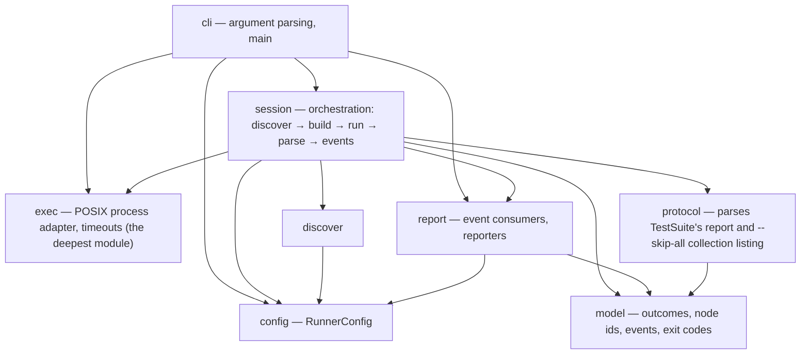

# mtest

A pytest-like test runner for [Mojo](https://www.modular.com/mojo) that
orchestrates the standard library's per-file `TestSuite` — it never replaces it.

> [!NOTE]
> **Status: walking skeleton, now with machine reporters.** `build/mtest` is a
> real binary — it discovers files, builds each one, executes it directly,
> parses each file's `TestSuite` report, and reports a truthful exit code at
> per-test granularity: `-k`, node-id selection, `--maxfail`, `mtest collect`,
> `--durations`, `--retries` (with a FLAKY verdict), `--compile-timeout`,
> `--shard`, and the three machine reporters (`--json`, `--junit-xml`,
> `--gh-annotations`) are all live today, and the project ships a conda
> package built from source. What's still missing: **concurrency** — there
> is no worker pool yet, `-n`/`--workers` and `--serial` are refused, and the
> runner is single-child and sequential; a crash's isolation-rerun attribution
> is bounded and diagnostic-only, never a verdict; captured output is
> file-scoped (not per test); packaged-artifact runtime supervision on macOS is
> unverified; and GitHub's real Checks-UI rendering of the annotation lines is
> a manual, maintainer-run gate that has not been recorded yet. See
> [Status](#status) for exactly what that means before you rely on it.

## Installation

`mtest` ships as a conda package built by
[rattler-build](https://prefix-dev.github.io/rattler-build/) from
[`recipe/recipe.yaml`](recipe/recipe.yaml). The recipe builds `mtest`
**from source**, inside an isolated build environment pinned to the same
toolchain this repo itself builds against (`mojo ==1.0.0b2`, `clang
==18.1.8`) — it never repackages an already-linked binary.

The installed binary is not loader-clean: `readelf -d` shows a direct
`NEEDED` on `libKGENCompilerRTShared.so`, whose transitive closure resolves
entirely inside the Mojo runtime. Rather than vendor those libraries, the
recipe declares a conda **run** dependency:

```yaml
requirements:
  run:
    - mojo-compiler ==1.0.0b2
```

A dedicated CI job proves that dependency is both necessary and sufficient:
it builds the package into a local conda channel, installs it into a
**fresh** scratch environment carrying only the declared run dependency (not
the full `mojo`/`clang` build toolchain), and runs the installed binary
directly against three focused dogfood probes covering the model, native
process supervisor, and session verdict layers.

**Platforms:**

- **linux-64 is the gated platform.** A CI job builds the package, installs
  it from a local channel into that fresh scratch environment, and exercises
  the installed binary end to end.
- **osx-arm64 is declared, not gated.** It matches the recipe's platform list
  and the package channels solve for it, but no CI runner installs or runs
  the packaged artifact there. Current executed macOS evidence stops at package
  build, executable link, and an `--help` smoke run. The unified workflow now
  requires direct, dogfood, and end-to-end source-checkout cells; direct and
  dogfood have passed on hosted macOS, while packaged-artifact **runtime supervision on
  macOS remains a documented ceiling, not a proven target** (see
  [Status](#status)).

The package is not yet published to a public channel. Build it locally with
the recipe and install from the resulting local channel:

```console
$ pixi run package-build   # rattler-build -> build/conda-channel/*.conda; nothing uploaded
$ pixi run package-check   # installs into a fresh scratch env, runs the installed binary
```

Both tasks are standalone — a dedicated CI job runs them, but neither is part
of the ordinary `pixi run ci` gate (see [Developing](#developing)). To build
and run `mtest` straight from a checkout instead of installing a package, see
[Developing](#developing).

The independent package job is intentionally networked: rattler-build solves
its isolated build environment against the Modular and conda-forge channels,
and the fresh scratch installs use the local artifact channel plus those
external channels to resolve its declared runtime dependency. Nothing uploads,
publishes, or authenticates.

## Why

Mojo's standard library ships a per-file test harness — `TestSuite` — that
discovers `test_*` functions in a module and runs them. It does one file at a
time, and the `mojo test` CLI subcommand that used to drive many files was
removed. That leaves a gap every project fills by hand: a shell loop over
`mojo build`, some `grep` of stdout, and a prayer that the exit code means what
you think it means.

`mtest` fills that gap. It is an **orchestrator on top of `TestSuite`**, not a
replacement. `TestSuite` keeps owning discovery and the report format *inside*
each file; `mtest` parses that report and owns everything *between* files —
finding them, building them, running them under supervision, selecting and
aggregating tests across files, and reporting them the way CI expects.

## Design principles

- **Exit-code fidelity is the product.** A test runner whose exit code you
  cannot trust is worse than no runner. `mtest` builds each test file and
  executes the binary directly — live today — because that is the only way
  Mojo reports a truthful process exit code; `mojo run` masks every outcome to
  `1` and never appears in the gate.
- **A crash is not a failure.** An assertion that fails (FAIL) and a process
  that aborts or dies by signal (CRASH) are different events with different
  causes. They stay distinct in the console summary, the exit code, and the
  JUnit XML mapping: FAIL becomes a `<failure>`, CRASH a sentinel `<error>`
  (see [Machine reporters](#machine-reporters)).
- **Loud over silent.** Every excluded file is reported with an `EXCLUDED`
  line today; a skipped, deselected, or truncated run must never look like a
  run that passed everything. Retry and compile-timeout reporting extend this
  now: every crash-class attempt gets its own `TRY` line, a killed compile's
  cache-quarantine posture is announced with a `WARNING`, and a bounded crash
  attribution pass is announced before it runs and never lets a stopped search
  read as a soft accusation.
- **CI is the customer.** Deterministic, path-sorted console output and a
  hermetic, zero-runtime-dependency build are in place now, `--shard` lets
  one suite spread across a CI matrix deterministically, and machine-readable
  reports — JUnit XML and GitHub annotations — are live (see
  [Machine reporters](#machine-reporters)). Parallel workers are the
  remaining milestone toward that goal — see [Status](#status).

## What works today

- **Discovery** of `test_*.mojo` files under a directory (or an explicit file
  path), with `--exclude` globs and an include path (`-I`).
- **Build-then-execute, never `mojo run`.** Every file is built to a binary
  with `mojo build` and the binary is run directly, because that is the only
  way Mojo reports a truthful process exit code — `mojo run` masks every
  outcome to `1`.
- **Per-test outcomes, selection, and collection.** The `protocol` layer
  parses every file's `TestSuite` report, so results are tracked per test, not
  just per file: `-k STR` (a case-insensitive substring filter over node ids),
  an explicit node-id operand (`path::test`), `--maxfail N` (stop scheduling
  after N failing tests), and `mtest collect` / `--collect-only` (list node
  ids, sorted lexicographically, via a `--skip-all` collection probe, without
  running a single test body).
- **A real outcome model**, now at both file and test granularity: PASS, FAIL,
  CRASH (death by signal, kept distinct from FAIL), TIMEOUT, COMPILE-ERROR,
  COMPILE-TIMEOUT, and NO-TESTS (a file that builds and exits cleanly but
  reports zero tests — the former "zero-test ceiling" is closed; see
  [Status](#status)), each with a framed detail section (captured output, or
  the compiler's own error) and a one-line reproduce command. A signal or
  timeout is named **in words** (`signal 11 — SIGSEGV, segmentation fault`,
  `timed out after 1s`), and a kill that had to escalate past a polite
  terminate says so (`escalated to SIGKILL`) in the same line the `TRY`
  attempt log uses, so the two never disagree.
- **`--retries N`**, crash-class only. A run that dies by signal or hits its
  deadline — or a build/precompile that is killed or dies with a compiler-ICE
  signature in its stderr — gets up to `N` extra attempts; a failing
  assertion, an ordinary compile error, or anything else deterministic is
  never retried. A file that fails once and then passes is reported **FLAKY**
  (a pass — exit 0), never silently as a plain PASS. Every attempt gets its
  own `TRY` line naming why it failed; the last attempt is authoritative. On
  the default (non-selection) run path the full build-and-run chain retries;
  under `-k`/a node id, only crash-class **run** retries are wired today (a
  build-side crash-class failure under selection is not yet retried) — see
  [Status](#status).
- **`--compile-timeout SECS`**, bounding a single file's *build* (default
  `600`, `0` disables) the same way `--timeout` bounds its run: exceeding it
  yields **COMPILE-TIMEOUT** with a split-or-exclude hint, killed with a
  compile-specific grace (~5s longer than a run kill) so a compiler flushing
  its module cache gets the chance to exit cleanly on the terminate signal
  before it is force-killed. A killed compile's retry rebuild runs against a
  fresh, quarantined per-attempt module cache, announced with a loud
  `WARNING` — defense-in-depth; see [Status](#status) for what a cache probe
  actually found.
- **`--shard [hash:|slice:]M/N`**, for spreading one suite across a CI matrix:
  splits the discovered file set into `N` disjoint shards before any build and
  runs (or `collect`s) only shard `M`'s files. `hash:` (the default) assigns
  by a stable FNV-1a hash of the file's path, so assignment never depends on
  discovery order or machine; `slice:` deals sorted files round-robin. Gates
  are never sharded — every gate runs on every shard.
- **Bounded crash attribution.** When a file CRASHes, a secondary,
  strictly-bounded pass (at most 32 isolation reruns per file, under a
  120s-per-file/600s-per-session wall-clock budget) re-runs its tests one at a
  time to try to name a culprit. It **never** changes the file's CRASH verdict
  or the exit code — it is diagnostic evidence only, printed on its own
  `ATTRIBUTION` line: `ATTRIBUTED` when one test reproduces the crash alone,
  or a stated reason (`NO-REPRODUCTION`, `PROBE-FAILED`, `RUN-CAP`,
  `TIME-BUDGET`) when it doesn't — the culprit then stands honestly
  **UNATTRIBUTED**, never guessed.
- **`--durations N`**, the N slowest *files* by run-only wall-clock, printed
  after the summary band (survives `-q`).
- **The `SLOW` annotation.** A build or run step whose wall time reaches a
  fixed **60s** threshold (no flag) is flagged `SLOW` on its verdict line —
  an informal note, never an outcome; it never changes a verdict, a count, or
  the exit code. Under `-v` it names which step (build, run, or both) crossed
  the threshold.
- **Precompiled package dependencies** via `--precompile`, a per-file
  `--timeout`, gate files that must pass first (`--gate`), stop-after-first-
  failure (`-x`/`--exitfirst`), quiet/verbose console modes (`-q`/`-v`,
  `-s`/`--show-output`), and color control (`--color`, `NO_COLOR`).
- **A clean interrupt.** Ctrl-C stops scheduling, tears down the in-flight
  child's process group, prints a partial summary with NOT-RUN accounting, and
  exits `2`.
- **Three machine reporters**, composable with the console and with each
  other. `--json PATH|-` writes the versioned NDJSON event stream
  ([docs/json-stream.md](docs/json-stream.md) is the normative spec).
  `--junit-xml PATH` writes a schema-validated JUnit report assembled from
  the runner's own typed events — never a parse of console text — atomically
  renamed onto `PATH` so a prior report survives any failure.
  `--gh-annotations MODE` (`off|on|auto`, default `auto` — on iff
  `GITHUB_ACTIONS=true`) emits GitHub Actions workflow-command annotations in
  a deterministic tail, with every echoed region of captured child output
  wrapped in a per-run `::stop-commands::` fence so a test's own output can
  never forge a workflow command. See [Machine reporters](#machine-reporters)
  below and [Extending mtest](#extending-mtest) for the honest ceilings.
- **A deterministic console summary** and a documented, honest set of
  remaining limits — see [Status](#status).

What is **not** built yet: **concurrency** — parallel workers (`-n`/
`--workers`) and serial pinning (`--serial`, meaningless without a pool).
Each is recognized by the parser and refused before any test runs — see
[CLI reference](#cli-reference).

## Examples

Every command below was run against this build. `mtest` spawns a `mojo build`
child per file, so `mojo` must be on that child's `PATH` — run it under
`pixi run` (or inside a `pixi shell`), after building the binary:

```console
$ pixi run build-bin
```

### A passing run

```console
$ pixi run bash -c 'build/mtest e2e/suite/test_passing.mojo'
mtest 0.4.0 (mojo)
root: /home/mikko/dev/mtest   selected: 1 files   excluded: 0

PASS           e2e/suite/test_passing.mojo  0.07s

===== 3 passed, 0 failed, 0 skipped (0 excluded, 0 not run) in 0.5s =====
$ echo $?
0
```

`test_passing.mojo` has three `test_*` functions; the summary counts them
individually (`3 passed`), not the one file that held them.

### A mixed run — FAIL, CRASH, COMPILE-ERROR, NO-TESTS, and PASS together

```console
$ pixi run bash -c 'build/mtest e2e/suite'
mtest 0.4.0 (mojo)
root: /home/mikko/dev/mtest   selected: 7 files   excluded: 0

PASS           e2e/suite/nested/test_nested.mojo  0.07s
COMPILE-ERROR  e2e/suite/test_compile_error.mojo  0.00s
CRASH          e2e/suite/test_crashing.mojo  1.12s  (signal 4 — SIGILL, illegal instruction)
FAIL           e2e/suite/test_failing.mojo  0.08s
PASS           e2e/suite/test_noisy.mojo  0.02s
PASS           e2e/suite/test_passing.mojo  0.02s
NO-TESTS       e2e/suite/test_zero.mojo   0.07s

--- COMPILE-ERROR e2e/suite/test_compile_error.mojo — mojo build said: ---
/home/mikko/dev/mtest/e2e/suite/test_compile_error.mojo:12:17: error: use of unknown declaration 'this_symbol_is_never_defined_anywhere'
    var value = this_symbol_is_never_defined_anywhere()
                ^~~~~~~~~~~~~~~~~~~~~~~~~~~~~~~~~~~~~
mojo: error: failed to parse the provided Mojo source module
reproduce: mojo build e2e/suite/test_compile_error.mojo -o build/bin/e2e_ssuite_stest_ucompile_uerror

--- CRASH e2e/suite/test_crashing.mojo (signal 4 — SIGILL, illegal instruction) — captured output (file-scoped; TestSuite does not attribute output to individual tests) ---
ABORT: /home/mikko/dev/mtest/e2e/suite/test_crashing.mojo:17:10: simulated hard crash
--- captured stderr ---
#0 0x00007ef08659c33b (/home/mikko/dev/mtest/.pixi/envs/default/lib/libKGENCompilerRTShared.so+0x7233b)
#1 0x00007ef0865994a6 (/home/mikko/dev/mtest/.pixi/envs/default/lib/libKGENCompilerRTShared.so+0x6f4a6)
#2 0x00007ef08659d127 (/home/mikko/dev/mtest/.pixi/envs/default/lib/libKGENCompilerRTShared.so+0x73127)
#3 0x00007ef086245330 (/lib/x86_64-linux-gnu/libc.so.6+0x45330)
#4 0x0000604b8bdac3a8 test_crashing::test_aborts_process() test_crashing.mojo:0:0
#5 0x0000604b8bdacef0 main (/home/mikko/dev/mtest/build/bin/e2e_ssuite_stest_ucrashing+0x1ef0)
#6 0x00007ef08622a1ca __libc_start_call_main ./csu/../sysdeps/nptl/libc_start_call_main.h:74:3
#7 0x00007ef08622a28b call_init ./csu/../csu/libc-start.c:128:20
#8 0x00007ef08622a28b __libc_start_main ./csu/../csu/libc-start.c:347:5
#9 0x0000604b8bdac1d5 _start (/home/mikko/dev/mtest/build/bin/e2e_ssuite_stest_ucrashing+0x11d5)
reproduce: mtest e2e/suite/test_crashing.mojo

--- FAIL e2e/suite/test_failing.mojo::test_second_fails ---
At e2e/suite/test_failing.mojo:14:17: AssertionError: `left == right` comparison failed:
   left: 1
  right: 2
reproduce: mtest e2e/suite/test_failing.mojo::test_second_fails

--- FAIL e2e/suite/test_failing.mojo (exit 1) — captured output (file-scoped; TestSuite does not attribute output to individual tests) ---
Unhandled exception caught during execution: 
Running 3 tests for /home/mikko/dev/mtest/e2e/suite/test_failing.mojo
    PASS [ 0.001 ] test_first_passes
    FAIL [ 0.058 ] test_second_fails
      At /home/mikko/dev/mtest/e2e/suite/test_failing.mojo:14:17: AssertionError: `left == right` comparison failed:
         left: 1
        right: 2
    PASS [ 0.001 ] test_third_passes
--------
Summary [ 0.059 ] 3 tests run: 2 passed , 1 failed , 0 skipped 
Test suite' /home/mikko/dev/mtest/e2e/suite/test_failing.mojo 'failed!

--- captured stderr ---


===== 9 passed, 1 failed, 0 skipped, 1 crashed, 1 compile error (0 excluded, 0 not run) in 3.9s =====
$ echo $?
1
```

Two details worth naming explicitly:

- **The summary band's units are deliberately mixed.** `passed`/`failed`/
  `skipped` count *tests* (`test_failing.mojo` contributes 2 passed + 1 failed
  on its own); `crashed`/`compile error` count *files*, because an abnormal
  outcome — a crash, a timeout, a compile error — has no reliable per-test
  breakdown. This is not a bug; it is the honest boundary of what the runner
  can attribute (see [Status](#status)).
- `test_zero.mojo` above is reported **NO-TESTS**, not PASS: it builds and
  exits `0`, but its `TestSuite` report shows zero tests ran. This closes what
  used to be an open "zero-test ceiling" — a file that never ran a test used
  to be indistinguishable from a real pass. It still doesn't fail the *whole*
  session by itself here (other files fail this run regardless), but a
  directory containing *only* NO-TESTS files collects nothing and exits `5`
  — see the [`-k`/collect examples](#selecting-tests---k-and-node-ids) below.

### `--help`

```console
$ pixi run bash -c 'build/mtest --help'
mtest — a pytest-like test runner for Mojo

usage: mtest [run] [PATHS...] [flags] [-- BUILD-ARGS...]

This build serves: paths, --exclude, -I, --build-arg, --gate, --precompile, --mojo, -x/--exitfirst, --timeout, --compile-timeout, -s/--show-output, -q, -v, --color, -k, --maxfail, --durations, --shard, --retries, --json, --junit-xml, --gh-annotations, collect/--collect-only, --help, --version
$ echo $?
0
```

(this is the same output the [CLI reference](#cli-reference)'s freshness-contracted block below shows — the two are kept in sync, never independently drifted)

### `version`

```console
$ pixi run bash -c 'build/mtest version'
mtest 0.4.0
$ echo $?
0
```

### `--exclude`

```console
$ pixi run bash -c 'build/mtest e2e/suite --exclude "*_failing.mojo" --exclude "*_crashing.mojo" --exclude "*_compile_error.mojo"'
mtest 0.4.0 (mojo)
root: /home/mikko/dev/mtest   selected: 4 files   excluded: 3

EXCLUDED       e2e/suite/test_compile_error.mojo  (*_compile_error.mojo)
EXCLUDED       e2e/suite/test_crashing.mojo  (*_crashing.mojo)
EXCLUDED       e2e/suite/test_failing.mojo  (*_failing.mojo)
PASS           e2e/suite/nested/test_nested.mojo  0.07s
PASS           e2e/suite/test_noisy.mojo  0.02s
PASS           e2e/suite/test_passing.mojo  0.02s
NO-TESTS       e2e/suite/test_zero.mojo   0.02s

===== 7 passed, 0 failed, 0 skipped (3 excluded, 0 not run) in 1.8s =====
$ echo $?
0
```

Every exclusion is a loud `EXCLUDED` line naming the pattern that matched — an
excluded file is never silently dropped.

### Selecting tests — `-k` and node ids

`e2e/matrix/` holds two files with distinctly named tests, built for
exactly this: `test_alpha.mojo` (`test_alpha_one`, `test_alpha_two`,
`test_alpha_three`) and `test_beta.mojo` (`test_beta_one`, `test_beta_two`).

`-k STR` is a case-insensitive substring filter over the full node id
(`path::name`), so it matches on the file path too, not just the test name:

```console
$ pixi run bash -c 'build/mtest -k one e2e/matrix'
mtest 0.4.0 (mojo)
root: /home/mikko/dev/mtest   selected: 2 files   excluded: 0

PASS           e2e/matrix/test_alpha.mojo 0.02s
PASS           e2e/matrix/test_beta.mojo  0.03s

===== 2 passed, 0 failed, 0 skipped (0 excluded, 0 not run, 3 deselected) in 0.9s =====
$ echo $?
0
```

Both files still get scheduled and run (each has an `_one` test), but the
non-matching tests are removed and counted once, as `3 deselected` — they are
never listed individually, unlike an `EXCLUDED` file.

A node-id operand (`path::test`) selects exactly one test; every non-selected
test in the file is deselected the same way:

```console
$ pixi run bash -c 'build/mtest e2e/matrix/test_alpha.mojo::test_alpha_two'
mtest 0.4.0 (mojo)
root: /home/mikko/dev/mtest   selected: 1 files   excluded: 0

PASS           e2e/matrix/test_alpha.mojo 0.03s

===== 1 passed, 0 failed, 0 skipped (0 excluded, 0 not run, 2 deselected) in 0.5s =====
$ echo $?
0
```

If **every** test in a file is deselected, the file itself is never scheduled
and is counted `not run` (distinct from the per-test `deselected` count):

```console
$ pixi run bash -c 'build/mtest -k passing e2e/suite/test_passing.mojo e2e/suite/test_noisy.mojo e2e/suite/test_failing.mojo'
mtest 0.4.0 (mojo)
root: /home/mikko/dev/mtest   selected: 3 files   excluded: 0

PASS           e2e/suite/test_passing.mojo  0.02s

===== 3 passed, 0 failed, 0 skipped (0 excluded, 2 not run, 6 deselected) in 1.3s =====
$ echo $?
0
```

(`-k passing` matches every test in `test_passing.mojo` because the filename
itself contains "passing"; the other two files contribute zero matches, so
they show up as `2 not run` rather than being built for nothing shown.) A `-k`
that empties the whole session is not an error by itself, but the session then
has nothing to run and exits `5`.

### `--maxfail` — stop after N failing tests

```console
$ pixi run bash -c 'build/mtest --maxfail 1 e2e/maxfail'
mtest 0.4.0 (mojo)
root: /home/mikko/dev/mtest   selected: 3 files   excluded: 0

FAIL           e2e/maxfail/test_a_fail.mojo  0.07s

--- FAIL e2e/maxfail/test_a_fail.mojo::test_one_fails ---
At e2e/maxfail/test_a_fail.mojo:10:17: AssertionError: `left == right` comparison failed:
   left: 1
  right: 2
reproduce: mtest e2e/maxfail/test_a_fail.mojo::test_one_fails

--- FAIL e2e/maxfail/test_a_fail.mojo (exit 1) — captured output (file-scoped; TestSuite does not attribute output to individual tests) ---
Unhandled exception caught during execution: 
Running 1 tests for /home/mikko/dev/mtest/e2e/maxfail/test_a_fail.mojo
    FAIL [ 0.029 ] test_one_fails
      At /home/mikko/dev/mtest/e2e/maxfail/test_a_fail.mojo:10:17: AssertionError: `left == right` comparison failed:
         left: 1
        right: 2
--------
Summary [ 0.029 ] 1 tests run: 0 passed , 1 failed , 0 skipped 
Test suite' /home/mikko/dev/mtest/e2e/maxfail/test_a_fail.mojo 'failed!

--- captured stderr ---


===== 0 passed, 1 failed, 0 skipped (0 excluded, 2 not run) in 0.5s =====
$ echo $?
1
```

`--maxfail 1` stops *scheduling* once the first failing test is seen; the two
remaining files (one more failure, one pass) are never built and are counted
`not run`. `N=0` (the default) means no limit. See [Status](#status) for the
one honest caveat: the check lands *between* files, not mid-file.

### `collect` — listing node ids without running anything

`mtest collect` (and `mtest --collect-only`) compiles each file, runs it under
`--skip-all` to enumerate its tests without executing a single test body, and
lists the resulting node ids sorted **lexicographically** — the runner's own
frozen order, not source declaration order:

```console
$ pixi run bash -c 'build/mtest collect e2e/matrix'
e2e/matrix/test_alpha.mojo::test_alpha_one
e2e/matrix/test_alpha.mojo::test_alpha_three
e2e/matrix/test_alpha.mojo::test_alpha_two
e2e/matrix/test_beta.mojo::test_beta_one
e2e/matrix/test_beta.mojo::test_beta_two
$ echo $?
0
```

(Note `test_alpha_three` sorts before `test_alpha_two` — plain string order,
not declaration order or numeric order.)

A file that can't be probed — a compile error, a crash, or a timeout during
the `--skip-all` probe itself — writes a diagnostic to stderr and the listing
**continues** for the rest:

```console
$ pixi run bash -c 'build/mtest collect e2e/collect --timeout 2'
collect: e2e/collect/test_probe_crash.mojo: the --skip-all probe crashed
collect: e2e/collect/test_probe_hang.mojo: the --skip-all probe timed out
e2e/collect/test_probe_ok.mojo::test_one
e2e/collect/test_probe_ok.mojo::test_two
$ echo $?
1
```

### `--durations` — the slowest files

After the summary band, `--durations N` prints the `N` slowest **files** by
run-only wall-clock (build time is not counted). The header always states the
*actual* number of rows, `min(N, files that ran)` — asking for more than ran
does not pad the list:

```console
$ pixi run bash -c 'build/mtest --durations 10 e2e/matrix'
mtest 0.4.0 (mojo)
root: /home/mikko/dev/mtest   selected: 2 files   excluded: 0

PASS           e2e/matrix/test_alpha.mojo 0.02s
PASS           e2e/matrix/test_beta.mojo  0.07s

===== 5 passed, 0 failed, 0 skipped (0 excluded, 0 not run) in 0.9s =====

slowest 2 files:
  e2e/matrix/test_beta.mojo  0.07s
  e2e/matrix/test_alpha.mojo  0.02s
$ echo $?
0
```

`N=0` (the default) disables the list; an explicit `--durations` survives
`-q`. It ranks whole files, never individual tests — see [Status](#status).

### Interrupt behavior

`Ctrl-C` (SIGINT) stops scheduling new files, sends the in-flight child's
**owned process group** (not just the child) SIGINT/kill, prints a partial
summary with a NOT-RUN count for everything that never got a chance to run, and
exits `2`. A descendant that deliberately leaves that group cannot be killed by
the group sweep; a retained capture pipe then becomes a bounded, loud internal
cleanup error rather than a false pass. Run against a directory containing a
file that sleeps forever (`e2e/slow/`, interrupted after it started but before
it finished):

```console
$ pixi run bash -c 'build/mtest e2e/slow'
# ^C sent to the process group ~1.5s after the header printed
mtest 0.4.0 (mojo)
root: /home/mikko/dev/mtest   selected: 3 files   excluded: 0


===== 0 passed, 0 failed, 0 skipped (0 excluded, 3 not run) in 1.5s =====
$ echo $?
2
```

All 3 files are reported NOT-RUN because the interrupt landed before any of
them finished; a `ps` check after exit shows no orphaned `mojo`/`mtest`
processes left behind.

### `--retries` and FLAKY

`e2e/flaky/test_flaky.mojo` is built for exactly this: it CRASHes (a real
SIGSEGV) on its first run, then PASSES on a re-run, keyed by a marker file
under `build/e2e-scratch/` that must be reset between runs for deterministic
ordering (the way `scripts/e2e_check.py`'s `retries-flaky` scenario does):

```console
$ rm -f build/e2e-scratch/flaky_marker
$ pixi run bash -c 'build/mtest e2e/flaky/test_flaky.mojo --retries 1'
mtest 0.4.0 (mojo)
root: /home/mikko/dev/mtest   selected: 1 files   excluded: 0

TRY            e2e/flaky/test_flaky.mojo       attempt 1/2  run signal  (signal 11 — SIGSEGV, segmentation fault)  1.13s
FLAKY          e2e/flaky/test_flaky.mojo       0.02s

===== 1 passed, 0 failed, 0 skipped, 1 flaky (0 excluded, 0 not run) in 1.6s =====
$ echo $?
0
```

The `TRY` line names the crashed first attempt; the file is reported **FLAKY**
(a pass, not a plain PASS) once the retry succeeds, and the process exits `0`
— a flaky pass is not, by itself, a CI failure. With `--retries 0` (the
default) there is no second attempt, so the same crash stands as the file's
final, only outcome:

```console
$ rm -f build/e2e-scratch/flaky_marker
$ pixi run bash -c 'build/mtest e2e/flaky/test_flaky.mojo --retries 0'
mtest 0.4.0 (mojo)
root: /home/mikko/dev/mtest   selected: 1 files   excluded: 0

CRASH          e2e/flaky/test_flaky.mojo       1.12s  (signal 11 — SIGSEGV, segmentation fault)
WARNING  crash-attribution-start: re-running the crashed file(s) one test at a time to name the culprit (1 file(s); bounded and best-effort). This is SECONDARY diagnostics: the CRASH verdict already stands and nothing found here can change it or the exit code
ATTRIBUTION    e2e/flaky/test_flaky.mojo       NO-REPRODUCTION  the crash did not reproduce with each test run alone; the CRASH verdict stands and the culprit is UNATTRIBUTED  (1 isolation rerun(s), 0.06s)

--- CRASH e2e/flaky/test_flaky.mojo (signal 11 — SIGSEGV, segmentation fault) — captured output (file-scoped; TestSuite does not attribute output to individual tests) ---
--- captured stderr ---
[...stack trace omitted...]
reproduce: mtest e2e/flaky/test_flaky.mojo

===== 0 passed, 0 failed, 0 skipped, 1 crashed (0 excluded, 0 not run) in 1.6s =====
$ echo $?
1
```

That run also shows the crash-attribution pass **unprompted** — every CRASH
triggers it. Here it can't reproduce the crash in isolation (this fixture's
crash is keyed by a marker file, not by test order, so running it alone a
second time just passes), so the culprit stays honestly **UNATTRIBUTED**; the
CRASH verdict and exit code are unchanged either way. `--retries` under
selection (`-k` or a node id) retries this same crash-class **run** failure
identically — only a build-side crash-class failure is not yet retried under
selection (see [Status](#status)).

### Crash attribution — naming, or honestly failing to name, a culprit

`e2e/attribution/` holds the honesty pair the attribution pass is built
around: one file whose crash is deterministic (always the same test) and one
whose crash only happens when its tests run together. Both still report
CRASH, at the same exit code — attribution is diagnostic evidence layered on
top, never a second verdict:

```console
$ pixi run bash -c 'build/mtest e2e/attribution/test_deterministic_crasher.mojo'
mtest 0.4.0 (mojo)
root: /home/mikko/dev/mtest   selected: 1 files   excluded: 0

CRASH          e2e/attribution/test_deterministic_crasher.mojo  1.12s  (signal 4 — SIGILL, illegal instruction)
WARNING  crash-attribution-start: re-running the crashed file(s) one test at a time to name the culprit (1 file(s); bounded and best-effort). This is SECONDARY diagnostics: the CRASH verdict already stands and nothing found here can change it or the exit code
ATTRIBUTION    e2e/attribution/test_deterministic_crasher.mojo  ATTRIBUTED  culprit: test_boom  (2 isolation rerun(s), 1.18s)

[...captured output omitted...]

===== 0 passed, 0 failed, 0 skipped, 1 crashed (0 excluded, 0 not run) in 2.7s =====
$ echo $?
1
```

```console
$ pixi run bash -c 'build/mtest e2e/attribution/test_order_dependent_crasher.mojo'
mtest 0.4.0 (mojo)
root: /home/mikko/dev/mtest   selected: 1 files   excluded: 0

CRASH          e2e/attribution/test_order_dependent_crasher.mojo  1.18s  (signal 11 — SIGSEGV, segmentation fault)
WARNING  crash-attribution-start: re-running the crashed file(s) one test at a time to name the culprit (1 file(s); bounded and best-effort). This is SECONDARY diagnostics: the CRASH verdict already stands and nothing found here can change it or the exit code
ATTRIBUTION    e2e/attribution/test_order_dependent_crasher.mojo  NO-REPRODUCTION  the crash did not reproduce with each test run alone; the CRASH verdict stands and the culprit is UNATTRIBUTED  (2 isolation rerun(s), 0.08s)

[...captured output omitted...]

===== 0 passed, 0 failed, 0 skipped, 1 crashed (0 excluded, 0 not run) in 1.7s =====
$ echo $?
1
```

Both runs exit `1` with an identical CRASH shape; only the `ATTRIBUTION` line
differs. The pass is strictly bounded (at most 32 isolation reruns per file,
under per-file and per-session wall-clock budgets) so a pathological crasher
can never hang a run — when the budget or the run cap is exhausted first, the
line says so (`RUN-CAP`, `TIME-BUDGET`) instead of guessing.

### Compile timeout

`--compile-timeout SECS` bounds a file's *build* the same way `--timeout`
bounds its run. The committed `scripts/fake_slow_mojo.py` — a `--mojo`
stand-in that sleeps forever on `build` but honors the terminate signal
promptly — makes this fast and deterministic to demonstrate without waiting
out a real stalled compile:

```console
$ pixi run bash -c 'build/mtest --mojo scripts/fake_slow_mojo.py e2e/suite/test_passing.mojo --compile-timeout 1'
mtest 0.4.0 (scripts/fake_slow_mojo.py)
root: /home/mikko/dev/mtest   selected: 1 files   excluded: 0

COMPILE-TIMEOUT  e2e/suite/test_passing.mojo     0.00s  (timed out after 1s)

--- COMPILE-TIMEOUT e2e/suite/test_passing.mojo (timed out after 1s) — mtest killed the build at the compile timeout; the compiler said: ---
fake_slow_mojo.py: build: lowering module (this will not finish)
fake_slow_mojo.py: SIGTERM received; exiting
the build exceeded the 1s compile timeout — split the module into smaller files or exclude it (raise the deadline with --compile-timeout N, or --compile-timeout 0 to remove it)
reproduce: mtest --mojo scripts/fake_slow_mojo.py --compile-timeout 1 e2e/suite/test_passing.mojo

===== 0 passed, 0 failed, 0 skipped, 1 compile timeout (0 excluded, 0 not run) in 1.0s =====
$ echo $?
1
```

`test_passing.mojo` is a perfectly valid file here — only slow to compile
under this stand-in — which is exactly what separates COMPILE-TIMEOUT from
COMPILE-ERROR. Combined with `--retries`, a killed compile's rebuild runs
against a fresh, quarantined module cache, announced with a loud `WARNING`:

```console
$ pixi run bash -c 'build/mtest --mojo scripts/fake_slow_mojo.py e2e/suite/test_passing.mojo --compile-timeout 1 --retries 1'
mtest 0.4.0 (scripts/fake_slow_mojo.py)
root: /home/mikko/dev/mtest   selected: 1 files   excluded: 0

TRY            e2e/suite/test_passing.mojo     attempt 1/2  build compile-timeout  (timed out)  1.02s
WARNING  compile-kill-residual: the compile of 'e2e/suite/test_passing.mojo' was killed (compile-timeout); the shared module cache may be suspect, so the rebuild ran quarantined against a fresh per-attempt cache (the shared cache was neither used nor deleted)
COMPILE-TIMEOUT  e2e/suite/test_passing.mojo     0.00s  (timed out after 1s)

[...captured output omitted...]

===== 0 passed, 0 failed, 0 skipped, 1 compile timeout (0 excluded, 0 not run) in 2.1s =====
$ echo $?
1
```

The stand-in never finishes compiling, so both attempts time out and the file
is still COMPILE-TIMEOUT at exit `1` — the quarantine warning fires
regardless of whether the retry eventually succeeds.

### A timeout narrative — signals in words, SIGKILL escalation

`e2e/stubborn/test_stubborn.mojo` ignores the terminate signal, forcing the
supervisor's full kill protocol (terminate, a grace period, then `SIGKILL`).
The verdict line is the only place a `--retries 0` reader learns the child had
to be force-killed, so it says so in words, not a bare exit status:

```console
$ pixi run bash -c 'build/mtest e2e/stubborn/test_stubborn.mojo --timeout 1 --retries 0'
mtest 0.4.0 (mojo)
root: /home/mikko/dev/mtest   selected: 1 files   excluded: 0

TIMEOUT        e2e/stubborn/test_stubborn.mojo 1.31s  (timed out after 1s, escalated to SIGKILL)

--- TIMEOUT e2e/stubborn/test_stubborn.mojo (timed out after 1s, escalated to SIGKILL) — captured output (file-scoped; TestSuite does not attribute output to individual tests) ---
--- captured stderr ---
reproduce: mtest e2e/stubborn/test_stubborn.mojo

===== 0 passed, 0 failed, 0 skipped, 1 timed out (0 excluded, 0 not run) in 1.7s =====
$ echo $?
1
```

Every crash and timeout is narrated this way — `signal N — NAME, meaning` for
a death by signal, `timed out after Ns` for a deadline, and `, escalated to
SIGKILL` appended whenever a polite terminate had to be followed by a hard
kill — in both the verdict line and any `TRY` line for a non-final attempt, so
the two always agree.

### Sharding a CI matrix

`--shard [hash:|slice:]M/N` splits the discovered file set into `N` disjoint
shards before any build, for spreading one suite across parallel CI jobs.
`hash:` (the default) assigns each file by a stable hash of its path, so
assignment never depends on machine or discovery order — the recommended mode
for a real CI matrix. `mtest collect` makes the partition easy to see: the
union of every shard's listing is exactly the unsharded listing, and no node
id appears twice.

```console
$ pixi run bash -c 'build/mtest collect e2e/suite --shard 1/3'
collect: e2e/suite/test_compile_error.mojo: compile error (probe skipped)
e2e/suite/test_crashing.mojo::test_aborts_process
e2e/suite/test_crashing.mojo::test_after_crash_passes
e2e/suite/test_crashing.mojo::test_before_crash_passes
e2e/suite/test_failing.mojo::test_first_passes
e2e/suite/test_failing.mojo::test_second_fails
e2e/suite/test_failing.mojo::test_third_passes
e2e/suite/test_noisy.mojo::test_prints_report_lookalike_and_passes
e2e/suite/test_noisy.mojo::test_prints_timing_lookalike_and_passes
e2e/suite/test_noisy.mojo::test_prints_to_stderr_and_passes
$ echo $?
1
$ pixi run bash -c 'build/mtest collect e2e/suite --shard 2/3'
e2e/suite/nested/test_nested.mojo::test_nested_passes
$ echo $?
0
$ pixi run bash -c 'build/mtest collect e2e/suite --shard 3/3'
e2e/suite/test_passing.mojo::test_one_passes
e2e/suite/test_passing.mojo::test_three_passes
e2e/suite/test_passing.mojo::test_two_passes
$ echo $?
0
```

(`test_zero.mojo` contributes no node ids to any shard because it's NO-TESTS,
not because sharding dropped it.) `--shard` and `collect` compose: a
sharded-out file is never even probed, so `test_compile_error.mojo`'s
probe-skipped diagnostic appears only on the one shard that owns it — the
same shard, every time, because `hash:` assignment is a pure function of the
path. `--shard` applies to `run` the same way, partitioning which files get
built and executed rather than which node ids get listed.

### Machine reporters

Three reporters — `--json`, `--junit-xml`, and `--gh-annotations` — compose
with the console and with each other; each is
described in full in [contract §15](docs/cli-contract.md#15-reporters). What
follows is real, captured output from each.

#### The JSON event stream — `--json PATH|-`

`--json -` makes stdout the byte-pure NDJSON stream and relocates the console
to stderr; `--gh-annotations` defaults to `auto`, which is a usage error
alongside `--json -` (the two would fight over stdout), so a `--json -` run
must say `--gh-annotations off` explicitly:

```console
$ pixi run bash -c 'build/mtest --json - --gh-annotations off e2e/matrix' 1>/tmp/stream.ndjson
mtest 0.4.0 (mojo)
root: /home/mikko/dev/mtest   selected: 2 files   excluded: 0

PASS           e2e/matrix/test_alpha.mojo      0.02s
PASS           e2e/matrix/test_beta.mojo       0.02s

===== 5 passed, 0 failed, 0 skipped (0 excluded, 0 not run) in 0.8s =====
$ echo $?
0
```

(the console above printed to stderr; `/tmp/stream.ndjson` on stdout carries
only stream lines). Line 1 is the frozen header, then one JSON object per
event, in the order the session produced them:

```console
$ head -n 4 /tmp/stream.ndjson
{"event":"stream","version":1,"generator":"mtest 0.4.0"}
{"event":"session_started","root":"/home/mikko/dev/mtest","toolchain":"mojo","selected_count":2,"excluded_count":0,"shard_label":"","sharded_out_count":0}
{"event":"file_started","path":"e2e/matrix/test_alpha.mojo"}
{"event":"test_reported","path":"e2e/matrix/test_alpha.mojo","name":"test_alpha_one","outcome":"pass","detail":"","detail_omitted_bytes":0,"timing":"0.001"}
$ tail -n 1 /tmp/stream.ndjson
{"event":"session_finished","summary":{"pass":2,"fail":0,"skip":0,"crash":0,"timeout":0,"compile_error":0,"compile_timeout":0,"malformed_suite":0,"precompile_error":0,"flaky":0,"deselected":0,"excluded":0,"not_run":0},"wall_time_us":808900,"exit_code":0,"test_counts":{"passed":5,"failed":0,"skipped":0,"deselected":0},"flaky_files":0}
```

`file_finished` records (omitted above for length) carry the full build
argv, captured output, and per-attempt disposition for that file —
[docs/json-stream.md](docs/json-stream.md) documents every field.

#### JUnit XML — `--junit-xml PATH`

```console
$ pixi run bash -c 'build/mtest --junit-xml build/scratch/report.xml e2e/suite'
mtest 0.4.0 (mojo)
root: /home/mikko/dev/mtest   selected: 7 files   excluded: 0
[...console output as in the mixed-run example above...]
===== 9 passed, 1 failed, 0 skipped, 1 crashed, 1 compile error (0 excluded, 0 not run) in 4.8s =====
$ echo $?
1
```

The report at `build/scratch/report.xml` (a real one, opening with the
frozen `<testsuites>` root and two representative `<testsuite>` children —
one plain pass, one file-level error):

```xml
<?xml version="1.0" encoding="UTF-8"?>
<testsuites name="mtest" tests="12" failures="1" errors="2">
<testsuite name="e2e/suite/nested/test_nested.mojo" tests="1" failures="0" errors="0" skipped="0" time="0.017"><testcase name="e2e/suite/nested/test_nested.mojo::test_nested_passes" classname="e2e.suite.nested.test_nested"/><system-out>
Running 1 tests for /home/mikko/dev/mtest/e2e/suite/nested/test_nested.mojo 
    PASS [ 0.001 ] test_nested_passes
--------
Summary [ 0.001 ] 1 tests run: 1 passed , 0 failed , 0 skipped 

</system-out></testsuite>
<testsuite name="e2e/suite/test_compile_error.mojo" tests="1" failures="0" errors="1" skipped="0" time="0.000"><testcase name="[build]" classname="e2e.suite.test_compile_error"><error message="build failed" type="CompileError">/home/mikko/dev/mtest/e2e/suite/test_compile_error.mojo:12:17: error: use of unknown declaration 'this_symbol_is_never_defined_anywhere'
    var value = this_symbol_is_never_defined_anywhere()
                ^~~~~~~~~~~~~~~~~~~~~~~~~~~~~~~~~~~~~
mojo: error: failed to parse the provided Mojo source module
</error></testcase>[...system-err omitted...]</testsuite>
[...5 more <testsuite> elements omitted...]
</testsuites>
```

`errors="2"` on the root counts the COMPILE-ERROR and CRASH files (each maps
to an `<error>`-carrying sentinel testcase, `[build]` here since neither was
retried); `failures="1"` is `test_failing.mojo::test_second_fails`'s
`<failure>`. The document validates against the committed
`scripts/schemas/junit-10.xsd` — the settled dialect `scripts/junit_check.py`
blesses (see [Status](#status) for why "settled dialect" is not the same
claim as "the one true JUnit schema").

#### GitHub Actions annotations — `--gh-annotations MODE`

`MODE` is `off|on|auto` (default `auto`, on iff `GITHUB_ACTIONS=true`). Here
it's forced `on` so the tail renders without a real Actions environment:

```console
$ pixi run bash -c 'build/mtest --gh-annotations on e2e/suite'
mtest 0.4.0 (mojo)
[...console output as in the mixed-run example above, ending with the summary band, then:...]
::error file=e2e/suite/test_compile_error.mojo::e2e/suite/test_compile_error.mojo: compile error
::error file=e2e/suite/test_crashing.mojo::e2e/suite/test_crashing.mojo: crashed (signal 4 — SIGILL, illegal instruction)
::error file=e2e/suite/test_failing.mojo,line=14::e2e/suite/test_failing.mojo::test_second_fails:       At /home/mikko/dev/mtest/e2e/suite/test_failing.mojo:14:17: AssertionError: `left == right` comparison failed:
::notice::9 passed, 1 failed, 0 skipped, 1 crashed, 1 compile error (0 excluded, 0 not run) in 5.0s
$ echo $?
1
```

Every `::error`/`::warning` line is node-id-sorted within its own block
(errors, then warnings, then the single `::notice`) — never interleaved
across kinds. `test_compile_error.mojo` and `test_crashing.mojo` are
file-level errors (no `line=`, no per-test location exists for a whole-file
outcome); `test_failing.mojo`'s row carries `line=14` because its assertion
detail carried an `At <path>:14:17:` pointer. There is no `::warning` line in
this run (no FLAKY file); see [Status](#status) for the caps and the
`file=` root assumption these annotations rely on.

## CLI reference

This section is generated against `build/mtest --help` — it is not allowed to
drift from that output. `run` is the default subcommand: `mtest tests/` means
`mtest run tests/`.

```text
mtest — a pytest-like test runner for Mojo

usage: mtest [run] [PATHS...] [flags] [-- BUILD-ARGS...]

This build serves: paths, --exclude, -I, --build-arg, --gate, --precompile, --mojo, -x/--exitfirst, --timeout, --compile-timeout, -s/--show-output, -q, -v, --color, -k, --maxfail, --durations, --shard, --retries, --json, --junit-xml, --gh-annotations, collect/--collect-only, --help, --version
```

Flags this build serves:

| Flag | Meaning |
|------|---------|
| `PATHS...` | files, directories (walked recursively for `test_*.mojo`), an explicit file path, or a node id (`path::test`, selects one test) |
| `-k STR` | case-insensitive substring filter over node ids; single-valued (a repeated `-k` takes the last occurrence in this build — see [contract §24.3](docs/cli-contract.md#243-selection-and-parsing-deviations-in-this-build)); ignored under `collect` today; a `-k` that empties the whole session exits `5` |
| `--exclude GLOB` | (repeatable) drop matching files from the run; always reported with a loud `EXCLUDED` line |
| `-I PATH` | (repeatable) an include path forwarded to every `mojo build` |
| `--build-arg ARG` / `-- ARGS...` | (repeatable / pass-through) forward one argument to `mojo build`; `-o`, `--emit`, and extra source operands are refused (exit 4) |
| `--gate PATH` | (repeatable) files that must pass first; a gate failure aborts the whole session |
| `--precompile SRC[:OUT]` | (repeatable) `mojo precompile` a package before any test build; its output directory is auto-added to `-I` |
| `--mojo PATH` | override the `mojo` toolchain resolved from `PATH` (or `MTEST_MOJO`) |
| `-x`, `--exitfirst` | stop scheduling new files after the first failing file |
| `--maxfail N` | stop scheduling once `N` tests have failed (`N=0`, the default, means no limit); the check lands between files, not mid-file |
| `--timeout SECS` | bound a single file's run (default `300`, `0` disables); exceeding it yields TIMEOUT |
| `--compile-timeout SECS` | bound a single file's build (default `600`, `0` disables); exceeding it yields COMPILE-TIMEOUT, killed with a compile-specific grace |
| `--retries N` | crash-class-only retries, `N` extra attempts (default `0`); a late pass is reported FLAKY; under selection (`-k`/node id), only crash-class run retries are wired — see [Status](#status) |
| `-s`, `--show-output MODE` | `failures` (default), `all`, or `none` — which outcomes show captured output |
| `--durations N` | print the `N` slowest files by run-only wall-clock after the summary (`N=0`, the default, disables it); survives `-q` |
| `-q` | quiet: omit PASS lines |
| `-v` | verbose: add the build command, per-step timing, and the `SLOW`-step label |
| `--color WHEN` | `auto` (default), `always`, or `never`; `NO_COLOR` also disables color |
| `--shard [hash:\|slice:]M/N` | run (or `collect`) only shard `M` of `N`, `1<=M<=N`; `hash:` (default, stable FNV-1a over the path) or `slice:` (sorted round-robin); a malformed value is a usage error |
| `--json PATH\|-` | write the versioned NDJSON event stream to `PATH`, or to stdout when `-` ([docs/json-stream.md](docs/json-stream.md) is normative); run-only |
| `--junit-xml PATH` | write a schema-validated JUnit XML report, assembled from typed events and renamed atomically onto `PATH` |
| `--gh-annotations MODE` | `off\|on\|auto` (default `auto`, on iff `GITHUB_ACTIONS=true`); emit a GitHub Actions annotation tail after the console summary; `--json -` requires `--gh-annotations off` explicitly |
| `collect [PATHS] [flags]`, `--collect-only` | list node ids, sorted lexicographically, instead of running anything |
| `-h`, `--help` | print this usage text and exit 0 |
| `--version` | print the version and exit 0 |

**Recognized but not yet available** — each is parsed (the parser knows its
spelling and arity) but **refused before any test runs**, with a usage error
naming the flag and the capability that brings it, per the contract's
[availability status](docs/cli-contract.md#24-availability-status-this-build):
`-n`/`--workers` (parallel workers) and `--serial` (serial execution pinning,
meaningless without a worker pool). For example:

```console
$ pixi run bash -c 'build/mtest -n 2 e2e/suite'
cli: '-n' is part of the mtest v1 contract but is not available in this build (it arrives with parallel workers); this build serves: paths, --exclude, -I, --build-arg, --gate, --precompile, --mojo, -x/--exitfirst, --timeout, --compile-timeout, -s/--show-output, -q, -v, --color, -k, --maxfail, --durations, --shard, --retries, --json, --junit-xml, --gh-annotations, collect/--collect-only, --help, --version (see mtest --help)
$ echo $?
4
```

The full target surface — every flag, the frozen exit-code table, the node-id
grammar, and the outcome vocabulary — is specified in
[docs/cli-contract.md](docs/cli-contract.md); §24 there is the single source of
truth for what this build serves versus refuses.

## Extending mtest

`mtest` has no plugin API, and it never will in the way a Python test runner
does: Mojo cannot load code at runtime, so there is no hook, no entry point,
and nothing to `import` into the process. The `--json` event stream **is**
the extension mechanism instead — the same posture Go's own `go test -json`
/ `test2json` and tools like `gotestsum` take: don't extend the runner
in-process, run it once and let separate-process consumers subscribe to its
typed event stream.

A consumer is any program — Python, a shell pipeline, another Mojo binary, a
CI step — that reads the NDJSON lines from `--json PATH` or `--json -` and
reacts to them: a custom dashboard, a flaky-test tracker, a Slack notifier, a
coverage aggregator, a second-opinion JUnit renderer. None of that runs
inside `mtest`; all of it runs in a separate process reading a stream mtest
already produces for its own console and JUnit reporters.

[docs/json-stream.md](docs/json-stream.md) is the **normative** spec — the
stable contract, distinct from the console's informal text layout, which is
free to change. Two obligations make that contract usable by anyone else's
code:

- **The stream is versioned on its header line, and only there** —
  `{"event":"stream","version":1,"generator":"mtest <version>"}`. Version 1
  freezes the NDJSON framing, the header shape, every event name, every
  field's name and meaning, and the token vocabularies.
- **A conforming consumer MUST ignore unknown fields and unknown event
  kinds.** Growth within version 1 is additive only — new fields on existing
  records, new event kinds — never a silent meaning change; a removal or a
  meaning change bumps the header `version`. A consumer that rejects a
  record merely because it carries a field or an `event` it has never seen
  is not conforming to the contract and will break on the next additive
  release, not because mtest broke compatibility.

The [worked consumer skeleton](docs/json-stream.md#12-a-worked-consumer-skeleton)
in the spec shows the whole discipline in about twenty lines: strict about
what version 1 freezes (reject non-finite tokens, reject duplicate keys),
tolerant of anything it doesn't recognize, and treating a missing terminal
`session_finished` record as the truncation signal it is.

## Architecture

`mtest` is built in layers, imported one direction only — a layer may import
from a layer below it, never sideways or upward:



`exec` is the **deepest module**: a small process-control interface hiding
pipes, concurrent draining, FFI, platform differences, and cleanup invariants —
it has no dependency on any other layer. `model` and `config` are true leaves
too (zero internal dependencies); `protocol` depends only on `model` — it is
the parser that turns `TestSuite`'s printed report, and its `--skip-all`
collection listing, into the typed events everything above it consumes. A
subprocess-supervision feasibility study confirmed the whole pipeline is
buildable from Mojo on the pinned toolchain via POSIX FFI (separate byte-exact
capture, a terminate-then-kill timeout targeting the whole process group,
exit-vs-signal discrimination).

**The resilience machinery lives inside `session`, not as a new layer.** A
pure, total crash-class classifier (`retry_class`) decides, from a step's
`Termination` and its stderr alone, whether a failure is eligible for
`--retries` — a signal or a deadline kill always is; an ordinary compile error
or a failing assertion never is. The attempt loop that consumes that decision
resumes from the failed step (a crashed run re-runs the already-built binary;
a killed build rebuilds, quarantined) rather than restarting the whole file.
`--shard`'s partition (`shard`) is a pure function of a file's path, applied
by `session` before any build so a sharded-out file is never even probed. The
crash-attribution pass is a bounded post-pass that runs after the main
session finishes, in the same single child the rest of the runner uses — it
re-runs a crashed file's tests one at a time, sequentially, never in
parallel, and is skipped outright under interrupt. None of this introduces a
worker pool or any concurrency: every build, run, retry attempt, and
attribution rerun still goes through the same one-child-at-a-time supervisor
the walking skeleton always had.

## Self-hosting

The exhaustive source suite and the runner dogfood use complementary paths:

- `pixi run test-direct` discovers all classified modules under `tests/unit/`
  and `tests/integration/`, generates explicit `TestSuite` registrations for
  every `test_*` function, compiles one aggregate binary, and executes it
  directly. It covers 77 modules and 907 tests without invoking `mtest` or
  paying 77 separate compiler startups.
- `pixi run test` builds the real `build/mtest` binary and sends three small,
  standalone probes through its discover/build/run/parse/report pipeline. The
  harness independently pins the exact probe paths and requires three PASS
  rows, `selected: 3`, `excluded: 0`, and process exit 0.

Both paths build native binaries and execute them directly; neither uses
`mojo run`. A focused aggregate keeps failures easy to reproduce:

```console
$ pixi run test-file -- tests/integration/test_exec_capture.mojo
aggregate-tests: generated build/tests/aggregate_main.mojo for 1 module(s), 12 test(s)
==> building aggregate test binary -> build/tests/aggregate
==> running aggregate test binary
==> tests/integration/test_exec_capture.mojo
...
All aggregate test modules passed.
```

The focused dogfood run used by both the source-checkout and installed-package
gates is intentionally small:

```console
$ pixi run test
root: /checkout/mtest   selected: 3 files   excluded: 0

PASS           tests/dogfood/exec_probe.mojo
PASS           tests/dogfood/model_probe.mojo
PASS           tests/dogfood/session_probe.mojo

===== 3 passed, 0 failed, 0 skipped (0 excluded, 0 not run) =====
self_host_check: OK -- selected and passed all 3 focused dogfood probes
```

`pixi run ci` also keeps two independent product-level oracles:

- **`e2e`** — the binary end-to-end gate: builds `build/mtest`, then drives it
  against the committed known-outcome tree under `e2e/` (via
  `e2e/manifest.json`) and asserts exact exit codes and console
  structure. Every example in this README is a hand-run instance of what
  `e2e` checks automatically.
- **`transcripts-check`** — the protocol pin: regenerates per-file protocol
  `TestSuite` report transcripts from committed fixtures at the pinned Mojo
  toolchain and diffs them byte-for-byte against `tests/snapshots/protocol/`. This
  is the oracle the `protocol` layer is parsed against; a red diff here after
  a repository change indicts the change, not the snapshots.

## Status

`mtest` is a **walking skeleton**: the whole pipeline exists and runs for real
against a real binary, including per-test selection, collection, and
reporting — but several finer-grained things a mature runner does are still
open, and are stated honestly here rather than glossed over.

- **The zero-test ceiling is closed.** This build parses the per-file report
  `TestSuite` prints (the `protocol` layer), so a file that builds cleanly and
  exits `0` without running a single test — an empty file, or one where every
  `test_*` function was accidentally renamed — is no longer indistinguishable
  from a real pass. It is reported **NO-TESTS**, excluded from the `passed`
  count, and a session that collects nothing but NO-TESTS files exits `5`
  ("nothing collected"), the same as an empty walk. `e2e/suite/test_zero.mojo`
  in the [mixed-run example above](#a-mixed-run--fail-crash-compile-error-no-tests-and-pass-together)
  demonstrates this.
- **No concurrency in this build.** There is no worker pool: `-n`/`--workers`
  and `--serial` are both refused before any test runs (see
  [CLI reference](#cli-reference)) — that is a later milestone. Every build,
  run, retry attempt, and crash-attribution rerun goes through the same
  single-child, sequential supervisor, one file at a time, in the order
  discovery produced. Nothing in this README should be read as implying a
  worker pool, parallel builds, or a live `k/n` progress counter exist today.
- **A crashed file's verdict is never attributed, but a bounded post-pass may
  name a culprit.** `TestSuite`'s report never reaches a conclusion when the
  process dies mid-run, so the CRASH outcome is reported at the **file**
  level and that file-level verdict is always authoritative — it is never
  changed by anything below. After the main session finishes, a strictly
  bounded, sequential post-pass (at most 32 isolation reruns per crashed
  file, under a 120s-per-file and 600s-per-session wall-clock budget) re-runs
  the file's tests one at a time to try to name a culprit, on its own
  `ATTRIBUTION` line. When the crash reproduces with one test alone, that
  test is named `ATTRIBUTED`; when it doesn't reproduce — an order-dependent
  crash can pass every test run alone — or the run cap or a wall-clock budget
  stops the search first, the culprit stands honestly **UNATTRIBUTED**, never
  guessed. The [crash-attribution examples above](#crash-attribution--naming-or-honestly-failing-to-name-a-culprit)
  show both outcomes for real. The pass is skipped entirely under interrupt.
- **The compiler-crash signature list is assumption-pinned.** `--retries`
  treats a compile-side nonzero exit as crash-class only when its stderr
  carries a recognized crash signature (the LLVM/Mojo "PLEASE submit a bug
  report" banner, a `Stack dump` header, or one of two stack-frame shapes).
  Those markers were **ported from the transcript normalizer's patterns, not
  validated against a real Mojo internal compiler error** — no ICE was
  reproduced on this toolchain during the resilience work that added them. If
  a real ICE later prints a different banner, it will not be recognized as
  crash-class until the marker list is extended.
- **Retries under selection cover less ground than the default path.**
  `--retries` retries the full build-and-run chain on the default
  (non-selection) run path. Under `-k` or a node-id operand, only
  crash-class **run** retries are wired — a run that dies by signal or hits
  its deadline is re-run against the already-built binary — but a
  build-side crash-class failure (a killed compile, or a compile that dies
  with a crash signature) is **not** retried when a selection flag is in
  play. The classification and FLAKY reporting are otherwise identical; see
  [contract §24.3](docs/cli-contract.md#243-selection-and-parsing-deviations-in-this-build).
- **The `SLOW` annotation is a fixed, unconfigurable 60s threshold** — there
  is no flag to change it. It is purely informal: it never changes a
  verdict, a count, or the exit code, and it is not part of any determinism
  guarantee.
- **Cache-quarantine is defense-in-depth, not a proven fix for an observed
  problem.** A compile killed by `--compile-timeout` (or by a compile-class
  retry) has its rebuild run against a fresh, per-attempt module cache
  rather than the shared one, announced with a loud `WARNING` naming the
  residual risk. This exists because a killed compiler *could*, in
  principle, leave a damaged shared cache entry that then surfaces as a
  misleading failure in some unrelated, innocent file. A dedicated probe
  during this work killed real compiles mid-flight and found the module
  cache commits atomically — **no corruption was observed**. The
  per-attempt quarantine is kept anyway as defense-in-depth against a
  failure mode the probe did not manage to trigger, not as a fix for one it
  did.
- **Captured output is file-scoped, not per-test.** Every captured-output
  block is explicitly labeled "captured output (file-scoped; TestSuite does
  not attribute output to individual tests)" — `TestSuite` does not segment a
  file's stdout/stderr by which test produced which line, so `mtest` cannot
  either. A FAIL block's parsed assertion detail *is* per-test; the raw
  captured-output block beneath it is not.
- **`--maxfail` can overshoot.** The check that stops scheduling lands
  **between** files, not mid-file: a file already in flight always finishes.
  A file with two or more failing tests can therefore push the true failing
  count past `N` before the runner notices — the
  [`--maxfail` example above](#--maxfail--stop-after-n-failing-tests) stops at
  exactly 1 only because each `e2e/maxfail/` fixture contains a single
  failing test.
- **`--durations` is file-level only.** The slowest-files list ranks whole
  files by run-only wall-clock; the slowest individual *test* inside an
  otherwise-fast file is invisible to it. A per-test granularity is reserved
  (`docs/cli-contract.md` §21), blocked on the same upstream per-test-timing
  gap that blocks per-test attribution above.
- **Recorded macOS arm64 evidence is still build/link smoke, not runtime
  coverage — and packaged-artifact runtime remains a ceiling.** The last
  executed hosted evidence audits the native post-fork call graphs with the
  pinned Clang, precompiles the package, links the executable, and runs
  `--help`. The unified workflow now requires native lifecycle preflight plus
  direct, dogfood, and end-to-end source-checkout cells, but their first hosted
  green is pending, so successful macOS runtime supervision is still
  unverified. ASan/Valgrind remain Linux-only. Separately, `osx-arm64` is
  declared in [`recipe/recipe.yaml`](recipe/recipe.yaml) and the channels solve
  for it, but no CI runner installs or runs the packaged binary there (see
  [Installation](#installation)).
- **The installed binary's linkage is a verdict about loading, not about
  behavior.** The packaged `mtest` is not loader-clean — `readelf -d` shows a
  direct `NEEDED` on `libKGENCompilerRTShared.so`, whose transitive closure
  resolves entirely inside the Mojo runtime — so the recipe declares
  `mojo-compiler ==1.0.0b2` as a conda run dependency rather than vendoring
  those libraries. The linux-64 packaging gate proves a fresh environment
  carrying only that declared dependency is sufficient to **load and run**
  the binary; it is not a claim that the installed artifact's behavior has
  been independently re-verified beyond that load-and-smoke check.
- **The JUnit dialect is a settled choice, not a universal standard.** JUnit
  XML has no single canonical schema across every consumer. `mtest` commits
  to one dialect (`scripts/schemas/junit-10.xsd`) and validates every emitted
  report against it with the same oracle (`scripts/junit_check.py`) CI runs —
  that is honesty about conformance to *this* schema, not a claim that every
  JUnit-consuming tool in the wild agrees on one true dialect.
- **GitHub annotations are capped, and their `file=` paths assume the
  invocation root is the repository root.** Each annotation message is
  bounded to 4096 escaped bytes; the per-run per-workflow-step caps are 10
  error and 10 warning annotations (a GitHub Actions workflow-step limit,
  distinct from the Checks API's separate 50-per-request cap some readers
  conflate it with) — past the cap, the first `cap - 1` rows render
  individually and one aggregate `… and N more …` line accounts for the
  rest. Separately, every `file=` property is emitted relative to mtest's own
  invocation root (§2 of the contract: the current working directory at
  invocation), on the assumption that root **is** the repository root GitHub
  checked out — an annotation run from any other directory will point GitHub
  at the wrong file.
- **The real-Actions annotation rendering is a manual, maintainer-run gate —
  not yet recorded.** Every annotation shape, sort order, cap, and the
  stop-commands fence around echoed child output is verified in-repo: unit
  tests pin the renderer, `scripts/annotations_check.py` is a local proxy for
  what GitHub's own Checks runner does with workflow-command lines, and the
  e2e cells drive the real binary end to end, including a hostile-console
  case with a forged `::error` line. What none of that can prove is that
  GitHub's real Checks UI places the inline annotations where expected and
  neutralizes a forged workflow command exactly as the local proxy models —
  confirming that requires a human pushing a throwaway workflow to a fork and
  reading the result in the GitHub UI. That run has not happened yet, so
  treat the annotation *shapes* in this README as verified, and their
  rendering in a real GitHub Actions run as **pending**.
- **Interrupt behavior is implemented**, not aspirational: Ctrl-C cleans up the
  in-flight child's process group, prints the partial summary with NOT-RUN
  accounting, and exits `2`. See the
  [example above](#interrupt-behavior).
- **Not built yet**: parallel workers (`-n`/`--workers`) and serial pinning
  (`--serial`, meaningless without a pool). Each is refused explicitly
  (exit 4) rather than silently accepted — see [CLI reference](#cli-reference).

## Developing

Requires [pixi](https://pixi.sh). The toolchain (Mojo `1.0.0b2`) and all tasks
are pinned in [pixi.toml](pixi.toml).

```console
$ pixi install                 # locked local environment setup
$ pixi run ci                  # ci-preflight -> test-direct -> test -> e2e
```

`pixi run ci` is the canonical serial local floor. `ci-preflight` runs the
version, formatting, harness, safety, post-fork, native, JUnit, build, rendered-
JUnit, and transcript checks in fail-fast order before the three behavioral
gates above.

GitHub preserves the same logical floor without serializing independent work.
Linux preflight releases separate fail-fast `test-direct`, dogfood `test`,
`e2e`, ASan/LSan, and Valgrind cells; macOS preflight independently releases
configured `test-direct`, `test`, and `e2e` cells. The Linux package-consumption
job starts independently. Memory safety therefore runs on every pull request,
configured `main`/`master` push, and manual workflow invocation, with no
scheduled memory-safety workflow. Hosted macOS direct and dogfood cells have
passed; the end-to-end cell remains the outstanding behavioral proof.

Individually:

| Task | What it does |
|------|--------------|
| `pixi run build` | precompile `src/mtest` to `build/mtest.mojopkg` — the compile gate |
| `pixi run build-bin` | link the runnable binary at `build/mtest` from `src/main.mojo` |
| `pixi run ci-preflight` | run the exact ten-step static/build/transcript barrier used by Linux hosted CI |
| `pixi run harness-check` | fast self-tests for deterministic aggregate generation, focused dogfood membership, watchdog behavior, and exact CI topology |
| `pixi run safety-check` | mutation-test and run the unsafe-Mojo inventory; enforces adjacent `# SAFETY:` proofs, but does not establish that those proofs are true |
| `pixi run postfork-check` | mutation-test the Clang AST auditor, traverse the complete production/testing child call graphs, and require the exact reviewed platform-call set; proves allowlist conformance, not syscall correctness |
| `pixi run native-check` | run `postfork-check`, strict C17 ABI/layout/export checks, and native lifecycle/fault tests; does not replace dynamic analysis |
| `pixi run transcripts` | regenerate protocol snapshots in place (local only) |
| `pixi run transcripts-check` | regenerate to a temp dir and diff byte-for-byte — the protocol pin |
| `pixi run test-unit` | compile the unit modules into one aggregate binary and execute it directly |
| `pixi run test-integration` | compile the integration modules into one aggregate binary and execute it directly |
| `pixi run test-direct` | generate, build, and directly execute one aggregate binary containing all 77 classified modules and 907 tests, with no `mtest` involved |
| `pixi run test-file -- PATH` | generate, build, and directly execute a focused aggregate for one classified module |
| `pixi run test` | run three focused probes through `build/mtest`, requiring exact independent header and PASS-row membership |
| `pixi run e2e` | build `build/mtest`, then drive it against `e2e/` and assert exact exit codes and console structure |
| `pixi run asan-check` | on Linux, prove live OOB/UAF/leak controls are detected and source-build the highest-risk exec suites with ASan/LSan; this is risk-weighted coverage, not a whole-program proof |
| `pixi run valgrind-check` | on Linux, prove Memcheck controls and source-build the exec/native coverage under the pinned Valgrind binary; it does not prove all paths leak- or corruption-free |

The Valgrind matrix cell needs matching glibc debug symbols on every pull
request, configured `main`/`master` push, and manual workflow run. Among source,
test, and memory-analysis lanes, it alone has a narrow approved apt exception
after the locked Pixi install: it captures the runner's preinstalled `libc6`
version, logs apt provenance, requests exactly `libc6-dbg=<that-version>`, and
fails if the package is unavailable, libc changes, or the versions differ. The
independent package lane has the separate external-channel contract described
under [Installation](#installation); neither exception makes its job hermetic.

See [Self-hosting](#self-hosting) for how `test` and `test-direct` relate.

The protocol snapshots are the project's contract with the toolchain: a red
`transcripts-check` after a repository change indicts the change, not the
snapshots. They are regenerated only by the generator, never by hand, and only
when the toolchain itself changes (which shows up in every transcript header).

## Non-goals

- **Not an assertion library.** Assertions come from `std.testing`
  (`assert_equal`, `assert_raises`, …). Property testing likewise belongs
  upstream.
- **Not a replacement for `TestSuite`.** `mtest` orchestrates it and depends on
  its per-file protocol. When Mojo ships an official multi-file runner, the goal
  is to remain the fastest-to-re-pin orchestrator on top of it, or to be absorbed
  gracefully.
- **No runtime dependencies.** The runner is pure Mojo; Python appears only in
  build/test harnesses and test-only subprocess fixtures.

## Toolchain

`mtest` pins Mojo `1.0.0b2`. Re-pinning quickly on each Modular release — and
regenerating the protocol transcripts so the diff *is* the changelog — is a core
part of how the project stays trustworthy.

## License

[MIT](LICENSE).
