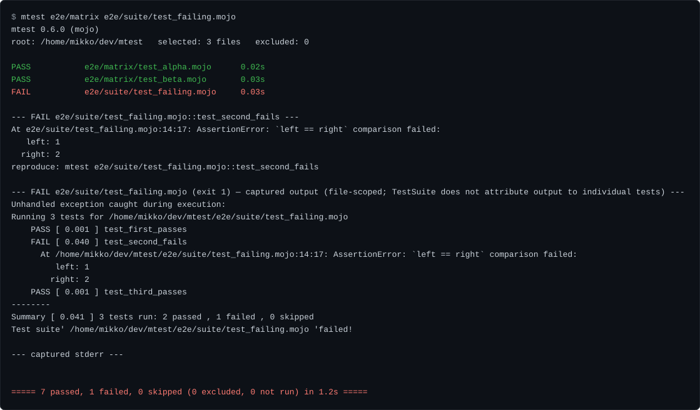
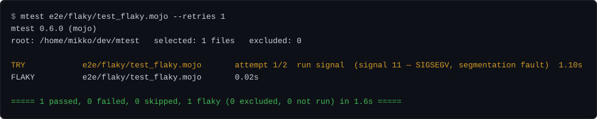
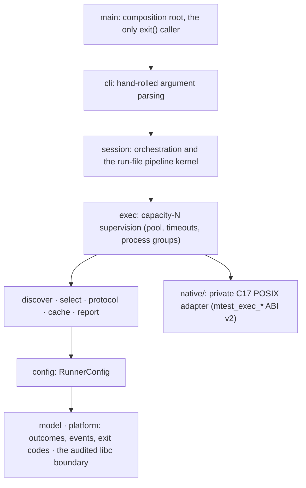

<p align="center">
  
</p>

# mtest

[](https://github.com/mikeleppane/mtest/actions/workflows/ci.yml)
[](https://github.com/mikeleppane/mtest/actions/workflows/codeql.yml)

A pytest-like test runner for [Mojo](https://www.modular.com/mojo).

mtest orchestrates the standard library's per-file `TestSuite`, it does not
replace it. `TestSuite` keeps owning discovery and the report format inside
each file; mtest owns everything between files: finding them, building each
one, executing the binary under supervision, selecting and aggregating tests
across files, and reporting results the way CI expects.



## Why

Mojo's standard library ships a per-file test harness, `TestSuite`, and the
`mojo test` CLI subcommand that used to drive many files was removed. That
leaves a gap most projects fill by hand: a shell loop over `mojo build`, a
grep of stdout, and an exit code nobody fully trusts. mtest replaces that loop
with one binary. What it does differently:

- **Truthful exit codes.** Every test file is compiled with `mojo build` and
  the binary is executed directly, because that is the only way Mojo reports a
  truthful process exit code. `mojo run` masks every outcome to `1` and is
  never used.
- **CRASH and FAIL stay distinct.** A failed assertion and a process that
  aborts or dies by signal are different events with different causes, and
  they stay separate in the console, the event stream, and the JUnit mapping.
  The exit code groups both into its failing class.
- **Nothing is skipped quietly.** Every excluded file, retry attempt, and
  timeout is reported visibly, so a run that skipped something never looks
  like a run that passed everything.
- **Built for CI.** Deterministic path-sorted output, a hermetic build with
  zero runtime dependencies, sharding for CI matrices, and machine-readable
  reports are all first-class. Product logic is pure Mojo, and project
  configuration is parsed natively by the pinned, vendored `mojo-toml` source.

## Features

- Recursive discovery of `test_*.mojo` files, with `--exclude` globs and
  `-I` include paths.
- Per-test outcomes parsed from each file's `TestSuite` report: `-k`
  substring selection, `path::test` node ids, `--maxfail N`, and
  `mtest collect` to list node ids without running any test body.
- A full outcome model: PASS, FAIL, SKIP, CRASH, TIMEOUT, COMPILE-ERROR,
  COMPILE-TIMEOUT, MALFORMED-SUITE, and PRECOMPILE-ERROR, plus a FLAKY
  annotation for a pass that needed retries. A file that builds and exits
  cleanly without running a single test is labeled NO-TESTS on the console
  and never counts as a pass. Every abnormal outcome carries captured output
  and a one-line reproduce command, and every signal or timeout is named in
  words (`signal 11 — SIGSEGV, segmentation fault`).
- Crash-class retries (`--retries N`) with an explicit FLAKY verdict for a
  late pass. Deterministic failures, such as an ordinary compile error or a
  failing assertion, are never retried.
- Bounded crash attribution: after a CRASH, a strictly bounded pass re-runs
  that file's tests one at a time to name a culprit, and reports honestly
  when it cannot. It never changes the verdict or the exit code.
- Timeouts for both the run (`--timeout`) and the build
  (`--compile-timeout`). Every kill targets the whole process group, and a
  run timeout that had to go past the polite terminate says so on its
  verdict line (`escalated to SIGKILL`).
- Deterministic sharding (`--shard`) for spreading one suite across a CI
  matrix.
- Three machine reporters: an NDJSON event stream (`--json`),
  schema-validated JUnit XML (`--junit-xml`), and GitHub Actions annotations
  (`--gh-annotations`).
- A clean interrupt: Ctrl-C tears down the in-flight process group, prints a
  partial summary with NOT-RUN accounting, and exits `2`.
- Project configuration in `mtest.toml`: a closed schema resolved per key as
  defaults < file < `MTEST_MOJO` < command line, with per-file `[[override]]`
  tables, and `mtest config show` to render the resolved values with the layer
  each one came from.
- Failure re-selection from the last completed run: `--lf` narrows to what
  failed, `--ff` runs those files first. Both are soft filters, so a stale
  entry is dropped loudly, never fatally.
- `mtest doctor`: ten read-only environment checks (toolchain identity,
  configuration, last-run state, temp, report destinations) without building
  or running a test.
- Gate files (`--gate`), precompiled package dependencies (`--precompile`),
  a slowest-files list (`--durations`), quiet and verbose modes, and color
  control (`--color`, `NO_COLOR`).

## Installation

mtest ships as a conda package built **from source** by
[rattler-build](https://prefix-dev.github.io/rattler-build/) from
[`recipe/recipe.yaml`](recipe/recipe.yaml), inside an isolated build
environment pinned to the same toolchain this repo builds against
(`mojo ==1.0.0b2`, `clang ==18.1.8`). The binary links against the Mojo runtime,
so the package declares `mojo-compiler ==1.0.0b2` as its sole conda run
dependency. The native TOML parser is compiled into the shipped binary from
the pinned vendored source.

mtest is published to
[modular-community](https://prefix.dev/channels/modular-community/packages/mtest)
for linux-64 and osx-arm64. In a Pixi workspace:

```console
$ pixi workspace channel add https://conda.modular.com/max/
$ pixi workspace channel add https://repo.prefix.dev/modular-community
$ pixi add mtest
$ pixi run mtest --version
mtest 1.0.0
```

Three channels have to resolve, and they are the same three the release
verifier installs from: `https://conda.modular.com/max/` for the pinned
`mojo-compiler` run dependency, `https://repo.prefix.dev/modular-community`
for mtest itself, and `conda-forge` — which a Pixi workspace already carries
by default — for everything underneath. A workspace missing any one of them
fails to solve.

linux-64 and osx-arm64 are both gated: each has its own blocking CI job that
builds the package, installs the exact artifact it just built into a fresh
environment carrying only the declared run dependencies, and exercises the
installed binary. That includes running a known-failing fixture through it, so
the installed package is proven to report failures truthfully, not just
successes.

To run mtest straight from a checkout instead, see
[Developing](#developing).

### Supported toolchains

| mtest | Mojo | Platforms | Status |
|-------|------|-----------|--------|
| 1.0.x | `1.0.0b2` | linux-64, osx-arm64 | Supported |

**Supported** means this repository builds, gates, and publishes that
combination: the pinned toolchain is what the protocol snapshots were captured
against, what both blocking packaged-artifact jobs install, and what the conda
package declares as its run dependency. There is no compatibility range, and
that is a deliberate design position rather than an unfinished one. mtest links
the Mojo runtime and parses the exact report `TestSuite` prints, so a build
serves one toolchain; accepting a report the runner does not fully understand
is how a runner produces a false green, and this one exits 3 on protocol drift
instead.

## Your first test

A test file is an ordinary Mojo program: `test_*` functions plus a `main()`
that hands them to the standard library's `TestSuite`. The import is
`std.testing` — a bare `from testing import ...` does not resolve on this
toolchain. Save this as `tests/test_math.mojo`:

```mojo
"""Arithmetic examples for a first mtest run."""

from std.testing import assert_equal, TestSuite


def test_addition() raises:
    assert_equal(2 + 2, 4)


def test_multiplication() raises:
    assert_equal(3 * 7, 21)


def main() raises:
    TestSuite.discover_tests[__functions_in_module()]().run()
```

`mtest` builds each test file and runs the resulting binary, so `mojo` has to
be reachable from the workspace — which it is, because `pixi add mtest` pulled
in the pinned `mojo-compiler` as a run dependency. `run` is the default
subcommand, so `mtest tests/` means `mtest run tests/`:

```console
$ pixi run mtest tests/
mtest 1.0.0 (mojo)
root: /tmp/mtest-quickstart   selected: 1 files   excluded: 0

PASS           tests/test_math.mojo            0.03s

===== 2 passed, 0 failed, 0 skipped, builds: 1, cached: 0 (0 excluded, 0 not run) in 1.3s =====
$ echo $?
0
```

The summary counts individual tests, not files: two `test_*` functions in one
file report as two passes and one build. `builds`/`cached` is the build cache —
this store was cold, so the file was compiled.

Change that import to a bare `from testing import ...` and the file no longer
compiles. A file that does not compile is reported as a distinct outcome, not
as a failure, and the run exits non-zero:

```console
$ pixi run mtest tests/
mtest 1.0.0 (mojo)
root: /tmp/mtest-quickstart   selected: 1 files   excluded: 0

COMPILE-ERROR  tests/test_math.mojo            0.00s

--- COMPILE-ERROR tests/test_math.mojo — mojo build said: ---
    | /tmp/mtest-quickstart/tests/test_math.mojo:3:6: error: unable to locate module 'testing'
    | from testing import assert_equal, TestSuite
    |      ^
    | mojo: error: failed to parse the provided Mojo source module
reproduce: mojo build tests/test_math.mojo -o build/bin/tests_stest_umath


===== 0 passed, 0 failed, 0 skipped, 1 compile error, builds: 1, cached: 0 (0 excluded, 0 not run) in 1.0s =====
$ echo $?
1
```

The `reproduce:` line is the exact `mojo build` command mtest ran, so a compile
error is reproducible outside the runner without reconstructing the invocation.

Everything else — selection, retries, timeouts, sharding, the machine
reporters, and `mtest.toml` — is under [Usage](#usage) below.

## Assertion diagnostics

The package includes an optional source-only
`mtest.assertions.assert_equal`. It still raises an ordinary error inside
`TestSuite`; the runner, report format, and exit code do not change. Add the
installed source root to both the test compiler and mtest:

```mojo
"""Executable example for the optional source-only assertion companion."""

import mtest.assertions as assertions
import std.testing as testing
from std.testing import TestSuite


def test_standard_assertion_still_coexists() raises:
    testing.assert_equal(2 + 2, 4)


def test_text_difference_has_scalar_and_context() raises:
    assertions.assert_equal(
        "alpha\nbeta\ngamma",
        "alpha\nBETa\ngamma",
        msg="configuration text changed",
    )


def main() raises:
    TestSuite.discover_tests[__functions_in_module()]().run()
```

```console
$ mtest --no-config --no-cache --show-output failures \
    -I <PREFIX>/share/mtest/companions/assertions/src \
    companions/assertions/examples
mtest 1.0.0 (mojo)
root: <REPO>   selected: 1 files   excluded: 0

FAIL           companions/assertions/examples/test_diagnostics.mojo  <TIME>

--- FAIL companions/assertions/examples/test_diagnostics.mojo::test_text_difference_has_scalar_and_context ---
    | At companions/assertions/examples/test_diagnostics.mojo:13:28: text differs at scalar 6
    |   actual: U+0062 'b'
    |   expected: U+0042 'B'
    |   actual line 1: alpha\n
    |   actual line 2: beta\n
    |   actual line 3: gamma
    |   expected line 1: alpha\n
    |   expected line 2: BETa\n
    |   expected line 3: gamma
    |   reason: configuration text changed
reproduce: mtest -I <PREFIX>/share/mtest/companions/assertions/src companions/assertions/examples/test_diagnostics.mojo::test_text_difference_has_scalar_and_context

--- FAIL companions/assertions/examples/test_diagnostics.mojo (exit 1) — captured output (file-scoped; TestSuite does not attribute output to individual tests) ---
    | Unhandled exception caught during execution:
    | Running 2 tests for <REPO>/companions/assertions/examples/test_diagnostics.mojo
    |     PASS [ <TIME> ] test_standard_assertion_still_coexists
    |     FAIL [ <TIME> ] test_text_difference_has_scalar_and_context
    |       At <REPO>/companions/assertions/examples/test_diagnostics.mojo:13:28: text differs at scalar 6
    |         actual: U+0062 'b'
    |         expected: U+0042 'B'
    |         actual line 1: alpha\n
    |         actual line 2: beta\n
    |         actual line 3: gamma
    |         expected line 1: alpha\n
    |         expected line 2: BETa\n
    |         expected line 3: gamma
    |         reason: configuration text changed
    | --------
    | Summary [ <TIME> ] 2 tests run: 1 passed , 1 failed , 0 skipped
    | Test suite' <REPO>/companions/assertions/examples/test_diagnostics.mojo 'failed!
    |
--- captured stderr ---


===== 1 passed, 1 failed, 0 skipped, builds: 1, cached: 0 (0 excluded, 0 not run) in <TIME> =====
```

That output was captured from the installed `.conda` artifact. The companion
specializes only top-level `String`, `List[T]`, and `Dict[String, V]`; nested
containers and custom values are displayed opaquely. List details show at most
eight entries per side, and dictionary details show at most eight entries in
each of the missing, unexpected, and changed categories. Their `omitted by
entry limit` counts describe that eight-entry selection. Dictionary keys whose
escaped display would exceed 1024 bytes are omitted from structural rows and
counted separately by `omitted by key display limit`; category totals and
displayable short-key details remain. Structural key and category order is
deterministic; opaque values retain their own `Writable` formatting, including
any ordering it chooses.

Finalized opaque-value projections are at most 1024 bytes, text context is at
most 4096 bytes, and a complete assertion body is at most 16384 bytes. Text
context shows the differing line and at most two lines on either side;
`... [cropped]` marks omitted whole lines outside that window. A bare leading
`... ` marks bytes cropped from the start of a retained long line. Each byte
cap includes a complete `... [truncated]` marker at the point where that
projection or body omitted bytes; later detail can follow a per-operand marker.
Equality is exact; a passing assertion formats nothing, while a failing
assertion formats each displayed operand once. These limits bound bytes
finalized and emitted by the companion, not private work performed inside
user-defined equality or formatting code. A present reason retains bounded
space at the end even when mismatch detail is truncated.

`<PREFIX>/share/mtest/companions/assertions/src` is one complete source package named
`mtest`, not an extension merged into another `mtest` package. Put it before
any other include root that provides `mtest`. The runner never injects this
path automatically, and Mojo does not merge it with the runner-private
precompiled package. Source-file permissions follow the environment's prefix
policy; shared-prefix installs may therefore be group-writable but are never
accepted as world-writable by the package verifier.

Only `mtest.assertions.assert_equal` is supported. The shipped underscore
modules are source implementation details, even though Mojo can import an
explicit source-module path.

## Usage

mtest spawns a `mojo build` child per file, so `mojo` must be on that
child's `PATH`. From a checkout, build the binary once and run it under
`pixi run` (or inside a `pixi shell`):

```console
$ pixi run build-bin
$ pixi run bash -c 'build/mtest tests/'
```

`run` is the default subcommand: `mtest tests/` means `mtest run tests/`.
Everything below is real, captured output from this build.

### Writing a test file

A test file is a normal Mojo program: `test_*` functions plus a `main()`
that hands them to the standard library's `TestSuite`. This is
[`e2e/suite/test_passing.mojo`](e2e/suite/test_passing.mojo) (docstring
omitted), the file the next example runs:

```mojo
from std.testing import assert_equal, TestSuite


def test_one_passes() raises:
    assert_equal(1, 1)


def test_two_passes() raises:
    assert_equal(2, 2)


def test_three_passes() raises:
    assert_equal(3, 3)


def main() raises:
    TestSuite.discover_tests[__functions_in_module()]().run()
```

mtest compiles the file, runs the binary, and parses the report `TestSuite`
prints; selection reaches the suite through the arguments mtest passes it.
A file without that `main()` does not build as a standalone program.

### A passing run

```console
$ pixi run bash -c 'build/mtest e2e/suite/test_passing.mojo'
mtest 1.0.0 (mojo)
root: /home/mikko/dev/mtest   selected: 1 files   excluded: 0

PASS           e2e/suite/test_passing.mojo  0.07s

===== 3 passed, 0 failed, 0 skipped, builds: 1, cached: 0 (0 excluded, 0 not run) in 1.2s =====
$ echo $?
0
```

The file holds three `test_*` functions; the summary counts them
individually, not the one file that held them. The `builds`/`cached` pair is
the build cache: this store was cold, so the file was compiled; a rerun over an
unchanged tree compiles nothing and reports `builds: 0, cached: 1` instead. The
console fences below are captured against a cold store unless the text says
otherwise ([Build cache](#build-cache)).

### A mixed run

`e2e/suite/` is the committed known-outcome tree the end-to-end gate runs
against. One directory exercises most of the outcome model at once:

```console
$ pixi run bash -c 'build/mtest e2e/suite'
mtest 1.0.0 (mojo)
root: /home/mikko/dev/mtest   selected: 7 files   excluded: 0

PASS           e2e/suite/nested/test_nested.mojo  0.07s
COMPILE-ERROR  e2e/suite/test_compile_error.mojo  0.00s
CRASH          e2e/suite/test_crashing.mojo  1.12s  (signal 4 — SIGILL, illegal instruction)
FAIL           e2e/suite/test_failing.mojo  0.08s
PASS           e2e/suite/test_noisy.mojo  0.02s
PASS           e2e/suite/test_passing.mojo  0.02s
NO-TESTS       e2e/suite/test_zero.mojo   0.07s

--- COMPILE-ERROR e2e/suite/test_compile_error.mojo — mojo build said: ---
    | /home/mikko/dev/mtest/e2e/suite/test_compile_error.mojo:12:17: error: use of unknown declaration 'this_symbol_is_never_defined_anywhere'
    |     var value = this_symbol_is_never_defined_anywhere()
    |                 ^~~~~~~~~~~~~~~~~~~~~~~~~~~~~~~~~~~~~
    | mojo: error: failed to parse the provided Mojo source module
reproduce: mojo build e2e/suite/test_compile_error.mojo -o build/bin/e2e_ssuite_stest_ucompile_uerror

[...CRASH detail with its captured stack trace omitted...]

--- FAIL e2e/suite/test_failing.mojo::test_second_fails ---
    | At e2e/suite/test_failing.mojo:14:17: AssertionError: `left == right` comparison failed:
    |    left: 1
    |   right: 2
reproduce: mtest e2e/suite/test_failing.mojo::test_second_fails

[...file-scoped captured output omitted...]

===== 9 passed, 1 failed, 0 skipped, 1 crashed, 1 compile error, builds: 7, cached: 0 (0 excluded, 0 not run) in 5.9s =====
$ echo $?
1
```

The summary band's units are deliberately mixed: `passed`, `failed`, and
`skipped` count *tests*, while `crashed` and `compile error` count *files*,
because an abnormal outcome has no reliable per-test breakdown. `test_zero.mojo`
is reported NO-TESTS, not PASS: it builds and exits `0`, but its report shows
zero tests ran. A session that collects nothing but NO-TESTS files exits `5`.

### Selecting tests

`-k STR` is a case-insensitive substring filter over the full node id
(`path::name`), so it matches file paths as well as test names:

```console
$ pixi run bash -c 'build/mtest -k one e2e/matrix'
mtest 1.0.0 (mojo)
root: /home/mikko/dev/mtest   selected: 2 files   excluded: 0

PASS           e2e/matrix/test_alpha.mojo 0.02s
PASS           e2e/matrix/test_beta.mojo  0.03s

===== 2 passed, 0 failed, 0 skipped, builds: 2, cached: 0 (0 excluded, 0 not run, 3 deselected) in 1.7s =====
```

A node-id operand selects exactly one test:

```console
$ pixi run bash -c 'build/mtest e2e/matrix/test_alpha.mojo::test_alpha_two'
mtest 1.0.0 (mojo)
root: /home/mikko/dev/mtest   selected: 1 files   excluded: 0

PASS           e2e/matrix/test_alpha.mojo 0.03s

===== 1 passed, 0 failed, 0 skipped, builds: 1, cached: 0 (0 excluded, 0 not run, 2 deselected) in 1.2s =====
```

Non-matching tests are counted once as `deselected`, never listed
individually. A file whose every test is deselected is not scheduled at all
and is counted `not run`. A `-k` that empties the whole session exits `5`.

### Listing tests without running them

`mtest collect` (and `--collect-only`) compiles each file, enumerates its
tests through a probe that skips every test body, and lists node ids in
plain lexicographic order:

```console
$ pixi run bash -c 'build/mtest collect e2e/matrix'
e2e/matrix/test_alpha.mojo::test_alpha_one
e2e/matrix/test_alpha.mojo::test_alpha_three
e2e/matrix/test_alpha.mojo::test_alpha_two
e2e/matrix/test_beta.mojo::test_beta_one
e2e/matrix/test_beta.mojo::test_beta_two
$ echo $?
0
```

A file that cannot be probed (a compile error, a crash, a timeout) writes a
diagnostic to stderr and the listing continues for the rest, with a nonzero
exit at the end. Per-test narrowing is a `run` behavior in this build:
under `collect`, `-k` prints a loud ignored notice and a `path::test`
operand contributes its whole file to the listing.

### Retries and FLAKY

`--retries N` grants up to `N` extra attempts, and only to crash-class
failures: a death by signal, a deadline kill, or a compiler that itself
crashed. A failing assertion or an ordinary compile error is deterministic
and is never retried. Every attempt gets its own `TRY` line naming why it
failed, and a file that crashes once and then passes is reported FLAKY, a
pass with a visible history, never a plain PASS:



A FLAKY-only session exits `0`. Without `--retries`, the same crash stands
as the file's final outcome, and every CRASH triggers the bounded
attribution pass:

```console
$ pixi run bash -c 'build/mtest e2e/attribution/test_deterministic_crasher.mojo'
mtest 1.0.0 (mojo)
root: /home/mikko/dev/mtest   selected: 1 files   excluded: 0

CRASH          e2e/attribution/test_deterministic_crasher.mojo  1.12s  (signal 4 — SIGILL, illegal instruction)
WARNING  crash-attribution-start: re-running the crashed file(s) one test at a time to name the culprit (1 file(s); bounded and best-effort). This is SECONDARY diagnostics: the CRASH verdict already stands and nothing found here can change it or the exit code
ATTRIBUTION    e2e/attribution/test_deterministic_crasher.mojo  ATTRIBUTED  culprit: test_boom  (2 isolation rerun(s), 1.18s)

[...captured output omitted...]

===== 0 passed, 0 failed, 0 skipped, 1 crashed, builds: 1, cached: 0 (0 excluded, 0 not run) in 3.4s =====
$ echo $?
1
```

When the crash does not reproduce with any test run alone (an
order-dependent crash, for instance), the `ATTRIBUTION` line says
`NO-REPRODUCTION` and the culprit stands UNATTRIBUTED rather than guessed.
The pass is strictly bounded (at most 32 isolation reruns per file, under
per-file and per-session wall-clock budgets), and it never changes the CRASH
verdict or the exit code.

### Timeouts

`--timeout SECS` bounds a single file's run; `--compile-timeout SECS` bounds
its build the same way. A child that ignores the polite terminate signal is
force-killed, and the verdict line says so in words:

```console
$ pixi run bash -c 'build/mtest e2e/stubborn/test_stubborn.mojo --timeout 1 --retries 0'
mtest 1.0.0 (mojo)
root: /home/mikko/dev/mtest   selected: 1 files   excluded: 0

TIMEOUT        e2e/stubborn/test_stubborn.mojo 1.31s  (timed out after 1s, escalated to SIGKILL)

[...captured output omitted...]

===== 0 passed, 0 failed, 0 skipped, 1 timed out, builds: 1, cached: 0 (0 excluded, 0 not run) in 2.4s =====
$ echo $?
1
```

A build killed at the compile deadline is reported COMPILE-TIMEOUT, distinct
from COMPILE-ERROR, and a retried rebuild runs against a fresh, quarantined
per-attempt module cache, announced with a `WARNING`.

### Sharding a CI matrix

`--shard [hash:|slice:]M/N` splits the discovered file set into `N` disjoint
shards before any build and runs (or collects) only shard `M`. `hash:`, the
default, assigns each file by a stable hash of its path, so assignment never
depends on machine or discovery order:

```console
$ pixi run bash -c 'build/mtest collect e2e/suite --shard 3/3'
e2e/suite/test_passing.mojo::test_one_passes
e2e/suite/test_passing.mojo::test_three_passes
e2e/suite/test_passing.mojo::test_two_passes
$ echo $?
0
```

The union of every shard's listing is exactly the unsharded listing, and no
node id appears twice. Gate files are never sharded: every gate runs on
every shard. A complete matrix cell, with the report upload, is under
[Run it in CI](#run-it-in-ci).

### Run it in CI

Add `mtest` to your workspace as above, commit the resulting `pixi.toml` and
`pixi.lock`, then paste this workflow. It installs the locked environment,
runs the suite with GitHub annotations and a JUnit report, and keeps the
report as an artifact even when the run fails:

```yaml
name: Tests

on: [push, pull_request]

permissions:
  contents: read

jobs:
  test:
    runs-on: ubuntu-24.04
    timeout-minutes: 30
    steps:
      - uses: actions/checkout@3d3c42e5aac5ba805825da76410c181273ba90b1 # v7.0.1
        with:
          persist-credentials: false

      - uses: prefix-dev/setup-pixi@a09b6247153796b190642a2b53fac4241043cf6f # v0.10.0
        with:
          locked: true

      - run: >-
          pixi run mtest tests
          --gh-annotations auto
          --junit-xml build/test-results.xml

      - uses: actions/upload-artifact@043fb46d1a93c77aae656e7c1c64a875d1fc6a0a # v7.0.1
        if: always()
        with:
          name: test-results
          path: build/test-results.xml
```

`--gh-annotations auto` turns each failure into an inline annotation when the
run is on GitHub Actions and does nothing anywhere else, so the same command
works locally. `--junit-xml` is written even when tests fail, which is why the
upload step carries `if: always()`.

Each action is pinned to a commit SHA with its tag in a trailing comment, the
same way this repository pins its own workflows, and yours should be too: a tag
can be moved onto different code, a commit SHA cannot.

To spread one suite across a matrix, give each cell a shard and a distinct
report name. The union of every shard's selection is exactly the unsharded
selection, and no test runs twice:

```yaml
    strategy:
      fail-fast: false
      matrix:
        shard: [1, 2, 3, 4]
    steps:
      # ... checkout and setup-pixi as above ...
      - run: >-
          pixi run mtest tests
          --shard "hash:${{ matrix.shard }}/4"
          --gh-annotations auto
          --junit-xml "build/test-results-${{ matrix.shard }}.xml"

      - uses: actions/upload-artifact@043fb46d1a93c77aae656e7c1c64a875d1fc6a0a # v7.0.1
        if: always()
        with:
          name: test-results-${{ matrix.shard }}
          path: build/test-results-${{ matrix.shard }}.xml
```

**Do not cache `.mtest-cache/` between runners.** The build cache's key frames
the compiler, the toolchain libraries, the environment, the invocation root,
the build arguments, the include-root contents, and each file's own bytes — and
nothing about the host CPU. On one machine that is exactly right. Across hosted
runners it is not: a binary compiled where a wider instruction set was
available, restored onto a runner without it, is a valid cache hit that dies
with `signal 4` the moment it executes. The store is per-checkout by design and
there is no spelling that moves it. Cache pixi's own package downloads instead,
which `setup-pixi` already does.

### Machine reporters

The three reporters compose with the console and with each other.
[docs/cli-contract.md](docs/cli-contract.md) specifies each in full.

`--json PATH|-` writes a versioned NDJSON event stream
([docs/json-stream.md](docs/json-stream.md) is the normative spec). With
`-`, stdout carries only stream bytes and the console moves to stderr:

```console
$ pixi run bash -c 'build/mtest --json - --gh-annotations off e2e/matrix' 1>/tmp/stream.ndjson
$ head -n 4 /tmp/stream.ndjson
{"event":"stream","version":1,"generator":"mtest 1.0.0"}
{"event":"session_started","root":"/home/mikko/dev/mtest","toolchain":"mojo","selected_count":2,"excluded_count":0,"shard_label":"","sharded_out_count":0,"workers":1}
{"event":"file_started","path":"e2e/matrix/test_alpha.mojo"}
{"event":"test_reported","path":"e2e/matrix/test_alpha.mojo","name":"test_alpha_one","outcome":"pass","detail":"","detail_omitted_bytes":0,"timing":"0.001"}
```

`--junit-xml PATH` writes a schema-validated JUnit report assembled from the
runner's own typed events, never from a parse of console text, and renames
it atomically onto `PATH` so a prior report survives any failure. FAIL maps
to `<failure>`; CRASH and the other abnormal file outcomes map to sentinel
`<error>` testcases:

```xml
<?xml version="1.0" encoding="UTF-8"?>
<testsuites name="mtest" tests="12" failures="1" errors="2">
<testsuite name="e2e/suite/nested/test_nested.mojo" tests="1" failures="0" errors="0" skipped="0" time="0.017">[...]</testsuite>
<testsuite name="e2e/suite/test_compile_error.mojo" tests="1" failures="0" errors="1" skipped="0" time="0.000"><testcase name="[build]" classname="e2e.suite.test_compile_error"><error message="build failed" type="CompileError">[...]</error></testcase>[...]</testsuite>
[...]
</testsuites>
```

`--gh-annotations MODE` (`off|on|auto`, default `auto`: on iff
`GITHUB_ACTIONS=true`) emits GitHub Actions workflow-command annotations in
a deterministic tail after the summary:

```console
$ pixi run bash -c 'build/mtest --gh-annotations on e2e/suite'
[...console output as above, ending with the summary band, then:...]
::error file=e2e/suite/test_compile_error.mojo::e2e/suite/test_compile_error.mojo: compile error
::error file=e2e/suite/test_crashing.mojo::e2e/suite/test_crashing.mojo: crashed (signal 4 — SIGILL, illegal instruction)
::error file=e2e/suite/test_failing.mojo,line=14::e2e/suite/test_failing.mojo::test_second_fails:       At /home/mikko/dev/mtest/e2e/suite/test_failing.mojo:14:17: AssertionError: `left == right` comparison failed:
::notice::9 passed, 1 failed, 0 skipped, 1 crashed, 1 compile error (0 excluded, 0 not run) in 5.0s
```

Inside GitHub Actions (`GITHUB_ACTIONS=true`), every echoed region of
captured child output is wrapped in a per-run `::stop-commands::` fence, so
a test's own output can never forge a workflow command.

### Project configuration: `mtest.toml`

When `mtest.toml` sits at the invocation root, mtest loads it automatically;
absence is silent. `--config PATH` selects a different file, `--no-config`
suppresses discovery entirely, and the two are mutually exclusive. The schema
is closed: an unknown table, an unknown key, a wrong type, or an invalid value
is a usage error caught before anything is built.

This is the file the rest of this section runs against:

```toml
[run]
paths = ["e2e/matrix"]
workers = "auto"
retries = 1
timeout = 120

[build]
include = ["build"]
compile-timeout = 300

[report]
durations = 2
show-output = "none"

[[override]]
files = ["e2e/matrix/test_beta.mojo"]
timeout = 30
serial = true
```

`[run] paths` supplies the operands when the command line has none, so a bare
`mtest` runs the project's suite the project's way:

```console
$ pixi run bash -c 'build/mtest'
mtest 1.0.0 (mojo)
root: /home/mikko/dev/mtest   selected: 2 files   excluded: 0   workers: 16

PASS           e2e/matrix/test_alpha.mojo      0.02s
PASS           e2e/matrix/test_beta.mojo       0.02s  SERIAL

===== 5 passed, 0 failed, 0 skipped, builds: 2, cached: 0 (0 excluded, 0 not run) in 3.0s =====

slowest 2 files:
  e2e/matrix/test_alpha.mojo  0.02s
  e2e/matrix/test_beta.mojo  0.02s
$ echo $?
0
```

Resolution is per key: built-in defaults, then `mtest.toml`, then a non-empty
`MTEST_MOJO`, then the command line. A layer that sets a key replaces the whole
value from below it, lists included, and positional operands replace configured
`paths`. Color is the deliberate exception: `NO_COLOR` is not a layer value, and
it is consulted only once the winning `color` is `auto`.

Each `[[override]]` table carries per-file `timeout`, `compile-timeout`,
`retries`, and `serial = true`, keyed by glob. For each scalar the first
matching table wins, unless the command line supplied that scalar globally.
Serial membership is a union instead: any matching `serial = true` pins the
file, which is why `test_beta.mojo` above carries the `SERIAL` tag.

A configuration problem names the file, the table, the key, and what was
expected, and stops the run before a single build starts. Here it is the same
file, but with `retries = "two"` where an integer belongs:

```console
$ pixi run bash -c 'build/mtest e2e/matrix'
config: mtest.toml: [run] key 'retries': expected integer >= 0; got 'two'
$ echo $?
4
```

[§25 of the CLI contract](docs/cli-contract.md#25-project-configuration) is the
full closed schema and the whole resolution rule.

### Seeing what a configuration resolves to

`mtest config show` accepts the full `run` grammar and answers one question:
what would this invocation actually use? It resolves and renders, nothing else.
It never discovers, builds, runs, opens a reporter, or reads last-run state. The
output is copy-pasteable TOML, and every set key carries the layer it came from:

```console
$ pixi run bash -c 'build/mtest config show'
[run]
paths = ["e2e/matrix"]  # (mtest.toml)
exclude = []  # (default)
gates = []  # (default)
serial = []  # (default)
workers = "auto"  # (mtest.toml)
timeout = 120  # (mtest.toml)
retries = 1  # (mtest.toml)
maxfail = 0  # (default)
state = true  # (default)

[build]
mojo = "mojo"  # (default)
include = ["build"]  # (mtest.toml)
build-args = []  # (default)
precompile = []  # (default)
compile-timeout = 300  # (mtest.toml)

[report]
color = "auto"  # (default)
show-output = "none"  # (mtest.toml)
verbosity = "normal"  # (default)
durations = 2  # (mtest.toml)
# junit-xml = (unset)
# json = (unset)
gh-annotations = "auto"  # (default)

[[override]]
files = "e2e/matrix/test_beta.mojo"  # (mtest.toml)
timeout = 30  # (mtest.toml)
serial = true  # (mtest.toml)

# config file: mtest.toml
# state file: .mtest-cache/lastrun (present)
# selection flags are per invocation and are not rendered
$ echo $?
0
```

Flags resolve into the same rendering, so `config show` also answers "what does
this command line change?". Per-invocation selection flags such as `-k` are
accepted and deliberately not rendered:

```console
$ pixi run bash -c 'build/mtest config show --timeout 30 -n 4 -k alpha'
[run]
paths = ["e2e/matrix"]  # (mtest.toml)
exclude = []  # (default)
gates = []  # (default)
serial = []  # (default)
workers = 4  # (cli)
timeout = 30  # (cli)
retries = 1  # (mtest.toml)
[...the remaining tables and trailers as above...]
```

The state trailer reports only whether `.mtest-cache/lastrun` exists; the
command never reads it.

### Re-running just the failures: `--lf` and `--ff`

A completed run remembers what failed, in `.mtest-cache/lastrun` under the
invocation root. That directory is mtest's own working state — the last-run
record and the cached test binaries beside it — and none of it belongs in
review, so ignore it:

```gitignore
# mtest's build cache and its last-run state
.mtest-cache/
```

The file is deterministic text, sorted and root-relative, readable without
mtest. This is what a run over `e2e/matrix` and `e2e/suite/test_failing.mojo`
leaves behind, for two passing files and one failing test:

```console
$ cat .mtest-cache/lastrun
mtest-lastrun v1
test	e2e/suite/test_failing.mojo::test_second_fails
```

`--lf` (`--last-failed`) narrows the next run to what that state remembers, so
you read one failure instead of scrolling past the whole suite. It narrows what
*executes*, not what is built: the filter applies after each file has been
compiled and probed for its test names, so the compile cost of the selection is
unchanged. The run that wrote the state also filled the build cache, so the
bands in this section report hits rather than builds. `--lf` also runs on a
single worker, ignoring `-n`:

```console
$ pixi run bash -c 'build/mtest --lf e2e/matrix e2e/suite/test_failing.mojo'
mtest 1.0.0 (mojo)
root: /home/mikko/dev/mtest   selected: 3 files   excluded: 0

FAIL           e2e/suite/test_failing.mojo     0.02s

--- FAIL e2e/suite/test_failing.mojo::test_second_fails ---
    | At e2e/suite/test_failing.mojo:14:17: AssertionError: `left == right` comparison failed:
    |    left: 1
    |   right: 2
reproduce: mtest e2e/suite/test_failing.mojo::test_second_fails

[...file-scoped captured output omitted...]

===== 0 passed, 1 failed, 0 skipped, builds: 0, cached: 3 (0 excluded, 2 not run, 7 deselected) in 0.8s =====
$ echo $?
1
```

`--ff` (`--failed-first`) keeps the whole selection but moves the remembered
files to the front, so a rerun fails fast without giving up coverage:

```console
$ pixi run bash -c 'build/mtest --ff --show-output none e2e/matrix e2e/suite/test_failing.mojo'
mtest 1.0.0 (mojo)
root: /home/mikko/dev/mtest   selected: 3 files   excluded: 0

FAIL           e2e/suite/test_failing.mojo     0.02s
PASS           e2e/matrix/test_alpha.mojo      0.02s
PASS           e2e/matrix/test_beta.mojo       0.02s

===== 7 passed, 1 failed, 0 skipped, builds: 0, cached: 3 (0 excluded, 0 not run) in 0.9s =====
$ echo $?
1
```

Both are soft filters, never gates. A remembered id this selection does not
reach (deleted, renamed, or simply out of scope) is dropped with a line naming
it, and a state file that intersects nothing runs the ordinary full selection
rather than exiting `5`:

```console
$ pixi run bash -c 'build/mtest --lf e2e/matrix'
mtest 1.0.0 (mojo)
root: /home/mikko/dev/mtest   selected: 2 files   excluded: 0

lf: previously-failing e2e/suite/test_failing.mojo::test_second_fails no longer exists — dropped
lf: no previously-failing tests match this selection — running the full selection
PASS           e2e/matrix/test_alpha.mojo      0.02s
PASS           e2e/matrix/test_beta.mojo       0.03s

===== 5 passed, 0 failed, 0 skipped, builds: 0, cached: 2 (0 excluded, 0 not run) in 0.9s =====
$ echo $?
0
```

Gates are never filtered or reordered by either mode: they always run first.
`--lf` with `--ff`, and either with `--shard`, are usage errors; under
`collect` both are refused. State is written only after the final exit code
resolves to `0` or `1`, so an interrupt, an internal error, a usage error, or
an empty session leaves the previous file untouched, as do `collect`, sharded
runs, and `[run] state = false`.
[§26 of the CLI contract](docs/cli-contract.md#26-last-run-state-and-failure-re-selection)
specifies the format, the outcome-to-record mapping, and the merge rule that
preserves a failure you have not retested yet.

### Diagnosing the environment: `mtest doctor`

`mtest doctor` answers "is this machine set up to run tests?" without running
one. It performs ten read-only checks and prints exactly one `PASS`, `WARN`, or
`FAIL` line for each, in a fixed order. The inventory never shrinks, because a
missing line would be the one you needed:

```console
$ pixi run bash -c 'build/mtest doctor'
PASS version: mtest 1.0.0
PASS platform: Linux x86_64 supported
PASS root: /home/mikko/dev/mtest
PASS exec: runtime acquired
PASS toolchain: 'mojo' from PATH default: Mojo 1.0.0b2 (2cf4d08a)
PASS config: valid 'mtest.toml'
PASS config-semantics: resolved values valid
PASS state: cache and lastrun usable
PASS temp: invocation root and system temp usable
PASS report-destinations: none
$ echo $?
0
```

Every check body is guarded on its own, so a broken environment still produces
the whole report: the failing check says what broke, dependent checks say which
capability they were missing, and the rest still run.

```console
$ pixi run bash -c 'MTEST_MOJO=/opt/nonexistent/mojo build/mtest doctor --no-config'
PASS version: mtest 1.0.0
PASS platform: Linux x86_64 supported
PASS root: /home/mikko/dev/mtest
PASS exec: runtime acquired
FAIL toolchain: '/opt/nonexistent/mojo' from MTEST_MOJO: could not execute
PASS config: none
PASS config-semantics: resolved values valid
PASS state: cache and lastrun usable
PASS temp: invocation root and system temp usable
PASS report-destinations: none
$ echo $?
1
```

The `toolchain` check is deliberately strict: a `PASS` requires the exact
pinned identity `Mojo 1.0.0b2 (2cf4d08a)`, because a different toolchain is a
different `TestSuite` report format. `doctor` also treats a broken
configuration differently from every other command on purpose. A missing or
malformed selected config is a `FAIL`ed check and exit `1`, not the usage error
`run` and `config show` raise, because a diagnostic tool that refuses to
diagnose is useless. Its exit domain is `{0, 1, 2, 4}`, and `WARN` never fails
the command.

## Build cache

mtest compiles every test file with `mojo build` before it runs it. The build
cache keeps those binaries under `.mtest-cache/build-v1/` in the invocation
root, so a file whose compile inputs have not changed is not compiled again. It
is on by default and needs no configuration. The store is per-checkout and is
deliberately not persisted across CI runs: moving compiled artifacts into shared
state could reuse a binary built for a different host CPU.

The summary band reports the split. A cold store builds everything:

```console
$ pixi run bash -c 'build/mtest --cache-clear e2e/matrix'
mtest 1.0.0 (mojo)
root: /home/mikko/dev/mtest   selected: 2 files   excluded: 0

PASS           e2e/matrix/test_alpha.mojo      0.02s
PASS           e2e/matrix/test_beta.mojo       0.02s

===== 5 passed, 0 failed, 0 skipped, builds: 2, cached: 0 (0 excluded, 0 not run) in 1.6s =====
```

Run it again over the same tree and nothing is compiled:

```console
$ pixi run bash -c 'build/mtest e2e/matrix'
mtest 1.0.0 (mojo)
root: /home/mikko/dev/mtest   selected: 2 files   excluded: 0

PASS           e2e/matrix/test_alpha.mojo      0.02s
PASS           e2e/matrix/test_beta.mojo       0.02s

===== 5 passed, 0 failed, 0 skipped, builds: 0, cached: 2 (0 excluded, 0 not run) in 0.8s =====
```

`builds` counts files compiled for the first time this run — compile failures
included, because a file that failed to compile was still built. `cached` counts
files served from the store. Their sum is the run's first-attempt compile count.
The pair appears on the band only when the run admitted at least one compile,
and the same two numbers are `built_files` and `cached_files` on the `--json`
stream's `session_finished` record.

What the counters do *not* claim is that `builds: 0` means no compiler ran.
Three paths compile without admitting a first attempt, and none of them moves
either counter: a crash-class retry, a configured precompile step, and the
rebuild that recovers a file whose stored binary would not start. So
`builds: 0, cached: N` means nothing was compiled *to produce a verdict* — the
work the counters are about — and a run showing it can still have spawned the
compiler. Use `-v` if you need to see every command a run actually issued.

Read the counters, not the clock. Both runs above finish in about a second
because the files are tiny and `mojo` keeps a module cache of its own; the
counters are what tell you whether a compile happened.

`--compile-timeout` bounds only a compile that happens. A warm hit performs no
compile and cannot produce COMPILE-TIMEOUT; use `--no-cache` when you need to
exercise the deadline.

### What invalidates an entry

Each cached binary is keyed by a digest over the compile inputs mtest names —
everything an ordinary edit, upgrade, or move can reach:

- the resolved `mojo` executable — its canonical path, its contents, and its
  `--version` output — plus every entry of `<resolved compiler
  dir>/../lib/mojo`, by name and type, and the contents of every regular file
  among them, so a toolchain upgrade rebuilds everything. A wrapper script
  relocates that directory beside the wrapper, so the real compiler's libraries
  are not directly keyed; symlink resolution remains canonicalized;
- `MODULAR_HOME`, `MODULAR_CACHE_DIR`, `MODULAR_DERIVED_PATH`,
  `MODULAR_NVPTX_COMPILER_PATH`, and `XDG_CACHE_HOME` — the variables that move
  where the toolchain reads or writes something of its own, or which tool it
  reaches for. `PATH` is deliberately not among them; see the cache's non-goals
  in [the CLI contract](docs/cli-contract.md) for what that leaves uncovered;
- the canonicalized invocation root;
- the build arguments, with any file or `-I` directory they name resolved and
  digested. The `-I` argument spelling is keyed exactly as written (`-I lib`
  and `-I ./lib` differ), while the named directory contents are walked and
  digested;
- the walked contents of every include root — every `*.mojo`, `*.🔥`,
  `*.mojopkg`, and `*.mojoc` an `-I` makes visible, recursing into
  subdirectories that carry an `__init__`, and nothing else, so a README or a
  lockfile changing under an include root does not evict anything;
- the walked contents of the directory the test file sits in, by those same
  rules — the compiler resolves a bare `from helper import ...` against the
  source file's own directory, with no `-I` involved, so a helper beside a test
  is a build input nothing else in this list covers;
- the test file itself.

Files enter the key by **content**, never by modification time, so a `touch` or
a `git checkout` that rewrites a file with the same bytes still hits. A file
that differs across a branch switch keeps the generations of both states once
it has been compiled in both: switching between exactly two states of a file
hits both ways from the second cycle on, when every writer of the store is at
this version and nothing else is publishing into it concurrently. A third state
evicts the lowest-ranked of the three, which without a concurrent publisher is
the oldest; concurrent runs take no lock, so a source can hold more than two for
a while, and a race can still cost one rebuild. A configured precompile output
that moves can move the complete key besides, so none of this is a promise that
every branch restoration hits. Settings that cannot change a compiled byte —
timeouts, workers, retries, selection, reporters — are not in the key and never
invalidate anything. The
invocation root is in the key, though, so moving or renaming the checkout
invalidates everything in it.

Build inputs must remain stable while a compiler invocation runs; mutation
during compilation is unsupported. Publication refuses to store a build whose
own inputs did not hold still: the test file, the files beside it, the
directories the walk covered, and both ends of a symlinked input are re-checked
against the filesystem identity and change times they had when they were keyed
— and the test file and its directory against their content as well. So an
input you edited and left edited is caught, and so is one you edited and *undid*
while the compiler was reading it, where both content samples agree and the
stored binary would have come from bytes that are no longer anywhere. Nothing is
published, a `cache-publish` warning names the input, the run itself stays
green, and the file is rebuilt next run. A configured precompile step is covered
the same way: its source, include roots, and the earlier steps' packages it
consumes are re-checked before it is stamped, and a step whose inputs moved is
left unstamped and runs again.

That covers a build's own inputs, not everything in its key: the toolchain, the
`-I` root contents, and files named by build arguments are sampled once per
session. Those, along with a mutate-and-restore finishing inside one filesystem
timestamp tick and a persistent mid-session edit that a later file in the same
directory hits, are stated in full in [the CLI
contract](docs/cli-contract.md) under the cache's non-goals. If you edited
during a slow compile and changed your mind, `--no-cache` compiles from what is
on disk and `--cache-clear` discards what was stored.

The store pays for itself from about three test files upward. Its fixed
per-session cost — mostly digesting the compiler and the library directory
beside it — barely grows with the suite, so on a one- or two-file suite a warm
run can be slower than `--no-cache`, and from three files up it wins by more the
larger the suite gets. That is one machine with the compiler's own cache already
warm; CI compiles cold, which moves the crossover further in the cache's favour.

There is no import-graph analysis. One edit under an `-I` root invalidates every
file keyed over that root, and one edit beside a test file invalidates every test
in that directory; both over-rebuild on purpose, since the alternative is
guessing which files an edit reached and a wrong guess there is a stale binary.

The test files in that directory are the one thing left out of it. Each is an
entry point keyed on its own, so editing one leaves its neighbours cached and an
ordinary edit-and-rerun loop rebuilds one file rather than a directory. mtest
does not assume that is safe: it reads each file's imports, and a file that
imports a neighbouring test file — or one whose imports it cannot read — keys
over the whole directory like everything else.

Configured `precompile` steps are keyed separately, against their own sources
and include roots, so an unchanged step is skipped rather than re-run. A step
that does run rewrites its package, which moves the key every test file in the
session is built from — so skipping unchanged steps is also what lets the file
cache hit at all in a project that precompiles anything.

### When it turns itself off

Anything the key cannot fully characterize switches the cache off for the whole
session rather than risk a wrong hit. You get one `cache-off` warning naming the
first cause, and the run proceeds normally, compiling everything:

```console
$ pixi run bash -c 'build/mtest --build-arg --target-cpu --build-arg x86-64-v3 e2e/matrix'
mtest 1.0.0 (mojo)
root: /home/mikko/dev/mtest   selected: 2 files   excluded: 0

WARNING  cache-off: unrecognized build argument '--target-cpu'
PASS           e2e/matrix/test_alpha.mojo      0.02s
PASS           e2e/matrix/test_beta.mojo       0.02s

===== 5 passed, 0 failed, 0 skipped, builds: 2, cached: 0 (0 excluded, 0 not run) in 3.6s =====
```

The common causes are a build argument mtest's grammar does not recognize (as
above — an unknown flag might change what gets built in a way the key cannot
see), a `-Xlinker <flag>` the cache cannot characterize, a `mojo` that will not
resolve, and an include tree that cannot be walked: a file over the size cap, a
directory that cannot be listed, or a package directory hiding behind a symlink.
`collect` has no reporter to warn through and reports the same condition as a
`collect: cache-off: ...` line on stderr.

No cache condition ever fails a run that would otherwise pass, and none of them
changes a verdict.

### The two flags

`--no-cache` neither reads nor writes the store. Its gate sits ahead of any
staging, so the run creates no `build-v1/` and leaves no artifact a later run
could trust; it also emits no `cache-off` warning, because you asked for it.
(`.mtest-cache/` itself is still created, for the last-run state, and carries
the deletion-authorization marker like any other directory mtest makes.) This is how you get
a measurement with the store out of the picture:

```console
$ pixi run bash -c 'build/mtest --no-cache e2e/matrix'
mtest 1.0.0 (mojo)
root: /home/mikko/dev/mtest   selected: 2 files   excluded: 0

PASS           e2e/matrix/test_alpha.mojo      0.02s
PASS           e2e/matrix/test_beta.mojo       0.02s

===== 5 passed, 0 failed, 0 skipped, builds: 2, cached: 0 (0 excluded, 0 not run) in 0.8s =====
```

`--cache-clear` deletes `.mtest-cache` — the cached binaries and the last-run
state together — and *then* runs, so the session that clears the store also
repopulates it. Both flags are CLI-only and are never read from `mtest.toml`.

The two combine rather than conflict. `--cache-clear --no-cache` deletes the
store and then runs without repopulating it, which is how you get back to a
genuinely empty cache; `--cache-clear` alone leaves a fresh one behind.

That flag is also the only thing that shrinks the store. Publishing a binary
removes everything for *that* source beyond the two newest generations, so an
edit-and-rerun loop stays flat while an alternation between two states stays
warm — a target rather than a hard bound, since concurrent runs take no lock and
can leave a source over it until the next unraced publication. There is no size
cap and no expiry. Artifacts of tests you renamed or
deleted stay forever, and a build killed mid-compile — a timeout, a `Ctrl-C`,
a CI runner going away — leaves its half-staged directory behind. On a laptop
this is noise. On a CI checkout that lives for months it is worth clearing
periodically, or just `rm -rf .mtest-cache`: nothing in there cannot be rebuilt.

Deletion is guarded, because `.mtest-cache` is a path anything could be sitting
at. mtest writes a `CACHEDIR.TAG` marker whenever it creates that directory, and
`--cache-clear` refuses whatever the marker does not authorize it to delete — a symlink, a
directory with no marker, or a marker whose whole text does not match — as a pre-run usage
error, exit `4`, with the tree untouched:

```console
$ mtest --cache-clear tests
cache-clear: /tmp/demo/.mtest-cache: refusing to delete a symlink — only a real cache directory carrying mtest's exact deletion-authorization marker may be deleted, and following this link would delete whatever it points at; remove or repoint the link yourself, then rerun
$ echo $?
4
```

There is deliberately no "but its contents look like ours" override: that
heuristic is exactly how a directory somebody else created gets deleted. Nor is
the marker's presence enough — `CACHEDIR.TAG` is a shared convention that backup
tools and users write themselves, so mtest compares the whole file against the
text it writes. The diagnostic always hands over the manual `rm -rf`. mtest writes
the marker only into a `.mtest-cache/` it created itself — cache enabled or not,
since the directory is made for the last-run state either way — and never into
one it finds, nor over one that is already there. A directory that was already
there is therefore refused until you remove it yourself; a run that marked it
would be manufacturing the deletion authority this guard exists to ask for. Nothing under
`build/` is ever deleted.

Two outcomes are not refusals and are worth knowing about. A cache directory
mtest cannot characterize at all — a parent it may not search — is treated like
an absent one: nothing is deleted, no diagnostic is printed, and the run that
follows is simply cold. And once the guards pass, deletion can still fail
partway, on an unwritable entry or against another mtest writing into the store
at the same moment. That is the one case that leaves the tree changed; it exits
`4` and its diagnostic says the cache is now partial and hands you the `rm -rf`
to finish.

### The store is yours to throw away

```text
.mtest-cache/
├── CACHEDIR.TAG                                       # deletion-authorization marker
├── lastrun                                            # --lf/--ff state
└── build-v1/
    ├── e2e_smatrix_stest_ualpha_h8a5ff16933785.../
    │   ├── bin                                        # the cached binary
    │   ├── meta                                       # the key it was built for
    │   └── seq                                        # its place in the source's order
    └── e2e_smatrix_stest_ubeta_hfb59d7660a4b3.../
        ├── bin
        ├── meta
        └── seq
```

`CACHEDIR.TAG` carries the standard cachedir signature, so backup and archiving
tools that honor the convention skip the directory. The store is per-checkout,
is never shared between machines, is deliberately not persisted across CI runs,
and belongs in `.gitignore` — the same `.mtest-cache/` line that covers the
last-run state covers it. Deleting it by hand at any moment is safe; the next
run is simply cold.

A build compiles into a private staging directory beside its final home, and is
published with a single `rename(2)` once its bytes are on disk, so an
interrupted run never leaves a half-written entry for a later run to trust. Two
runs racing for one key is not an error either: the loser revalidates the
winner's entry and adopts it.

### It is never authoritative

Before a stored binary is run, the store re-checks that its directory is a real
directory and not a symlink, that its record parses, that the record names the
*whole* key and not just the half the directory name carries, and that the
binary on disk still digests to what the record says. A check that fails is a
miss, and the file is rebuilt; the entry is deleted too, unless it is something
the cache did not create — a symlink planted at a generation's path is refused
and left where it is, because deleting it would destroy evidence that something
else is writing into the store.

Those checks happen before the binary is executed, and a second mtest run over
the same checkout can replace or quarantine a generation in between. The same
race can reach a generation this run just published. A run that cannot execute
a stored binary compiles the file instead and says so with a `cache-rebuild`
warning, rather than failing a run whose only fault was the cache.

That is the shape of every decision here. A key that errs in the conservative
direction costs one rebuild, and no ordinary mistake — an edit, a toolchain
upgrade, an interrupted run, a store damaged from outside — costs a wrong
verdict. What that scope excludes is a hostile process running as you on your
machine: a compiler interposed through `LD_PRELOAD`, a helper swapped out
underneath a compile that is already running, a symlink raced into the path
`--cache-clear` is walking. Anyone who can do those can change your build far
more easily by editing it. [§8.5.1 of the command-line
contract](docs/cli-contract.md#851-what-the-cache-does-not-defend-against)
states each boundary and why it is drawn there.

## CLI reference

This section is generated against `build/mtest --help` and is not allowed to
drift from that output:

```text
mtest — a pytest-like test runner for Mojo

usage: mtest [run] [PATHS...] [flags] [-- BUILD-ARGS...]
       mtest config show [PATHS...] [flags] [-- BUILD-ARGS...]
       mtest doctor [--config PATH | --no-config] [--color WHEN] [-q | -v]

Subcommands:
  run [PATHS...] [flags]      Run tests (the default subcommand).
  collect [PATHS...] [flags]  List node ids without running tests.
  config show [PATHS...]      Show resolved configuration.
  doctor [flags]              Diagnose the environment without running tests.
  help                        Show this help and exit.
  version                     Show the version and exit.

Selection:
  --exclude GLOB              Exclude matching files (repeatable).
  -k STR                      Select node ids containing STR.
  --gate PATH                 Run PATH before ordinary files (repeatable).
  --shard [hash:|slice:]M/N   Run only the selected shard.

Execution:
  -x, --exitfirst             Stop after the first failing file.
  --maxfail N                 Stop after N failed tests (0 disables).
  --timeout SECS              Set per-file run timeout (0 disables).
  --retries N                 Retry crash-class outcomes N times.
  -n, --workers N|auto        Set worker count (default: 1).
  --serial GLOB               Run matching files serially (repeatable).
  --no-cache                  Build without reading/writing the build cache.
  --cache-clear               Delete .mtest-cache (cache/last-run state), run.

Building:
  -I PATH                     Add a Mojo include path (repeatable).
  --build-arg ARG             Forward one argument to mojo build (repeatable).
  --precompile SRC[:OUT]      Precompile package before builds (repeatable).
  --mojo PATH                 Use this Mojo executable.
  --compile-timeout SECS      Set per-file build timeout (0 disables).

Reporting:
  -s                          Show captured output for all files.
  --show-output MODE          Choose failures|all|none captured output.
  --durations N               Show N slowest file durations (0 disables).
  -q                          Suppress passing file rows.
  -v                          Show build commands and step timings.
  --color WHEN                Choose auto|always|never color output.
  --json PATH|-               Write NDJSON events to PATH or stdout.
  --junit-xml PATH            Write a JUnit XML report.
  --gh-annotations MODE       Choose off|on|auto GitHub annotations.

Session state:
  --config PATH               Use this project configuration file.
  --no-config                 Disable project configuration discovery.
  --lf, --last-failed         Run only entries from the last-failed state.
  --ff, --failed-first        Run last-failed entries before the rest.

General:
  --collect-only              List node ids without running tests.
  -h, --help                  Show this help and exit.
  --version                   Show the version and exit.
```

| Flag | Meaning |
|------|---------|
| `PATHS...` | files, directories (walked recursively for `test_*.mojo`), or a node id (`path::test`, selects one test) |
| `-k STR` | case-insensitive substring filter over node ids; a repeated `-k` takes the last occurrence; ignored under `collect`; a `-k` that empties the session exits `5` |
| `--exclude GLOB` | (repeatable) drop matching files from the run, each reported with an `EXCLUDED` line |
| `-I PATH` | (repeatable) an include path forwarded to every `mojo build` |
| `--build-arg ARG` / `-- ARGS...` | forward arguments to `mojo build`; `-o`, `--emit`, and extra source operands are refused (exit `4`) |
| `--gate PATH` | (repeatable) files that must pass first; a gate failure aborts the whole session |
| `--precompile SRC[:OUT]` | (repeatable) `mojo precompile` a package before any test build; its output directory is auto-added to `-I` |
| `--mojo PATH` | override the `mojo` toolchain resolved from `PATH` (or `MTEST_MOJO`) |
| `--config PATH`, `--no-config` | select one project config or disable config discovery |
| `config show [PATHS...] [flags]` | render the fully resolved configuration without running tests |
| `doctor [flags]` | run ten contained environment checks without starting a test session |
| `--lf`, `--last-failed` | run only tests recorded as failed in the last completed state |
| `--ff`, `--failed-first` | run last-failed tests first, then the remaining selection |
| `-x`, `--exitfirst` | stop scheduling new files after the first failing file |
| `--maxfail N` | stop scheduling once `N` tests have failed (`0`, the default, means no limit); checked between files, not mid-file |
| `--timeout SECS` | bound a single file's run (default `300`, `0` disables); exceeding it yields TIMEOUT |
| `--compile-timeout SECS` | bound a single file's build (default `600`, `0` disables); exceeding it yields COMPILE-TIMEOUT |
| `--retries N` | crash-class-only retries, `N` extra attempts (default `0`); a late pass is reported FLAKY |
| `-s`, `--show-output MODE` | `failures` (default), `all`, or `none`: which outcomes show captured output |
| `--durations N` | print the `N` slowest files by run-only wall-clock after the summary (`0`, the default, disables); survives `-q` |
| `-q` | quiet: omit PASS lines |
| `-v` | verbose: add the build command, per-step timing, and the `SLOW`-step label |
| `--color WHEN` | `auto` (default), `always`, or `never`; `NO_COLOR` disables `auto`, while an explicit `always` or `never` wins |
| `--shard [hash:\|slice:]M/N` | run (or collect) only shard `M` of `N`; `hash:` (default, stable over the path) or `slice:` (sorted round-robin) |
| `-n`, `--workers N\|auto` | run files across a pool of `N` worker processes; `auto` is half the logical cores (default `1`, sequential; ignored under `-k`/node-id selection) |
| `--serial GLOB` | (repeatable) pin matching files to a final one-at-a-time pass after the parallel batch |
| `--no-cache` | build without reading or writing the build cache; CLI-only, never read from `mtest.toml` |
| `--cache-clear` | delete `.mtest-cache` (build cache and last-run state), then run; CLI-only, never read from `mtest.toml` |
| `--json PATH\|-` | write the versioned NDJSON event stream to `PATH`, or to stdout with `-` |
| `--junit-xml PATH` | write a schema-validated JUnit XML report, renamed atomically onto `PATH` |
| `--gh-annotations MODE` | `off\|on\|auto` (default `auto`); `--json -` requires an explicit `--gh-annotations off` |
| `collect [PATHS] [flags]`, `--collect-only` | list node ids, sorted lexicographically, instead of running anything |
| `-h`, `--help` | print the usage text and exit `0` |
| `--version` | print the version and exit `0` |

`-n`/`--workers N` runs discovered files across a pool of `N` worker
processes; `-n auto` sizes the pool to half the machine's logical cores. The
header reports the resolved count, and completion order reflects the
parallelism:

```console
$ pixi run bash -c 'build/mtest -n 2 e2e/matrix'
mtest 1.0.0 (mojo)
root: /home/mikko/dev/mtest   selected: 2 files   excluded: 0   workers: 2

PASS           e2e/matrix/test_beta.mojo       0.02s
PASS           e2e/matrix/test_alpha.mojo      0.02s

===== 5 passed, 0 failed, 0 skipped, builds: 2, cached: 0 (0 excluded, 0 not run) in 1.9s =====
```

`--serial GLOB` pins matching files to a final one-at-a-time pass that runs
after the parallel batch drains, for a file that cannot safely share the
machine with its peers. Pinned files carry a `SERIAL` tag:

```console
$ pixi run bash -c "build/mtest -n 2 --serial 'e2e/matrix/test_alpha.mojo' e2e/matrix"
mtest 1.0.0 (mojo)
root: /home/mikko/dev/mtest   selected: 2 files   excluded: 0   workers: 2

PASS           e2e/matrix/test_beta.mojo       0.02s
PASS           e2e/matrix/test_alpha.mojo      0.03s  SERIAL

===== 5 passed, 0 failed, 0 skipped, builds: 2, cached: 0 (0 excluded, 0 not run) in 2.3s =====
```

The default is `-n 1`: a single worker on the sequential path, byte-for-byte
the same run and output as before the pool existed.

### Run and collect exit codes

These codes are frozen for `run` and `collect`, mirroring pytest. `config show`
and `doctor` have command-specific exit domains in
[§27 of the CLI contract](docs/cli-contract.md#27-inspection-subcommands):

| Code | Meaning |
|------|---------|
| `0` | every selected test's outcome is PASS or SKIP |
| `1` | at least one failing outcome (FAIL, CRASH, TIMEOUT, COMPILE-ERROR, COMPILE-TIMEOUT, MALFORMED-SUITE, PRECOMPILE-ERROR) |
| `2` | interrupted (SIGINT/SIGTERM); a partial summary is printed |
| `3` | internal mtest error, including protocol drift and a report-destination I/O failure |
| `4` | CLI usage error, detected before any test runs |
| `5` | no tests collected (empty walk, `-k` matched nothing, everything excluded) |

When run/collect outcomes mix: a usage error aborts with `4` before the run;
otherwise an interrupt dominates, then an internal error, then any failing
outcome, then nothing-collected.

The full contract, every flag, the node-id grammar, and the outcome
vocabulary live in [docs/cli-contract.md](docs/cli-contract.md).

## Architecture

mtest is pure Mojo, built in layers that import in one direction only:


```mermaid
flowchart TD
    main["main: composition root, the only exit() caller"]
    cli["cli: hand-rolled argument parsing"]
    session["session: orchestration and the run-file pipeline kernel"]
    exec["exec: capacity-N supervision (pool, timeouts, process groups)"]
    mid["discover · select · protocol · cache · report"]
    config["config: RunnerConfig"]
    leaves["model · platform: outcomes, events, exit codes · the audited libc boundary"]
    native["native/: private C17 POSIX adapter (mtest_exec_* ABI v2)"]

    main --> cli --> session --> exec --> mid --> config --> leaves
    exec --> native
```

Arrows show the layering: each module may import only from layers below it.

- `model` and `platform` are the leaves. `model` holds the outcome
  vocabulary, node ids, the typed event set, and exit-code resolution.
  `platform` is one of exactly two audited foreign-ABI boundaries: the
  narrow set of libc operations a Mojo caller needs directly, each carrying
  a local safety proof. The other is `native/`, a private C17 POSIX adapter
  compiled and statically linked at build time, which owns the machinery
  that must be async-signal-safe after `fork` (spawn, pipe supervision,
  signal handling). `exec` is its sole consumer.
- `protocol` parses `TestSuite`'s printed report, and its collection
  listing, into typed results; a parsed report is accepted only when its
  header count, row count, and summary totals all reconcile.
- `session` drives each file through a small pipeline kernel, a pure state
  machine that answers one question: which step does this file need next
  (build, probe, run, retry, stop)? A driver executes that step against
  `exec` and folds the completion back. Retry policy, `--maxfail`
  accounting, and stale-state recovery all live in the kernel, where they
  are unit-tested without spawning a process. The parallel scheduler
  dispatches that same kernel across the worker pool, gate files first, then
  the parallel batch, then any `--serial` pass, while the kernel itself stays
  process-free.
- Reporters consume the typed event stream behind a coordinator seam;
  `session` never imports a concrete reporter. The JUnit and annotation
  reporters are fed by the same events the console renders.
- `exec` supervises a pool of up to N children at once through a Supervisor
  over the native ABI: byte-exact stdout/stderr capture, a poll-based drain
  that never deadlocks, deadline kills that always target the whole process
  group, and exit-versus-signal discrimination. At `-n 1` it drives a single
  child, the same path as before the pool.

## Extending mtest

mtest has no plugin API. Mojo cannot load code at runtime, so there is no
hook to register and nothing to import into the process. The `--json` event
stream is the extension mechanism instead, the same posture Go's
`go test -json` takes: run the tool once, let separate-process consumers
subscribe to its typed events.

The stream is versioned on its header line, growth within version 1 is
additive only, and a conforming consumer must ignore unknown fields and
event kinds. [docs/json-stream.md](docs/json-stream.md) freezes the format
and includes a worked consumer skeleton in about twenty lines.

## Limitations

Facts about this build worth knowing before you rely on it:

- **The pool is descriptor-bounded, and capture is per-worker.** `-n auto`
  takes half the logical cores (`max(1, cores // 2)`, a measured politeness
  bound that leaves headroom for other work, not a compile-starvation limit);
  an explicit `-n N` above the environment's file-descriptor ceiling is
  loudly clamped down to what the machine can honor. Each worker buffers up
  to 16 MiB of captured output (8 MiB per stream), so peak capture memory
  scales with the resolved worker count.
- **Captured output is file-scoped.** `TestSuite` does not attribute a
  file's stdout/stderr to individual tests, so mtest cannot either. Parsed
  FAIL assertion details are per-test; the raw captured block is per-file.
- **The console shows child text, it does not execute it.** Every string a
  child or the compiler produced is neutralized before it is printed for a
  human: control characters become visible escapes (`\x1B`, `\x00`, `\u009B`)
  and multi-line blocks are fenced behind a `    | ` gutter, so a test cannot
  repaint your terminal or forge a line that reads as mtest's own. The GitHub
  annotation tail prints to the same destination and gets the same treatment,
  on top of its own `%25`/`%0A`/`%0D` workflow encoding. `mtest doctor`,
  `mtest config show`, and the configuration diagnostics neutralize the same
  set of code points in their own output's escape spelling, and the set is
  defined once and shared so it cannot drift between them. The JUnit report and
  the `--json` stream are written elsewhere and are unaffected: they still
  carry the raw text under their own escaping, as does `mtest collect`, whose
  node-id listing is specified byte-exact for tooling to consume. This stops
  the child *doing* things, not *looking* like things: bidi overrides and
  homoglyphs pass through, so a test name can still be visually misleading.
- **`--maxfail` is checked between files.** A file already in flight always
  finishes, so a file with several failing tests can push the count past
  `N` before scheduling stops.
- **Retries under selection are run-side only.** With `-k` or a node id, a
  crash-class run failure is retried, but a crash-class build failure is
  not.
- **`--durations` ranks whole files** by run-only wall-clock; it does not
  see the slowest individual test inside a fast file.
- **The SLOW annotation is a fixed 60s threshold**, informational only; it
  never changes a verdict or the exit code.
- **Memory analysis is Linux-only; packaging is not.** macOS arm64 CI is a
  blocking check too: it audits the native adapter, runs the direct and
  end-to-end suites, and consumes the installed conda artifact in its own job.
  ASan/LSan and Valgrind run only on linux-64.
- **Release profiles are explicit and artifact-checked.** linux-64 binaries use
  Mojo `x86-64` and C `x86-64` with generic tuning; osx-arm64 binaries use
  `apple-m1` and a macOS 14.0 deployment target. Production Mojo links use
  `-O3 -g0`, while compiler parallelism stays at Mojo's default of all
  available compiler threads. This profile does not promise a lower Linux
  glibc floor.
- **GitHub annotations are capped and root-relative.** GitHub's
  workflow-step limits allow 10 error and 10 warning annotations per step
  (past the cap, one aggregate line accounts for the rest), and every
  `file=` path assumes mtest was invoked from the repository root.
- **The JUnit dialect is one settled choice.** JUnit XML has no universal
  schema; every report is validated against the committed
  `scripts/schemas/junit-10.xsd`, which is a conformance claim about that
  schema, not about every consumer in the wild.
- **A configured key cannot be cleared per key from the command line.** A CLI
  value replaces a configured one, and positional operands replace configured
  `paths`, but there is no spelling that empties a configured list or reverses
  a configured `serial = true`, `state = false`, or `precompile` entry.
  `--no-config` is the all-or-nothing escape.
- **`config show` output is for humans.** It is valid, copy-pasteable TOML,
  but its layout and its `# (source)` comments are informal and may change; a
  machine-readable configuration format is reserved, not shipped.
- **The build cache has no import graph, and no reach past this checkout.** One
  edit under an `-I` root invalidates every file keyed over that root, and one
  edit beside a test file invalidates every test in that directory, so a
  one-line change to a shared library or a shared helper rebuilds the whole
  selection — deliberate over-rebuilding, since the alternative is guessing
  which files an edit reached. The store is per-checkout: there is no spelling
  that moves it
  elsewhere, and it is never shared between machines or between two clones on
  one machine. Anything it cannot characterize turns it off for the session
  rather than guessing. [Build cache](#build-cache) has the whole picture.
- **Last-run state is one file, last writer wins.** Two sessions running
  concurrently in one invocation root both write it, and the one that finishes
  last is the state the next `--lf` reads. A write failure is one stderr
  diagnostic that preserves the previous file; it never changes the exit code.

## Developing

See [CONTRIBUTING.md](CONTRIBUTING.md) for the contributor workflow and
[SECURITY.md](SECURITY.md) for private vulnerability reporting. Maintainers
use [docs/releasing.md](docs/releasing.md) for the GitHub and
modular-community publication procedure.

Requires [pixi](https://pixi.sh). The toolchain (Mojo `1.0.0b2`) and all
tasks are pinned in [pixi.toml](pixi.toml); re-pinning on a Modular release
regenerates the protocol transcripts. See [CHANGELOG.md](CHANGELOG.md) for
release-to-release changes.

```console
$ pixi install
$ pixi run build-bin
```

To build and verify the conda package locally, without touching a public
channel:

```console
$ pixi run package-build   # rattler-build -> build/conda-channel/*.conda
$ pixi run package-check   # verify: install into a scratch env, run the binary
```

`package-check` installs the exact artifact `package-build` just produced into
a fresh scratch environment — never your own — and runs it, including a
known-failing fixture, so the built package is proven to report failures
truthfully.

The contributor workflow, from a focused check to the full local gate:

```console
$ pixi run fmt
$ pixi run test-file -- PATH
$ pixi run test
$ pixi run e2e
$ pixi run ci
```

The tasks:

| Task | What it does |
|------|--------------|
| `pixi run fmt` | format Mojo plus every tracked native C source and header in place |
| `pixi run fmt-check` | run both formatters, then reject any resulting tree diff |
| `pixi run py-fmt` | apply ruff's safe lint fixes to the Python tooling, then format it in place |
| `pixi run py-check` | ruff format/lint and `mypy --strict` over the Python tooling (needs `uv`; not part of `ci`) |
| `pixi run clang-tidy-check` | run the focused pinned Clang parse-smoke and analyzer loop over every native C translation unit |
| `pixi run native-check` | own the native verdict: Clang-Tidy and post-fork analysis, ABI/layout/export checks, and lifecycle tests |
| `pixi run build` | precompile the vendored TOML parser and `src/mtest` to `build/toml.mojoc` and `build/mtest.mojoc`, the compile gate |
| `pixi run build-bin` | link the runnable binary at `build/mtest` |
| `pixi run build-profile-check` | verify the production binary and matching compiler IR against the release CPU, stripped-debug, and macOS deployment-target oracles |
| `pixi run test` | run every classified unit and integration module through `build/mtest` itself, then reconcile its report against an inventory derived from the sources on disk |
| `pixi run test-file -- PATH` | the same, focused on one module |
| `pixi run assertions-check` | compile and directly execute the source-only assertion consumers at `-O0` and `-O3` |
| `pixi run dogfood-check` | run three focused probes through the built `mtest` binary itself |
| `pixi run e2e` | drive `build/mtest` against the committed known-outcome tree under `e2e/` and assert exact exit codes and output structure |
| `pixi run transcripts-check` | regenerate the `TestSuite` protocol snapshots to a temp dir and diff byte-for-byte |
| `pixi run cache-protocol-check` | drive real `build/mtest` processes against throwaway projects and assert the build cache's protocol properties from outside |
| `pixi run build-stamp-check` | check the production build's precompile stamp against its inputs in a sandboxed copy of the tree |
| `pixi run ci` | the complete serial source, test, and memory floor: preflight checks, then `test`, `assertions-check`, `dogfood-check`, `e2e`, the two cache gates, the strict contract, and the memory lanes. Not a mirror of hosted CI — packaged-artifact consumption, CodeQL, and `py-check` all run there and not here |
| `pixi run asan-check` | Linux: build and run the highest-risk exec suites under ASan/LSan |
| `pixi run valgrind-check` | Linux: run the exec/native coverage under Memcheck |
| `pixi run ci-memory` | Linux: both memory lanes together, the way `ci` runs them |

`pixi run ci` is there for an explicit exhaustive local run; routine development
uses the focused tasks above, and the required hosted checks are the merge
verdict. The floor opens with a fail-fast preflight (version, formatting,
harness self-tests, repository policy, release tooling, unsafe-Mojo inventory,
post-fork and Clang-Tidy analysis, native ABI, JUnit oracle, build,
production-artifact profile, rendered-JUnit, transcript, ABI-probe, and
coverage-tripwire checks) and closes with `ci-memory`, so a
green local run covers memory safety instead of deferring it.
On Linux that is ASan/LSan then Memcheck; elsewhere it reports the two lanes as
uncovered and names the Linux cells that own them. Hosted CI runs the
behavioral floor (`test`, `assertions-check`, `e2e`) plus the two cache gates
and `contract-check-strict` as parallel cells on both Linux and macOS, runs the
static preflight, compiled oracles, and memory-safety cells on Linux, and
verifies the production artifact profile in the macOS preflight on every pull
request.

About the test setup:

- Everything executes real binaries. Both the classified suite and mtest
  itself build with `mojo build` and run the result directly; `mojo run`
  appears nowhere, because it masks crash exit codes.
- The protocol snapshots under `tests/snapshots/protocol/` pin `TestSuite`'s
  report format at the pinned toolchain. They are regenerated only by the
  committed generator, and only when the oracle side changes: a toolchain
  re-pin, or a deliberate fixture edit. A red
  `transcripts-check` after a repo change indicts the change, not the
  snapshots.
- The console images in this README are generated from real runs by
  `scripts/maintenance/console_svg.py`; the text examples are captured from
  the same build they document.

## Non-goals

- **A TestSuite replacement.** mtest orchestrates the standard library's
  harness and depends on its per-file protocol. The optional source-only
  `assert_equal` companion only improves mismatch detail, and it still reports
  an ordinary TestSuite failure. Property testing belongs upstream.
- **Third-party runtime dependencies.** mtest has none. Product logic is pure
  Mojo plus one statically linked C adapter and the pinned native TOML parser
  compiled into the shipped binary.

## License

[MIT](LICENSE).
