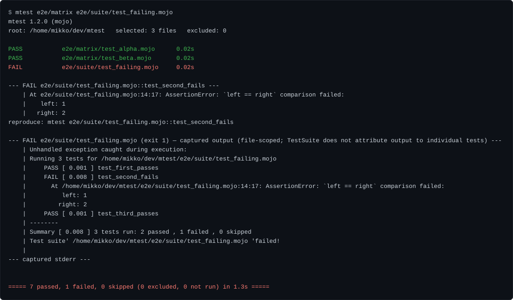
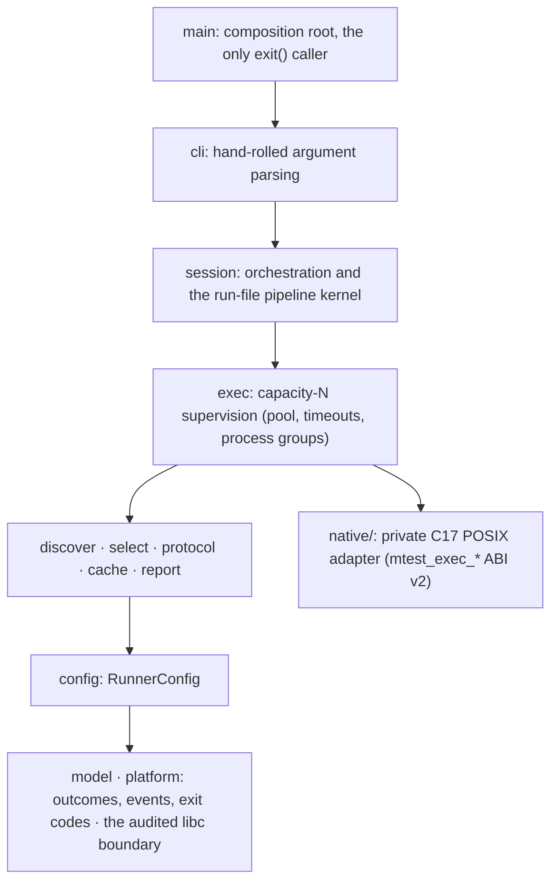

<p align="center">
  
</p>

# mtest

[](https://github.com/mikeleppane/mtest/actions/workflows/ci.yml)
[](https://github.com/mikeleppane/mtest/actions/workflows/codeql.yml)

A pytest-like test runner for [Mojo](https://www.modular.com/mojo).

mtest orchestrates the standard library's per-file `TestSuite`, it does not
replace it. `TestSuite` keeps owning discovery and the report format inside
each file; mtest owns everything between files: finding them, building each
one, executing the binary under supervision, selecting and aggregating tests
across files, and reporting results the way CI expects.



## Quick start

mtest is published to
[modular-community](https://prefix.dev/channels/modular-community/packages/mtest)
for linux-64 and osx-arm64.
[Supported toolchains](docs/install.md#supported-toolchains) names the Mojo
version each release needs. From an empty directory:

```console
$ pixi init .
$ pixi workspace channel add https://conda.modular.com/max/
$ pixi workspace channel add https://repo.prefix.dev/modular-community
$ pixi add mtest
$ pixi run mtest --version
mtest 1.1.0
```

In a workspace that already exists, skip `pixi init .`. Then save this as
`tests/test_math.mojo`:

```mojo
"""Arithmetic examples for a first mtest run."""

from std.testing import assert_equal, TestSuite


def test_addition() raises:
    assert_equal(2 + 2, 4)


def test_multiplication() raises:
    assert_equal(3 * 7, 21)


def main() raises:
    TestSuite.discover_tests[__functions_in_module()]().run()
```

and run the directory:

```console
$ pixi run mtest tests/
mtest 1.1.0 (mojo)
root: /tmp/mtest-quickstart   selected: 1 files   excluded: 0

PASS           tests/test_math.mojo            0.03s

===== 2 passed, 0 failed, 0 skipped, builds: 1, cached: 0 (0 excluded, 0 not run) in 1.3s =====
$ echo $?
0
```

[Getting started](docs/getting-started.md) picks up from here.

## Start here

| You want to | Read |
| --- | --- |
| Install mtest, or check which toolchain it supports | [Installation](docs/install.md) |
| Go from an empty directory to a green run | [Getting started](docs/getting-started.md) |
| Know what mtest does, and what it does not | [Overview](docs/overview.md) |
| Select, retry, time out, shard, shuffle, or configure a run | [Usage](docs/usage.md) |
| Run the suite in CI | [Continuous integration](docs/ci.md) |
| Write a report for a person to read | [Run reports](docs/reports.md) |
| Get more detail from a failed `assert_equal` | [Assertion diagnostics](docs/assertions.md) |
| Understand what the build cache keeps and when it rebuilds | [Build cache](docs/build-cache.md) |
| Install shell completion | [Shell completion](docs/completions.md) |
| Look up a flag or an exit code | [CLI reference](docs/cli-reference.md), [command-line contract](docs/cli-contract.md) |
| Read mtest's output from another program | [JSON event stream](docs/json-stream.md), [collect stream](docs/collect-stream.md) |
| Change mtest itself | [Contributing](CONTRIBUTING.md), [Architecture](docs/architecture.md) |
| Cut a release | [Releasing](docs/releasing.md) |

The same pages are built from `docs/` on every pull request and published from
`main` at <https://mikeleppane.github.io/mtest/>.
Release notes are in [CHANGELOG.md](CHANGELOG.md), and
[SECURITY.md](SECURITY.md) says how to report a vulnerability privately.

## Repository layout

| Path | What it is |
| --- | --- |
| `src/mtest` | The runner, in the layers drawn below. |
| `src/main.mojo` | The composition root the `mtest` binary is built from. |
| `native` | The private C17 POSIX adapter, statically linked into `exec`. |
| `companions/assertions` | The optional source-only `mtest.assertions` package. |
| `vendor/mojo-toml` | The pinned, vendored TOML parser. |
| `tests` | Unit and integration modules, and the `TestSuite` protocol snapshots. |
| `e2e` | The known-outcome tree the end-to-end gate runs against. |
| `scripts` | Build, gate, release, and documentation tooling. |
| `recipe` | The conda recipe the package is built from. |
| `docs` | The documentation site and the command-line contract. |
| `action.yml` | The composite GitHub Action. |

## Architecture

mtest is pure Mojo, built in layers that import in one direction only:


```mermaid
flowchart TD
    main["main: composition root, the only exit() caller"]
    cli["cli: hand-rolled argument parsing"]
    session["session: orchestration and the run-file pipeline kernel"]
    exec["exec: capacity-N supervision (pool, timeouts, process groups)"]
    mid["discover · select · protocol · cache · report"]
    config["config: RunnerConfig"]
    leaves["model · platform: outcomes, events, exit codes · the audited libc boundary"]
    native["native/: private C17 POSIX adapter (mtest_exec_* ABI v2)"]

    main --> cli --> session --> exec --> mid --> config --> leaves
    exec --> native
```

Arrows show the layering: each module may import only from layers below it.
[Architecture](docs/architecture.md) describes what each layer owns.

## License

[MIT](LICENSE).
