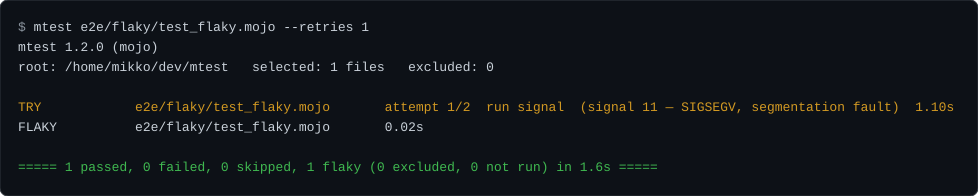

# Usage

mtest spawns a `mojo build` child per file, so `mojo` must be on that
child's `PATH`. The examples on this page run a binary built from a checkout,
so build it once and run it under `pixi run` (or inside a `pixi shell`):

```console
$ pixi run build-bin
$ pixi run bash -c 'build/mtest tests/'
```

`run` is the default subcommand: `mtest tests/` means `mtest run tests/`.
Everything below is real, captured output from this build.

## Writing a test file

A test file is a normal Mojo program: `test_*` functions plus a `main()`
that hands them to the standard library's `TestSuite`. This is
[`e2e/suite/test_passing.mojo`](https://github.com/mikeleppane/mtest/blob/main/e2e/suite/test_passing.mojo) (docstring
omitted), the file the next example runs:

```mojo
from std.testing import assert_equal, TestSuite


def test_one_passes() raises:
    assert_equal(1, 1)


def test_two_passes() raises:
    assert_equal(2, 2)


def test_three_passes() raises:
    assert_equal(3, 3)


def main() raises:
    TestSuite.discover_tests[__functions_in_module()]().run()
```

mtest compiles the file, runs the binary, and parses the report `TestSuite`
prints; selection reaches the suite through the arguments mtest passes it.
A file without that `main()` does not build as a standalone program.

## A passing run

```console
$ pixi run bash -c 'build/mtest e2e/suite/test_passing.mojo'
mtest 1.1.0 (mojo)
root: /home/mikko/dev/mtest   selected: 1 files   excluded: 0

PASS           e2e/suite/test_passing.mojo  0.07s

===== 3 passed, 0 failed, 0 skipped, builds: 1, cached: 0 (0 excluded, 0 not run) in 1.2s =====
$ echo $?
0
```

The file holds three `test_*` functions; the summary counts them
individually, not the one file that held them. The `builds`/`cached` pair is
the build cache: this store was cold, so the file was compiled; a rerun over an
unchanged tree compiles nothing and reports `builds: 0, cached: 1` instead. The
console fences below are captured against a cold store unless the text says
otherwise ([Build cache](build-cache.md)).

## A mixed run

`e2e/suite/` is the committed known-outcome tree the end-to-end gate runs
against. One directory exercises most of the outcome model at once:

```console
$ pixi run bash -c 'build/mtest e2e/suite'
mtest 1.1.0 (mojo)
root: /home/mikko/dev/mtest   selected: 7 files   excluded: 0

PASS           e2e/suite/nested/test_nested.mojo  0.07s
COMPILE-ERROR  e2e/suite/test_compile_error.mojo  0.00s
CRASH          e2e/suite/test_crashing.mojo  1.12s  (signal 4 — SIGILL, illegal instruction)
FAIL           e2e/suite/test_failing.mojo  0.08s
PASS           e2e/suite/test_noisy.mojo  0.02s
PASS           e2e/suite/test_passing.mojo  0.02s
NO-TESTS       e2e/suite/test_zero.mojo   0.07s

--- COMPILE-ERROR e2e/suite/test_compile_error.mojo — mojo build said: ---
    | /home/mikko/dev/mtest/e2e/suite/test_compile_error.mojo:12:17: error: use of unknown declaration 'this_symbol_is_never_defined_anywhere'
    |     var value = this_symbol_is_never_defined_anywhere()
    |                 ^~~~~~~~~~~~~~~~~~~~~~~~~~~~~~~~~~~~~
    | mojo: error: failed to parse the provided Mojo source module
reproduce: mojo build e2e/suite/test_compile_error.mojo -o build/bin/e2e_ssuite_stest_ucompile_uerror -D MTEST_SOURCE=/home/mikko/dev/mtest/e2e/suite/test_compile_error.mojo

[...CRASH detail with its captured stack trace omitted...]

--- FAIL e2e/suite/test_failing.mojo::test_second_fails ---
    | At e2e/suite/test_failing.mojo:14:17: AssertionError: `left == right` comparison failed:
    |    left: 1
    |   right: 2
reproduce: mtest e2e/suite/test_failing.mojo::test_second_fails

[...file-scoped captured output omitted...]

===== 9 passed, 1 failed, 0 skipped, 1 crashed, 1 compile error, builds: 7, cached: 0 (0 excluded, 0 not run) in 5.9s =====
$ echo $?
1
```

The summary band's units are deliberately mixed: `passed`, `failed`, and
`skipped` count *tests*, while `crashed` and `compile error` count *files*,
because an abnormal outcome has no reliable per-test breakdown. `test_zero.mojo`
is reported NO-TESTS, not PASS: it builds and exits `0`, but its report shows
zero tests ran. A session that collects nothing but NO-TESTS files exits `5`.

## Selecting tests

`-k STR` is a case-insensitive substring filter over the full node id
(`path::name`), so it matches file paths as well as test names:

```console
$ pixi run bash -c 'build/mtest -k one e2e/matrix'
mtest 1.1.0 (mojo)
root: /home/mikko/dev/mtest   selected: 2 files   excluded: 0

PASS           e2e/matrix/test_alpha.mojo 0.02s
PASS           e2e/matrix/test_beta.mojo  0.03s

===== 2 passed, 0 failed, 0 skipped, builds: 2, cached: 0 (0 excluded, 0 not run, 3 deselected) in 1.7s =====
```

A node-id operand selects exactly one test:

```console
$ pixi run bash -c 'build/mtest e2e/matrix/test_alpha.mojo::test_alpha_two'
mtest 1.1.0 (mojo)
root: /home/mikko/dev/mtest   selected: 1 files   excluded: 0

PASS           e2e/matrix/test_alpha.mojo 0.03s

===== 1 passed, 0 failed, 0 skipped, builds: 1, cached: 0 (0 excluded, 0 not run, 2 deselected) in 1.2s =====
```

Non-matching tests are counted once as `deselected`, never listed
individually. A file whose every test is deselected is not scheduled at all
and is counted `not run`. A `-k` that empties the whole session exits `5`.

## Listing tests without running them

`mtest collect` (and `--collect-only`) compiles each file, enumerates its
tests through a probe that skips every test body, and lists node ids in
lexicographic order — as plain lines by default, or as a versioned NDJSON
stream under `--format json` ([below](#machine-readable-collection)):

```console
$ pixi run bash -c 'build/mtest collect e2e/matrix'
e2e/matrix/test_alpha.mojo::test_alpha_one
e2e/matrix/test_alpha.mojo::test_alpha_three
e2e/matrix/test_alpha.mojo::test_alpha_two
e2e/matrix/test_beta.mojo::test_beta_one
e2e/matrix/test_beta.mojo::test_beta_two
$ echo $?
0
```

A file that cannot be probed (a compile error, a crash, a timeout) writes a
diagnostic to stderr and the listing continues for the rest, with a nonzero
exit at the end. Per-test narrowing is a `run` behavior in this build:
under `collect`, `-k` prints a loud ignored notice and a `path::test`
operand contributes its whole file to the listing.

### Machine-readable collection

`--format json` prints the same listing as a versioned NDJSON stream, for a CI
job or an editor integration that would otherwise split the plain lines
([Collect JSON stream](collect-stream.md) is the normative spec):

```console
$ pixi run bash -c 'build/mtest collect --format json e2e/matrix'
{"event":"collect","version":1,"generator":"mtest 1.1.0"}
{"event":"node","node_id":"e2e/matrix/test_alpha.mojo::test_alpha_one","path":"e2e/matrix/test_alpha.mojo","name":"test_alpha_one"}
[...one node record per test, in the same order as the plain listing...]
{"event":"collect_finished","nodes":5,"exit_code":0}
```

The terminal's `exit_code` is the exit code the process really ends with,
teardown included, so a consumer can gate on the record without also reading
`$?`. Diagnostics stay on stderr under either format, and `--format lines` is
the default. Collection compiles and probes every file it lists, so this is a
command to run when the test set changes, not one to run per keystroke.

## Retries and FLAKY

`--retries N` grants up to `N` extra attempts, and only to crash-class
failures: a death by signal, a deadline kill, or a compiler that itself
crashed. A failing assertion or an ordinary compile error is deterministic
and is never retried. Every attempt gets its own `TRY` line naming why it
failed, and a file that crashes once and then passes is reported FLAKY, a
pass with a visible history, never a plain PASS:



A FLAKY-only session exits `0`, unless `--fail-on-flaky` is set: that turns a
would-be `0` into `1` and changes nothing else — the same tests run, the same
retries happen, and the summary band names the flag beside the flaky count.
Without `--retries`, the same crash stands
as the file's final outcome, and every CRASH triggers the bounded
attribution pass:

```console
$ pixi run bash -c 'build/mtest e2e/attribution/test_deterministic_crasher.mojo'
mtest 1.1.0 (mojo)
root: /home/mikko/dev/mtest   selected: 1 files   excluded: 0

CRASH          e2e/attribution/test_deterministic_crasher.mojo  1.12s  (signal 4 — SIGILL, illegal instruction)
WARNING  crash-attribution-start: re-running the crashed file(s) one test at a time to name the culprit (1 file(s); bounded and best-effort). This is SECONDARY diagnostics: the CRASH verdict already stands and nothing found here can change it or the exit code
ATTRIBUTION    e2e/attribution/test_deterministic_crasher.mojo  ATTRIBUTED  culprit: test_boom  (2 isolation rerun(s), 1.18s)

[...captured output omitted...]

===== 0 passed, 0 failed, 0 skipped, 1 crashed, builds: 1, cached: 0 (0 excluded, 0 not run) in 3.4s =====
$ echo $?
1
```

When the crash does not reproduce with any test run alone (an
order-dependent crash, for instance), the `ATTRIBUTION` line says
`NO-REPRODUCTION` and the culprit stands UNATTRIBUTED rather than guessed.
The pass is strictly bounded (at most 32 isolation reruns per file, under
per-file and per-session wall-clock budgets), and it never changes the CRASH
verdict or the exit code.

## Timeouts

`--timeout SECS` bounds a single file's run; `--compile-timeout SECS` bounds
its build the same way. A child that ignores the polite terminate signal is
force-killed, and the verdict line says so in words:

```console
$ pixi run bash -c 'build/mtest e2e/stubborn/test_stubborn.mojo --timeout 1 --retries 0'
mtest 1.1.0 (mojo)
root: /home/mikko/dev/mtest   selected: 1 files   excluded: 0

TIMEOUT        e2e/stubborn/test_stubborn.mojo 1.31s  (timed out after 1s, escalated to SIGKILL)

[...captured output omitted...]

===== 0 passed, 0 failed, 0 skipped, 1 timed out, builds: 1, cached: 0 (0 excluded, 0 not run) in 2.4s =====
$ echo $?
1
```

A build killed at the compile deadline is reported COMPILE-TIMEOUT, distinct
from COMPILE-ERROR, and a retried rebuild runs against a fresh, quarantined
per-attempt module cache, announced with a `WARNING`.

## Sharding a CI matrix

`--shard [hash:|slice:]M/N` splits the discovered file set into `N` disjoint
shards before any build and runs (or collects) only shard `M`. `hash:`, the
default, assigns each file by a stable hash of its path, so assignment never
depends on machine or discovery order:

```console
$ pixi run bash -c 'build/mtest collect e2e/suite --shard 3/3'
e2e/suite/test_passing.mojo::test_one_passes
e2e/suite/test_passing.mojo::test_three_passes
e2e/suite/test_passing.mojo::test_two_passes
$ echo $?
0
```

The union of every shard's listing is exactly the unsharded listing, and no
node id appears twice. Gate files are never sharded: every gate runs on
every shard. A complete matrix cell, with the report upload, is under
[Continuous integration](ci.md#spreading-one-suite-across-a-matrix).

## Machine reporters

The three reporters compose with the console and with each other.
[The command-line contract](cli-contract.md) specifies each in full. The
document `--report` writes is for a reader rather than a machine and has its
own page, [Run reports](reports.md).

`--json PATH|-` writes a versioned NDJSON event stream
([JSON event stream](json-stream.md) is the normative spec). With
`-`, stdout carries only stream bytes and the console moves to stderr:

```console
$ pixi run bash -c 'build/mtest --json - --gh-annotations off e2e/matrix' 1>/tmp/stream.ndjson
$ head -n 4 /tmp/stream.ndjson
{"event":"stream","version":1,"generator":"mtest 1.1.0"}
{"event":"session_started","root":"/home/mikko/dev/mtest","toolchain":"mojo","selected_count":2,"excluded_count":0,"shard_label":"","sharded_out_count":0,"workers":1}
{"event":"file_started","path":"e2e/matrix/test_alpha.mojo"}
{"event":"test_reported","path":"e2e/matrix/test_alpha.mojo","name":"test_alpha_one","outcome":"pass","detail":"","detail_omitted_bytes":0,"timing":"0.001"}
```

`--junit-xml PATH` writes a schema-validated JUnit report assembled from the
runner's own typed events, never from a parse of console text, and renames
it atomically onto `PATH` so a prior report survives any failure. FAIL maps
to `<failure>`; CRASH and the other abnormal file outcomes map to sentinel
`<error>` testcases:

```xml
<?xml version="1.0" encoding="UTF-8"?>
<testsuites name="mtest" tests="12" failures="1" errors="2">
<testsuite name="e2e/suite/nested/test_nested.mojo" tests="1" failures="0" errors="0" skipped="0" time="0.017">[...]</testsuite>
<testsuite name="e2e/suite/test_compile_error.mojo" tests="1" failures="0" errors="1" skipped="0" time="0.000"><testcase name="[build]" classname="e2e.suite.test_compile_error"><error message="build failed" type="CompileError">[...]</error></testcase>[...]</testsuite>
[...]
</testsuites>
```

`--gh-annotations MODE` (`off|on|auto`, default `auto`: on iff
`GITHUB_ACTIONS=true`) emits GitHub Actions workflow-command annotations in
a deterministic tail after the summary:

```console
$ pixi run bash -c 'build/mtest --gh-annotations on e2e/suite'
[...console output as above, ending with the summary band, then:...]
::error file=e2e/suite/test_compile_error.mojo::e2e/suite/test_compile_error.mojo: compile error
::error file=e2e/suite/test_crashing.mojo::e2e/suite/test_crashing.mojo: crashed (signal 4 — SIGILL, illegal instruction)
::error file=e2e/suite/test_failing.mojo,line=14::e2e/suite/test_failing.mojo::test_second_fails:       At /home/mikko/dev/mtest/e2e/suite/test_failing.mojo:14:17: AssertionError: `left == right` comparison failed:
::notice::9 passed, 1 failed, 0 skipped, 1 crashed, 1 compile error (0 excluded, 0 not run) in 5.0s
```

Inside GitHub Actions (`GITHUB_ACTIONS=true`), every echoed region of
captured child output is wrapped in a per-run `::stop-commands::` fence, so
a test's own output can never forge a workflow command.

## Project configuration: `mtest.toml`

When `mtest.toml` sits at the invocation root, mtest loads it automatically;
absence is silent. `--config PATH` selects a different file, `--no-config`
suppresses discovery entirely, and the two are mutually exclusive. The schema
is closed: an unknown table, an unknown key, a wrong type, or an invalid value
is a usage error caught before anything is built.

This is the file the rest of this section runs against:

```toml
[run]
paths = ["e2e/matrix"]
workers = "auto"
retries = 1
timeout = 120

[build]
include = ["build"]
compile-timeout = 300

[report]
durations = 2
show-output = "none"

[[override]]
files = ["e2e/matrix/test_beta.mojo"]
timeout = 30
serial = true
```

`[run] paths` supplies the operands when the command line has none, so a bare
`mtest` runs the project's suite the project's way:

```console
$ pixi run bash -c 'build/mtest'
mtest 1.1.0 (mojo)
root: /home/mikko/dev/mtest   selected: 2 files   excluded: 0   workers: 16

PASS           e2e/matrix/test_alpha.mojo      0.02s
PASS           e2e/matrix/test_beta.mojo       0.02s  SERIAL

===== 5 passed, 0 failed, 0 skipped, builds: 2, cached: 0 (0 excluded, 0 not run) in 3.0s =====

slowest 2 files:
  e2e/matrix/test_alpha.mojo  0.02s
  e2e/matrix/test_beta.mojo  0.02s
$ echo $?
0
```

Resolution is per key: built-in defaults, then `mtest.toml`, then a non-empty
`MTEST_MOJO`, then the command line. A layer that sets a key replaces the whole
value from below it, lists included, and positional operands replace configured
`paths`. Color is the deliberate exception: `NO_COLOR` is not a layer value, and
it is consulted only once the winning `color` is `auto`.

Each `[[override]]` table carries per-file `timeout`, `compile-timeout`,
`retries`, and `serial = true`, keyed by glob. For each scalar the first
matching table wins, unless the command line supplied that scalar globally.
Serial membership is a union instead: any matching `serial = true` pins the
file, which is why `test_beta.mojo` above carries the `SERIAL` tag.

A configuration problem names the file, the table, the key, and what was
expected, and stops the run before a single build starts. Here it is the same
file, but with `retries = "two"` where an integer belongs:

```console
$ pixi run bash -c 'build/mtest e2e/matrix'
config: mtest.toml: [run] key 'retries': expected integer >= 0; got 'two'
$ echo $?
4
```

[§25 of the CLI contract](cli-contract.md#25-project-configuration) is the
full closed schema and the whole resolution rule.

## Seeing what a configuration resolves to

`mtest config show` accepts the full `run` grammar and answers one question:
what would this invocation actually use? It resolves and renders, nothing else.
It never discovers, builds, runs, opens a reporter, or reads last-run state. The
output is copy-pasteable TOML, and every set key carries the layer it came from:

```console
$ pixi run bash -c 'build/mtest config show'
[run]
paths = ["e2e/matrix"]  # (mtest.toml)
exclude = []  # (default)
gates = []  # (default)
serial = []  # (default)
workers = "auto"  # (mtest.toml)
timeout = 120  # (mtest.toml)
retries = 1  # (mtest.toml)
maxfail = 0  # (default)
state = true  # (default)
fail-on-flaky = false  # (default)

[build]
mojo = "mojo"  # (default)
include = ["build"]  # (mtest.toml)
build-args = []  # (default)
precompile = []  # (default)
compile-timeout = 300  # (mtest.toml)

[report]
color = "auto"  # (default)
show-output = "none"  # (mtest.toml)
verbosity = "normal"  # (default)
durations = 2  # (mtest.toml)
# junit-xml = (unset)
# json = (unset)
gh-annotations = "auto"  # (default)
# md = (unset)
# html = (unset)
style = "concise"  # (default)

[[override]]
files = "e2e/matrix/test_beta.mojo"  # (mtest.toml)
timeout = 30  # (mtest.toml)
serial = true  # (mtest.toml)

# config file: mtest.toml
# state file: .mtest-cache/lastrun (present)
# selection flags are per invocation and are not rendered
$ echo $?
0
```

Flags resolve into the same rendering, so `config show` also answers "what does
this command line change?". Per-invocation selection flags such as `-k` are
accepted and deliberately not rendered:

```console
$ pixi run bash -c 'build/mtest config show --timeout 30 -n 4 -k alpha'
[run]
paths = ["e2e/matrix"]  # (mtest.toml)
exclude = []  # (default)
gates = []  # (default)
serial = []  # (default)
workers = 4  # (cli)
timeout = 30  # (cli)
retries = 1  # (mtest.toml)
[...the remaining tables and trailers as above...]
```

The state trailer reports only whether `.mtest-cache/lastrun` exists; the
command never reads it.

## Re-running just the failures: `--lf` and `--ff`

A completed run remembers what failed, in `.mtest-cache/lastrun` under the
invocation root. That directory is mtest's own working state — the last-run
record and the cached test binaries beside it — and none of it belongs in
review, so ignore it:

```gitignore
# mtest's build cache and its last-run state
.mtest-cache/
```

The file is deterministic text, sorted and root-relative, readable without
mtest. This is what a run over `e2e/matrix` and `e2e/suite/test_failing.mojo`
leaves behind, for two passing files and one failing test:

```console
$ cat .mtest-cache/lastrun
mtest-lastrun v1
test	e2e/suite/test_failing.mojo::test_second_fails
```

`--lf` (`--last-failed`) narrows the next run to what that state remembers, so
you read one failure instead of scrolling past the whole suite. It narrows what
*executes*, not what is built: the filter applies after each file has been
compiled and probed for its test names, so the compile cost of the selection is
unchanged. The run that wrote the state also filled the build cache, so the
bands in this section report hits rather than builds. `--lf` also runs on a
single worker, ignoring `-n`:

```console
$ pixi run bash -c 'build/mtest --lf e2e/matrix e2e/suite/test_failing.mojo'
mtest 1.1.0 (mojo)
root: /home/mikko/dev/mtest   selected: 3 files   excluded: 0

FAIL           e2e/suite/test_failing.mojo     0.02s

--- FAIL e2e/suite/test_failing.mojo::test_second_fails ---
    | At e2e/suite/test_failing.mojo:14:17: AssertionError: `left == right` comparison failed:
    |    left: 1
    |   right: 2
reproduce: mtest e2e/suite/test_failing.mojo::test_second_fails

[...file-scoped captured output omitted...]

===== 0 passed, 1 failed, 0 skipped, builds: 0, cached: 3 (0 excluded, 2 not run, 7 deselected) in 0.8s =====
$ echo $?
1
```

`--ff` (`--failed-first`) keeps the whole selection but moves the remembered
files to the front, so a rerun fails fast without giving up coverage:

```console
$ pixi run bash -c 'build/mtest --ff --show-output none e2e/matrix e2e/suite/test_failing.mojo'
mtest 1.1.0 (mojo)
root: /home/mikko/dev/mtest   selected: 3 files   excluded: 0

FAIL           e2e/suite/test_failing.mojo     0.02s
PASS           e2e/matrix/test_alpha.mojo      0.02s
PASS           e2e/matrix/test_beta.mojo       0.02s

===== 7 passed, 1 failed, 0 skipped, builds: 0, cached: 3 (0 excluded, 0 not run) in 0.9s =====
$ echo $?
1
```

Both are soft filters, never gates. A remembered id this selection does not
reach (deleted, renamed, or simply out of scope) is dropped with a line naming
it, and a state file that intersects nothing runs the ordinary full selection
rather than exiting `5`:

```console
$ pixi run bash -c 'build/mtest --lf e2e/matrix'
mtest 1.1.0 (mojo)
root: /home/mikko/dev/mtest   selected: 2 files   excluded: 0

lf: previously-failing e2e/suite/test_failing.mojo::test_second_fails no longer exists — dropped
lf: no previously-failing tests match this selection — running the full selection
PASS           e2e/matrix/test_alpha.mojo      0.02s
PASS           e2e/matrix/test_beta.mojo       0.03s

===== 5 passed, 0 failed, 0 skipped, builds: 0, cached: 2 (0 excluded, 0 not run) in 0.9s =====
$ echo $?
0
```

Gates are never filtered or reordered by either mode: they always run first.
`--lf` with `--ff`, and either with `--shard`, are usage errors; under
`collect` both are refused. State is written only after the final exit code
resolves to `0` or `1`, so an interrupt, an internal error, a usage error, or
an empty session leaves the previous file untouched, as do `collect`, sharded
runs, and `[run] state = false`.
[§26 of the CLI contract](cli-contract.md#26-last-run-state-and-failure-re-selection)
specifies the format, the outcome-to-record mapping, and the merge rule that
preserves a failure you have not retested yet.

## Random order: `--shuffle` and `--seed`

A suite that passes only in one order is a suite with a hidden dependency
between its files — shared state on disk, a fixture one file leaves behind for
the next. `--shuffle` runs the files in a random order to surface it. The seed
is printed in the header, because the whole point of a random order is being
able to run it again:

```console
$ pixi run bash -c 'build/mtest --shuffle --show-output none e2e/matrix e2e/suite/test_passing.mojo'
mtest 1.1.0 (mojo)
root: /home/mikko/dev/mtest   selected: 3 files   excluded: 0   shuffle seed: 4039837840016826

PASS           e2e/suite/test_passing.mojo     0.02s
PASS           e2e/matrix/test_beta.mojo       0.02s
PASS           e2e/matrix/test_alpha.mojo      0.04s

===== 8 passed, 0 failed, 0 skipped, builds: 0, cached: 3 (0 excluded, 0 not run) in 1.0s =====
```

Hand that number back with `--seed N` and the same file list runs in the same
order, on any platform: one seed names one order, and that mapping is frozen
for 1.x. So a shuffled CI failure is reproducible from its own log, which is
the only thing that makes randomizing safe to leave on.

```console
$ pixi run bash -c 'build/mtest --shuffle --seed 4039837840016826 --show-output none e2e/matrix e2e/suite/test_passing.mojo'
mtest 1.1.0 (mojo)
root: /home/mikko/dev/mtest   selected: 3 files   excluded: 0   shuffle seed: 4039837840016826

PASS           e2e/suite/test_passing.mojo     0.02s
PASS           e2e/matrix/test_beta.mojo       0.03s
PASS           e2e/matrix/test_alpha.mojo      0.04s

===== 8 passed, 0 failed, 0 skipped, builds: 0, cached: 3 (0 excluded, 0 not run) in 1.0s =====
```

Only the **execution** order moves. Gates keep the order they were listed in
and still run first, `--shard` partitions the sorted list before the shuffle so
shard membership never changes, and every report — the summary band, the JUnit
document, the `collect` listing — stays sorted by node id. `--seed` without
`--shuffle` is a usage error, and so is asking for two orders at once:

```console
$ pixi run bash -c 'build/mtest --shuffle --lf e2e/matrix'
cli: '--shuffle' and '--lf'/'--ff' choose conflicting orders; pick one (see mtest --help)
$ echo $?
4
```

`--shuffle` is a command-line flag only — it is never read from `mtest.toml`,
because a randomized order is something you ask for on an invocation rather
than something a project should silently impose — and it is refused under
`collect`, whose listing is specified to be sorted.

## Diagnosing the environment: `mtest doctor`

`mtest doctor` answers "is this machine set up to run tests?" without running
one. It performs ten read-only checks and prints exactly one `PASS`, `WARN`, or
`FAIL` line for each, in a fixed order. The inventory never shrinks, because a
missing line would be the one you needed:

```console
$ pixi run bash -c 'build/mtest doctor'
PASS version: mtest 1.1.0
PASS platform: Linux x86_64 supported
PASS root: /home/mikko/dev/mtest
PASS exec: runtime acquired
PASS toolchain: 'mojo' from PATH default: Mojo 1.1.0 (8189361e)
PASS config: valid 'mtest.toml'
PASS config-semantics: resolved values valid
PASS state: cache and lastrun usable
PASS temp: invocation root and system temp usable
PASS report-destinations: none
$ echo $?
0
```

Every check body is guarded on its own, so a broken environment still produces
the whole report: the failing check says what broke, dependent checks say which
capability they were missing, and the rest still run.

```console
$ pixi run bash -c 'MTEST_MOJO=/opt/nonexistent/mojo build/mtest doctor --no-config'
PASS version: mtest 1.1.0
PASS platform: Linux x86_64 supported
PASS root: /home/mikko/dev/mtest
PASS exec: runtime acquired
FAIL toolchain: '/opt/nonexistent/mojo' from MTEST_MOJO: could not execute
PASS config: none
PASS config-semantics: resolved values valid
PASS state: cache and lastrun usable
PASS temp: invocation root and system temp usable
PASS report-destinations: none
$ echo $?
1
```

The `toolchain` check is deliberately strict: a `PASS` requires the exact
pinned identity `Mojo 1.1.0 (8189361e)`, because a different toolchain is a
different `TestSuite` report format. `doctor` also treats a broken
configuration differently from every other command on purpose. A missing or
malformed selected config is a `FAIL`ed check and exit `1`, not the usage error
`run` and `config show` raise, because a diagnostic tool that refuses to
diagnose is useless. Its exit domain is `{0, 1, 2, 3, 4}`, and `WARN` never
fails the command; the `3` is reserved for a stdout that could not take the
report block at all, which leaves no diagnosis delivered to stand behind.

## Debugging one test: `mtest debug`

Sometimes a report is the wrong tool. `mtest debug PATH::TEST` prepares exactly
one test the way a run would — precompiles, builds, and probes the file to
check the name really exists — prints the two commands it used, and then
**becomes** the test binary:

```console
$ pixi run bash -c 'build/mtest debug e2e/suite/test_passing.mojo::test_two_passes'
build: mojo build e2e/suite/test_passing.mojo -o build/bin/e2e_ssuite_stest_upassing -D MTEST_SOURCE=/home/mikko/dev/mtest/e2e/suite/test_passing.mojo
run: build/bin/e2e_ssuite_stest_upassing --only test_two_passes

Running 3 tests for /home/mikko/dev/mtest/e2e/suite/test_passing.mojo
    SKIP [ 0.001 ] test_one_passes
    PASS [ 0.001 ] test_two_passes
    SKIP [ 0.001 ] test_three_passes
--------
Summary [ 0.001 ] 3 tests run: 1 passed , 0 failed , 2 skipped

$ echo $?
0
```

Everything after those two lines is the test binary talking to your terminal
directly. mtest is gone — it replaced its own process image — so the test owns
stdin, stdout and stderr connected straight through rather than to a capture
pipe, the signals, the debugger you attached, and the exit status. There is no summary band and no mtest verdict, on purpose:
that `0` is the binary's statement about itself, not an mtest PASS. Run the
printed `run:` line under `gdb`, `lldb`, `strace`, or `valgrind` and you are
debugging exactly what mtest just ran.

Because there is no reporter left afterwards, the grammar is narrow: one node
id, the build flags (`--mojo`, `-I`, `--build-arg`, `--`), `--config`/
`--no-config`, and `-q`/`-v`. Everything else is refused before anything is
built, and so is a bare path — a debug session needs one test, not a file:

```console
$ pixi run bash -c 'build/mtest debug e2e/suite/test_passing.mojo; echo "EXIT=$?"'
cli: 'debug' wants exactly one PATH::TEST node id (see mtest --help)
EXIT=4
```

Every refusal happens while mtest still owns its exit code: `4` for a bad node
id, an unknown test name, a flag outside the grammar, or a broken `mtest.toml`;
`1` when the file will not compile or its probe crashes — with the compiler's
own banner or the binary's stderr printed beneath the diagnostic, since there
is no reporter left to echo them; `3` for a spawn failure or protocol drift;
and `2` for an interrupt, which is checked right up to the handover. Once the
handover happens, the code you get is the test's own.
